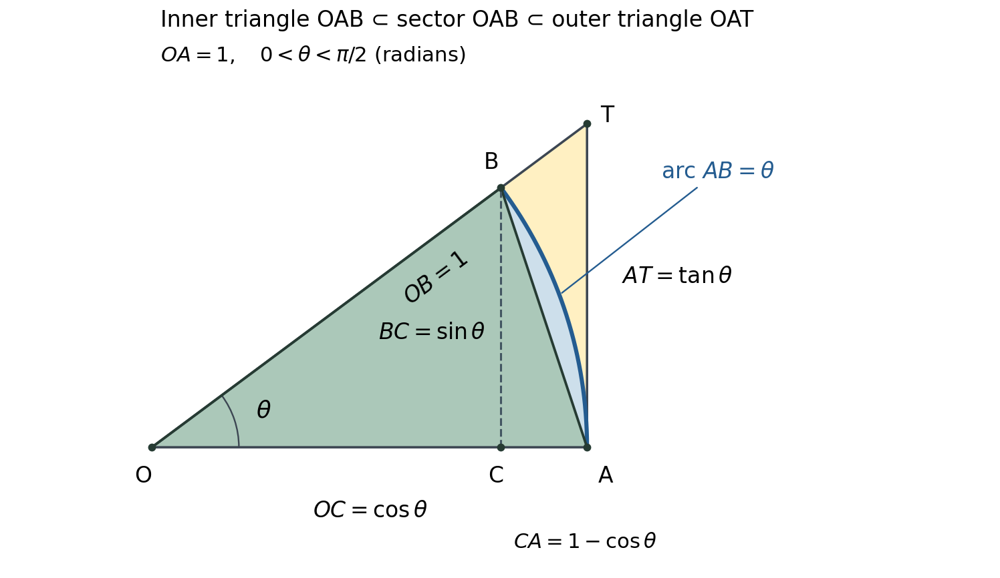

[P01] MIT 18.01, Fall 2006, Lecture 2: limits, continuity, and trigonometric limits.

[P02] Read the main explanation in order, from [rates and limits](#core) to [differentiability and continuity](#theorem). There are six attempts: [Q1](#q1), [Q2](#q2), [Q3](#q3), [Q4](#q4), [Q5](#q5), and [Q6](#q6). Their [hints](#hints) are grouped after the explanation; their [complete solutions](#solutions) form a separate group after the hints. Each help entry links back to its question. Q6 is also a later revisit. You need ordinary algebra, differentiation rules, elementary trigonometry and radian sector areas; the additional limit and continuity reasoning is developed here. No earlier lecture document is required.

<a id="core"></a>

[P03] A derivative answers a local question: how rapidly does the output change when the input changes near a particular value? A limit makes “near” precise enough to separate three things that need not agree: the output at a point, the outputs near that point, and the slopes near that point. We start with finite limits. The statement $`\lim_{x\to a}f(x)=L`$ means that the outputs can be made as close to the finite number $`L`$ as desired by keeping $`x`$ sufficiently close to $`a`$, with $`x\ne a`$. The closeness must work for all such inputs in the domain, not merely for a chosen sequence of favorable inputs. At an interior point approached from both sides, both sides must approach the same number. The point value $`f(a)`$ is not used in this limit.

[P04] We use these elementary limit rules: the limit of a sum, difference or product of functions with finite limits is the corresponding sum, difference or product of those limits. For a quotient, division of the limits is allowed if the denominator's limit is nonzero. Constants keep their value, and $`x\to a`$ gives $`\lim x=a`$. These rules apply to functions on the nearby nonexcluded inputs; changing a value at $`a`$ does not change a limit there. The nonzero condition matters: two quantities both approaching zero do not determine their ratio. For example, $`x/x=1`$ but $`x^2/x=x\to0`$ for $`x\ne0`$.

[P05] Fix a base point $`a`$. In the lecture's first graph, the horizontal change is $`\Delta x`$ and the vertical change is $`\Delta y=f(a+\Delta x)-f(a)`$. Their ratio is the secant slope, or average rate, between the two points. Letting the nonzero horizontal change approach zero gives the derivative when the limit exists as a finite number:

```math
f'(a)=\lim_{\Delta x\to0}\frac{f(a+\Delta x)-f(a)}{\Delta x}.
```

[P06] The base point stays fixed during this limit. Setting $`x=a+\Delta x`$ makes $`\Delta x=x-a`$, so the same derivative is $`\lim_{x\to a}[f(x)-f(a)]/(x-a)`$. This explains the lecture's interchange of input and increment notation. Neither original quotient permits a zero denominator. Simplifying for nonzero increments and then taking a limit is legitimate; substituting zero into the original quotient is not. A derivative's units are output units divided by input units.

[P07] The lecture's examples express the same rate in different settings. If $`q(t)`$ is charge transferred through a cross-section, $`dq/dt`$ is current, in charge per time. If $`s(t)`$ is accumulated distance traveled, $`ds/dt`$ is speed where it exists; if the function instead describes signed position, its derivative is signed velocity, whose magnitude is speed. If $`T(x)`$ is temperature along a spatial coordinate, $`dT/dx`$ is the temperature gradient in temperature units per length, not a rate per time. These interpretations come from identifying what each axis measures before taking the ratio.

[P08] For the lecture's rational example, define $`R(x)=(x^2+x)/(x+1)`$ on $`x\ne-1`$. As $`x\to3`$, the numerator tends to $`12`$ and the denominator to $`4`$, so the quotient rule for limits gives $`\lim_{x\to3}R(x)=3`$. Direct substitution works here because the limiting denominator is nonzero. Factoring also gives $`R(x)=x(x+1)/(x+1)=x`$ wherever $`x\ne-1`$. The cancellation preserves the original excluded input; it does not define the original fraction there.

<a id="q1"></a>

[P09] Q1, an early supported attempt. What are $`\lim_{x\to-1}R(x)`$ and $`R(-1)`$ for the original function in P08? Give both conclusions and explain why cancellation can settle one without supplying the other. This checks the distinction between a nearby limit and an actual point value. [Hint H1](#h1); [solution S1](#s1). Continue with P10 when ready.

[P10] Measurement sensitivity is another rate question. In the lecture's curved-Earth GPS sketch, $`s`$ labels the satellite altitude, $`h`$ the slant distance from satellite to observer, and $`L`$ a surface arc from the point below the satellite to the observer. The next sketch replaces the curved surface with a flat right triangle: vertical leg $`s`$, horizontal leg $`L`$, hypotenuse $`h`$. The flat model is an approximation to that geometry; its straight distance $`L`$ is not an exact formula for the original surface arc. The packet gives no numerical measurements or Earth radius. We can still determine what the flat model predicts about sensitivity.

[P11] Hold $`s\gt0`$ fixed and take $`L\ge0`$. Pythagoras constructs the relation $`h^2=s^2+L^2`$, hence $`L(h)=\sqrt{h^2-s^2}`$ for $`h\ge s`$. For $`h\gt s`$, differentiating this expression by the chain rule gives

```math
\frac{dL}{dh}=\frac{1}{2\sqrt{h^2-s^2}}(2h)
=\frac{h}{\sqrt{h^2-s^2}}=\frac hL.
```

[P12] This ratio is positive: a larger inferred slant distance gives a larger inferred ground distance when altitude is held fixed. It has units length/length. By the definition of derivative, for a sufficiently small nonzero measurement change at a fixed point with $`h\gt s`$, the finite ratio $`\Delta L/\Delta h`$ is close to $`h/L`$, giving the local approximation $`\Delta L\approx(h/L)\Delta h`$. The perturbed range must remain in the domain. Near $`h=s`$, $`L`$ is small and this factor becomes large. At $`h=s`$ itself there is no finite linear sensitivity: for $`\delta\gt0`$ the right-hand change ratio is

```math
\frac{L(s+\delta)-L(s)}{\delta}
=\frac{\sqrt{2s\delta+\delta^2}}{\delta}
=\sqrt{\frac{2s}{\delta}+1},
```

[P13] which grows without bound as $`\delta\to0^+`$. Thus an allowed geometric endpoint need not have a finite derivative. The derivative approximation is local, not an exact rule for an arbitrary finite measurement error. The lecture points to a problem set for a further GPS example; the deductions here use only its displayed flat triangle.

<a id="q2"></a>

[P14] Q2. Change which measurement varies: hold the slant range $`h`$ fixed and let the estimated altitude $`s`$ vary with $`0\lt s\lt h`$. In the same flat model, find $`dL/ds`$ and interpret its sign and units. Your response should identify the held-fixed quantity and explain whether an overestimated altitude raises or lowers the inferred ground distance. This checks transfer of the sensitivity calculation to a different controlling measurement. [Hint H2](#h2); [solution S2](#s2).

[P15] A one-sided limit restricts the nearby inputs. In $`\lim_{x\to a^+}f(x)`$, approach from $`x\gt a`$; in $`\lim_{x\to a^-}f(x)`$, approach from $`x\lt a`$. The superscript records the side of the input, not the sign of the output. A finite two-sided limit exists exactly when both one-sided limits exist and agree, in the setting where the domain contains inputs on both sides. To build a right-hand limit statement, first choose the formula valid to the right, then ask what its outputs approach; do not insert the formula valid only at the point.

[P16] Continuity connects nearby outputs to the point value. At an interior point $`a`$, $`f`$ is continuous when $`f(a)`$ is defined, the finite limit exists, and that limit equals $`f(a)`$:

```math
\lim_{x\to a}f(x)=f(a).
```

[P17] At an endpoint of an interval domain, continuity uses the limit from within that domain. Likewise, “continuous from the left at $`a`$” means the left limit equals the point value; it says nothing about the right limit. An open circle on a graph excludes that point from that branch. A filled circle specifies the value actually included. Neither marker alone determines the neighboring limits; follow the nearby branch.

[P18] The lecture's piecewise picture has a left line ending at a filled origin and a right line approaching an open point at height $`1`$. Its formula contains a sign misprint: the second condition is printed $`x\ge0`$, but the picture and continuation require $`x\le0`$. Written consistently, the example is

```math
f(x)=\begin{cases}-x,&x\le0,\\ x+1,&x\gt0.\end{cases}
```

[P19] This definition selects exactly one branch for each input. From the left, $`-x\to0`$; from the right, $`x+1\to1`$; at the point, the first branch gives $`f(0)=0`$. The function is continuous from the left, not from the right, and has no two-sided limit at zero. The lecture's displayed limit equal to $`1`$ on the following page is restricted in its prose to positive inputs: it is the right-hand limit, not a two-sided limit. Since changing $`f(0)`$ cannot change either nearby branch, no choice of this single value can make their unequal limits agree.

[P20] There are several distinct ways continuity can fail. A removable discontinuity has a common finite limit from both sides, but the point value is absent or different. Defining or replacing just that value by the common limit repairs it. The lecture's hole in an otherwise connected curve illustrates this without specifying a numerical location. In P08–P09, the missing value at $`-1`$ is removable: extending $`R`$ by the value $`-1`$ gives the continuous function $`x`$ there. A jump has two finite but unequal one-sided limits, as in P18. The lecture's separate jump sketch has two horizontal levels and open endpoints; their heights and the point value are unspecified, but their inequality already rules out a repair by one point value. Its sentence reverses the left/right superscripts; use the definitions in P15.

[P21] Infinite behavior is different again. For $`f(x)=1/x`$, positive inputs tending to zero produce arbitrarily large positive outputs, and negative inputs produce arbitrarily large negative outputs:

```math
\lim_{x\to0^+}\frac1x=+\infty,
\qquad
\lim_{x\to0^-}\frac1x=-\infty.
```

[P22] Here infinity is not a real point value. The first statement means the outputs eventually exceed any prescribed positive bound; the second means they eventually fall below any prescribed negative bound. The lecture calls this an infinite discontinuity. There is no finite two-sided limit, and not even a common signed infinite behavior on both sides. A finite value at zero could not repair it. Even if both sides diverged to the same infinity, that would not be a removable hole with a finite fill-in value.

[P23] The lecture's oscillating sketch shows repeated swings of persistent height as the input approaches zero from the right. No formula or numerical heights are supplied. The key failure is that the outputs do not settle near one height, not merely that the curve oscillates. To make the reasoning exact, consider the separate generated example $`v(x)=\sin(1/x)`$, $`x\ne0`$. For nonnegative integers $`n`$, set $`u_n=1/(\pi/2+2\pi n)`$ and $`v_n=1/(3\pi/2+2\pi n)`$. Both positive input sequences tend to zero, but sine's period and its values at $`\pi/2`$ and $`3\pi/2`$ give $`v(u_n)=1`$ and $`v(v_n)=-1`$. These outputs cannot both become arbitrarily close to the same finite number. Hence even the right-hand limit fails. The example explains the kind of failure in the sketch; it does not identify the sketch's unspecified formula.

<a id="q3"></a>

[P24] Q3. For the generated function below, choose the value of $`a`$ that makes $`g_a`$ continuous at zero. Explain why changing one value succeeds here but fails for P18's example. Your response should give both one-sided limits and the point value; this checks the decision between a removable defect and a jump. [Hint H3](#h3); [solution S3](#s3).

```math
g_a(x)=\begin{cases}x+2,&x\lt0,\\ a,&x=0,\\ 2-x,&x\gt0.\end{cases}
```

[P25] A derivative graph plots a slope as a height. For $`f(x)=1/x`$, the power rule gives $`f'(x)=-1/x^2`$ on $`x\ne0`$. We can also check directly against the definition. Fix $`x\ne0`$ and choose a nonzero $`\Delta x`$ with $`x+\Delta x\ne0`$. Then

```math
\frac{f(x+\Delta x)-f(x)}{\Delta x}
=\frac{1/(x+\Delta x)-1/x}{\Delta x}
=\frac{-\Delta x}{x(x+\Delta x)\Delta x}
=-\frac1{x(x+\Delta x)}
\longrightarrow-\frac1{x^2}.
```

[P26] At a chosen horizontal coordinate, read the tangent slope of the original curve and put that number at the same horizontal coordinate on the derivative graph. For example, at $`x=-2`$ the function height is $`-1/2`$ and the slope is $`-1/4`$; at $`x=-1`$ the height and slope are both $`-1`$; at $`x=1`$ the height is $`1`$ and slope $`-1`$; at $`x=2`$ the height is $`1/2`$ and slope $`-1/4`$. These are calculated examples, not numerical labels read from the lecture's schematic.

[P27] Both branches of the original reciprocal curve fall as the input increases, so both derivative branches lie below the horizontal axis. Close to zero the falling slopes are very steep, and $`-1/x^2`$ becomes very negative; far from zero the slopes flatten and the derivative approaches zero from below. Neither function has a value at zero. This reconstructs the relationship between the red tangents and red derivative points in the lecture's paired graphs. The derivative is not a copy of the original shape, and the negative height of the left reciprocal branch does not by itself determine its slope.

[P28] Symmetry helps check this construction. A domain is symmetric about zero when it contains $`-x`$ whenever it contains $`x`$. On such a domain an even function satisfies $`f(-x)=f(x)`$ (reflection across the vertical axis); an odd function satisfies $`f(-x)=-f(x)`$ (half-turn about the origin). The reciprocal function is odd, because $`1/(-x)=-1/x`$. Its derivative is even, because $`-1/(-x)^2=-1/x^2`$. These statements hold on the symmetric domain excluding zero; symmetry does not fill its hole.

[P29] In general, assume the required derivatives exist at the paired interior points. The chain rule gives $`\frac{d}{dx}f(-x)=-f'(-x)`$. Differentiating the defining equality for an odd function therefore gives $`-f'(-x)=-f'(x)`$, hence $`f'(-x)=f'(x)`$: its derivative is even. For an even function, differentiating $`f(-x)=f(x)`$ gives $`-f'(-x)=f'(x)`$, hence $`f'(-x)=-f'(x)`$: its derivative is odd. These are the two statements intended by the lecture's “and vice versa.” They are not a claim that an even derivative forces an odd original function: $`f(x)=x+1`$ has the even derivative $`1`$, but $`f(-x)=1-x`$ differs from $`-f(x)=-x-1`$.

[P30] The source motion example specifies height $`y(t)=400-16t^2`$ for $`-5\le t\le5`$. Its building drawing is a scene, not a calibrated graph of horizontal motion or a source of a building height. The formula makes $`t=0`$ the highest point: $`t^2\ge0`$ gives $`y(t)\le400`$, with equality at zero. Negative times therefore describe the part of this motion before that chosen time origin; they are not negative elapsed durations. The page does not specify height or time units, so retain its numbers in the source's unspecified units.

[P31] For $`-5\lt t\lt5`$, differentiation gives $`y'(t)=-32t`$, a straight decreasing line through the origin. It is signed vertical velocity, in height units per time unit. The height rises before zero because this velocity is positive, has a horizontal tangent at zero because the velocity is zero, and falls afterward because the velocity is negative. For example, at $`t=-2,0,2`$ the heights are $`336,400,336`$, while the velocities are $`64,0,-64`$. Equal heights on the ascent and descent accompany opposite velocities. The height function is even on $`[-5,5]`$, while its interior derivative is odd, as P29 predicts. The vertical speed is $`|y'(t)|`$; it cannot be negative. The source's height and derivative graphs illustrate precisely this transfer from tangent slopes to derivative heights.

[P32] At $`t=-5`$ and $`t=5`$, the formula gives height zero. The function restricted to $`[-5,5]`$ has inputs on only one side of each endpoint, so its ordinary two-sided derivative is asserted only in the interior. For a nonzero increment $`\delta`$ at $`-5`$, expansion gives $`[y(-5+\delta)-y(-5)]/\delta=160-16\delta`$; taking $`\delta\to0^+`$ gives the right-hand derivative $`160`$. At $`5`$ the quotient is $`[y(5+\delta)-y(5)]/\delta=-160-16\delta`$; taking $`\delta\to0^-`$ gives the left-hand derivative $`-160`$. Extending the same polynomial beyond the interval would also give these values as two-sided derivatives of the extension. The closed dots in the source's derivative sketch can depict either interpretation; the packet does not specify which it intends. We keep the interior derivative and the named one-sided endpoint derivatives distinct.

<a id="q4"></a>

[P33] Q4. Let $`\tau=t+5`$ measure elapsed time from the first zero height in P30. Express the height and interior velocity in terms of $`\tau`$, give the new time interval, and locate the time of zero velocity. Explain why the physical motion is unchanged although the zero of the time coordinate moved. Name the type of derivative available at each endpoint of the restricted interval. Is the height function even about the new time origin on that domain? Check the definition, not just the parabola's appearance. This checks translation between two time representations and the endpoint condition. [Hint H4](#h4); [solution S4](#s4).

[P34] We now justify the two trigonometric limits that the lecture's small-angle pictures suggest. All angles in this argument are in radians. For radius $`1`$ and a positive angle $`\theta`$, the arc length is $`\theta`$ and sector area is $`\theta/2`$. Initially take $`0\lt\theta\lt\pi/2`$, so every length in the drawing is nonnegative. Place $`O=(0,0)`$, $`A=(1,0)`$ and $`B=(\cos\theta,\sin\theta)`$ on the unit circle. The perpendicular foot is $`C=(\cos\theta,0)`$; the same ray from $`O`$ meets the tangent line $`x=1`$ at $`T=(1,\tan\theta)`$, because its slope is $`\sin\theta/\cos\theta`$.

[P35] Thus $`BC=\sin\theta`$ is the vertical distance, $`OC=\cos\theta`$ the horizontal projection, and $`CA=1-\cos\theta`$ the remaining horizontal gap. The curved arc from $`A`$ to $`B`$ has length $`\theta`$; it is not a vertical distance. These are the relationships in the lecture's four sector pictures. The diagram below adds the tangent triangle needed to compare their areas. Its angle is illustrative, not a new source measurement.



[P36] We will use the squeeze principle: if $`A(x)\le F(x)\le B(x)`$ near the point and both bounding functions approach the same finite number $`L`$, then $`F(x)`$ approaches $`L`$ as well. Once the bounds lie within any desired distance of $`L`$, the number trapped between them must do so too. In particular, a bound $`|F(x)|\le B(x)`$ with nonnegative $`B(x)\to0`$ forces $`F(x)\to0`$. This supplies a quantitative reason for a small quantity or a ratio to vanish; a shrinking drawing alone does not.

[P37] Triangle $`OAB`$ lies inside the sector: its straight chord stays inside the circle. The sector lies inside triangle $`OAT`$: its points lie between the same two rays and before the line $`x=1`$. The three respective areas are $`\sin\theta/2`$ (base $`OA=1`$, height $`BC`$), $`\theta/2`$, and $`\tan\theta/2`$ (base $`OA=1`$, height $`AT`$). Containment therefore gives

```math
\sin\theta\le\theta\le\tan\theta,
\qquad 0\lt\theta\lt\pi/2.
```

[P38] Dividing the first inequality by the positive $`\theta`$ gives $`\sin\theta/\theta\le1`$. In the second, substitute $`\tan\theta=\sin\theta/\cos\theta`$ and multiply by $`\cos\theta/\theta\gt0`$. This yields the other bound:

```math
\cos\theta\le\frac{\sin\theta}{\theta}\le1.
```

[P39] To complete the squeeze, we need $`\cos\theta\to1`$. We can establish it without assuming trigonometric derivatives. The already obtained bound $`\sin u\le u`$ for small positive $`u`$, together with $`\sin(-u)=-\sin u`$, gives $`|\sin u|\le|u|`$ for small positive or negative $`u`$. The identity $`1-\cos\theta=2\sin^2(\theta/2)`$ then gives

```math
0\le1-\cos\theta
=2\sin^2(\theta/2)
\le2(|\theta|/2)^2
=\theta^2/2.
```

[P40] Since $`\theta^2/2\to0`$, the squeeze principle gives $`1-\cos\theta\to0`$, or $`\cos\theta\to1`$. P38 now proves $`\sin\theta/\theta\to1`$ from the positive side. For a negative angle set $`u=-\theta\gt0`$. Oddness of sine gives $`\sin\theta/\theta=\sin(-u)/(-u)=\sin u/u`$, so the negative side has the same limit. We have proved the two-sided statement

```math
\lim_{\theta\to0}\frac{\sin\theta}{\theta}=1.
```

[P41] The same bound also proves the second limit. For nonzero small $`\theta`$, divide the nonnegative bound in P39 by $`|\theta|`$:

```math
\left|\frac{1-\cos\theta}{\theta}\right|
\le\frac{|\theta|}{2}\longrightarrow0,
\qquad
\lim_{\theta\to0}\frac{1-\cos\theta}{\theta}=0.
```

[P42] This justifies the source's comparison of the small horizontal gap with the arc length, including negative angles by an absolute-value bound. The quotient is not defined at zero; the limit describes nearby nonzero angles. Likewise $`\sin x/x`$ has a removable hole at zero, filled by $`1`$ to make it continuous. The radian condition is substantive: if $`d`$ is a numerical angle in degrees, its radian value is $`\pi d/180`$, so $`\sin(\pi d/180)/d=(\pi/180)[\sin(\pi d/180)/(\pi d/180)]\to\pi/180`$, not $`1`$.

[P43] To use a standard limit with a changed input, construct the exact standard ratio before taking limits. For example, for $`x\ne0`$,

```math
\frac{\sin(2x)}{5x}=\frac25\frac{\sin(2x)}{2x}.
```

[P44] As $`x\to0`$, the angle $`2x\to0`$ in radians, so the last ratio tends to $`1`$ and the expression tends to $`2/5`$. The factor $`2/5`$ follows from the exact rewritten denominator; it is not obtained by simply ignoring the angle's scale. For an expression involving $`1-\cos`$, its denominator matters too: P39 bounds the numerator by a quantity proportional to the square of the small angle, not merely by something tending to zero.

<a id="q5"></a>

[P45] Q5. With all angles in radians, find the following three limits and show the rewriting or bound that licenses each. In particular, explain why the last two answers differ although they have the same numerator. This checks both a scaled argument and a changed denominator. [Hint H5](#h5); [solution S5](#s5).

```math
\lim_{x\to0}\frac{\sin(3x)}x,
\qquad
\lim_{x\to0}\frac{1-\cos(2x)}x,
\qquad
\lim_{x\to0}\frac{1-\cos(2x)}{x^2}.
```

<a id="theorem"></a>

[P46] The lecture ends with a general implication: if $`f`$ is differentiable at an interior point $`a`$, then it is continuous there. Here differentiable means that $`f(a)`$ is defined and its difference quotient has a finite two-sided limit $`f'(a)`$. The theorem says that a well-defined finite local slope prevents a break in the function value. It does not assert that the derivative function itself is continuous.

[P47] To prove the claim, the target is $`f(x)-f(a)\to0`$. For $`x\ne a`$, factor that difference into a difference quotient and its input change:

```math
f(x)-f(a)=\left[\frac{f(x)-f(a)}{x-a}\right](x-a).
```

[P48] By differentiability, the bracket tends to the finite number $`f'(a)`$. The other factor tends to zero. The finite product-limit rule from P04 gives $`\lim_{x\to a}(f(x)-f(a))=f'(a)\cdot0=0`$. Adding the constant $`f(a)`$ gives $`\lim_{x\to a}f(x)=f(a)`$, which is continuity. The factorization was used only where $`x-a\ne0`$; no $`0/0`$ was introduced. A quotient diverging to infinity would not satisfy the hypothesis or justify this finite product-limit step.

[P49] Reversing the implication would be false. Return to Q3 with $`a=2`$: its common limit and point value are $`2`$, so $`g_2`$ is continuous at zero. But its difference quotient there is $`[g_2(x)-2]/x=1`$ for $`x\lt0`$ and $`-1`$ for $`x\gt0`$. These unequal finite slopes give no derivative at zero. Continuity tests whether the heights meet; differentiability tests whether the difference quotients meet. A corner can satisfy the first and fail the second. Conversely, a discontinuity immediately rules out a finite derivative there, by the theorem: if a derivative existed, continuity would follow.

<a id="q6"></a>

[P50] Q6, integrated application and later revisit. First, without looking back if practical, state the difference between a limit at zero, continuity there, and differentiability there, including the correct implication direction. This part checks retained definitions. Then consider the new function below. Decide separately whether it is continuous and differentiable at zero. Give a bound for the function's values and evidence about the difference quotient; simply calling it “oscillating” is insufficient. This second part checks transfer to a function whose oscillation shrinks. Try it now after the worked reasoning, or revisit it at a later study session with the explanation covered. Trying again the next day is an adjustable study suggestion, not a required or optimal schedule. [Hint H6](#h6); [solution S6](#s6).

```math
w(x)=\begin{cases}x\sin(1/x),&x\ne0,\\0,&x=0.\end{cases}
```

[P51] The route above develops the complete lecture packet, including the meanings of its figures and repairs to the printed branch/side signs. The primary source is MIT OpenCourseWare, [Lecture 2: Limits, Continuity, and Trigonometric Limits, 18.01 Single Variable Calculus, Fall 2006](https://ocw.mit.edu/courses/18-01-single-variable-calculus-fall-2006/acebd5cc8fe0315270d486685739d08f_lec2.pdf). PDF pages 2–3 provide the rate and sensitivity settings; pages 4–7 the limit/continuity examples; pages 8–9 the reciprocal, symmetry and motion graphs; pages 10–11 the trigonometric geometry; and page 12 the final theorem. The flat-model calculations, area bounds, exact oscillation example and questions are deductions or teaching examples supplied here, not additional numerical data from its schematics. No unseen problem-set questions are required by this reading route.

<a id="hints"></a>

[P52] Hints. Each entry advances its matching attempt without requiring you to read the complete solution group. Return to the question to finish the reasoning, or follow its solution link if needed. Complete solutions begin only after H6.

<a id="h1"></a>

[P53] H1. Near $`-1`$, write $`x=-1+\varepsilon`$ with $`\varepsilon\ne0`$. P08's cancellation is allowed for these inputs. What value does the simplified expression approach as $`\varepsilon\to0`$? Separately check the denominator of the original fraction at exactly $`-1`$. [Return to Q1](#q1); [solution S1](#s1).

<a id="h2"></a>

[P54] H2. Keep the fixed $`h`$ on the constant side of $`h^2=L^2+s^2`$. Differentiating with respect to the varying $`s`$ gives $`0=2L(dL/ds)+2s`$. Solve this for the rate, then use $`s\gt0`$ and $`L\gt0`$ to interpret its sign. [Return to Q2](#q2); [solution S2](#s2).

<a id="h3"></a>

[P55] H3. For left inputs use $`x+2`$; for right inputs use $`2-x`$. The constant $`a`$ changes neither expression. Once their limits are compared, choose the point value to meet P16's equality if possible. Contrast the two limiting heights with those in P19. [Return to Q3](#q3); [solution S3](#s3).

<a id="h4"></a>

[P56] H4. Solve the coordinate relation first: $`t=\tau-5`$. Replace every $`t`$ in the height formula, and map both old endpoints using $`\tau=t+5`$. The same time increment changes both coordinates by the same amount, so $`dt/d\tau=1`$; the chain rule introduces no time-scale factor. For evenness, first check whether the new domain contains $`-\tau`$ whenever it contains $`\tau`$. [Return to Q4](#q4); [solution S4](#s4).

<a id="h5"></a>

[P57] H5. For the first limit, make the denominator of the sine ratio $`3x`$. For the last two, P39's identity with angle $`2x`$ gives $`1-\cos(2x)=2\sin^2x`$. In each expression extract $`(\sin x/x)^2`$ and see which factor remains outside it. [Return to Q5](#q5); [solution S5](#s5).

<a id="h6"></a>

[P58] H6. The sine values lie between $`-1`$ and $`1`$, so first bound $`|x\sin(1/x)|`$ by a quantity that tends to zero. For differentiability, form $`[w(x)-w(0)]/x`$ before using that bound again: cancellation changes the oscillation's size. P23 gives two approaches to zero with different sine values. [Return to Q6](#q6); [solution S6](#s6).

<a id="solutions"></a>

[P59] Complete solutions. Compare the warrant for each conclusion with your own reasoning. The distinctions to check are the point value versus the limit, which variable is held fixed, height versus slope, and the conditions under which a limit rule is allowed.

<a id="s1"></a>

[P60] S1. For all nearby inputs with $`x\ne-1`$, cancellation gives $`R(x)=x`$. Therefore $`\lim_{x\to-1}R(x)=-1`$. At exactly $`-1`$, the original fraction is $`0/0`$ and supplies no function value, so $`R(-1)`$ is undefined. Equality on the other inputs determines the nearby limit but does not alter the domain. If we later choose to extend the function continuously, the only suitable added value is $`-1`$, as P20 explains; that is a newly defined extension. [Return to Q1](#q1).

<a id="s2"></a>

[P61] S2. With $`h`$ fixed, $`L(s)=\sqrt{h^2-s^2}`$ and $`0\lt s\lt h`$, so $`L\gt0`$. The chain rule gives

```math
\frac{dL}{ds}=\frac1{2\sqrt{h^2-s^2}}(-2s)
=-\frac{s}{\sqrt{h^2-s^2}}=-\frac sL.
```

[P62] Its units are length/length and its sign is negative. At fixed slant range, increasing the vertical leg leaves less horizontal length in the same right triangle. Thus a sufficiently small positive altitude estimation error lowers the inferred ground distance, with $`\Delta L\approx-(s/L)\Delta s`$, provided the perturbed altitude stays in the domain and the change is sufficiently small. This differs from P12 because that calculation held altitude fixed and varied slant range. Copying its positive sign would change the question being answered. [Return to Q2](#q2).

<a id="s3"></a>

[P63] S3. The left-hand limit is $`\lim_{x\to0^-}(x+2)=2`$; the right-hand limit is $`\lim_{x\to0^+}(2-x)=2`$. The common finite limit is therefore $`2`$, while the point value is $`g_a(0)=a`$. Continuity holds exactly for $`a=2`$. For any other $`a`$, replacing that point value repairs a removable defect. In P18 the two sides approach $`0`$ and $`1`$, so a single assigned value cannot equal both; that is a jump. Neither conclusion depends on the appearance of a single dot without its neighboring branches. P49 later uses this same continuous example to distinguish the slopes. [Return to Q3](#q3).

<a id="s4"></a>

[P64] S4. Substituting $`t=\tau-5`$ gives the new height function, denoted $`Y`$ to make the input change explicit:

```math
Y(\tau)=y(\tau-5)=400-16(\tau-5)^2
=160\tau-16\tau^2,
\qquad 0\le\tau\le10.
```

[P65] For $`0\lt\tau\lt10`$, its derivative is $`Y'(\tau)=160-32\tau`$. It is zero at $`\tau=5`$, corresponding to the old $`t=0`$, and the height there is $`400`$. At $`\tau=0`$ the height is zero, corresponding to old $`t=-5`$. We have changed which event receives the time label zero; no height, elapsed interval or velocity at a given event has changed. Because $`dt/d\tau=1`$, the old velocity $`-32t`$ becomes exactly $`-32(\tau-5)=160-32\tau`$.

[P66] For the restricted interval, the initial endpoint has a right-hand derivative and the final endpoint a left-hand derivative. Directly, for a small allowed nonzero increment $`\delta`$,

```math
\frac{Y(\delta)-Y(0)}{\delta}=160-16\delta
\longrightarrow160\quad(\delta\to0^+),
```

```math
\frac{Y(10+\delta)-Y(10)}{\delta}=-160-16\delta
\longrightarrow-160\quad(\delta\to0^-).
```

[P67] A two-sided endpoint derivative would instead be a statement about an extension beyond the restricted interval. The source does not need a choice between these conventions to establish the interior motion and the two named endpoint limits. The shifted height is not an even function about the new origin: its domain $`[0,10]`$ is not symmetric about zero. Even if we extend the polynomial, $`Y(-\tau)=-160\tau-16\tau^2`$ generally differs from $`Y(\tau)`$. It remains symmetric about $`\tau=5`$, the time corresponding to the old origin; reflection there exchanges $`5+r`$ and $`5-r`$, both of which give height $`400-16r^2`$ for $`|r|\le5`$. [Return to Q4](#q4).

<a id="s5"></a>

[P68] S5. For nonzero $`x`$, $`\sin(3x)/x=3[\sin(3x)/(3x)]`$. Since $`3x\to0`$ in radians, the standard sine ratio tends to $`1`$ and the first limit is $`3`$. For the other two, the identity $`1-\cos(2x)=2\sin^2x`$ gives

```math
\frac{1-\cos(2x)}{x}=2x\left(\frac{\sin x}{x}\right)^2
\longrightarrow0\cdot1=0,
```

```math
\frac{1-\cos(2x)}{x^2}=2\left(\frac{\sin x}{x}\right)^2
\longrightarrow2\cdot1=2.
```

[P69] The first of these rewritings leaves a factor $`x`$ tending to zero; the second does not. A numerator tending to zero therefore does not determine a quotient's limit independently of its denominator. Every equality was used for $`x\ne0`$; every passage to a limit used finite factors and the rules in P04. [Return to Q5](#q5).

<a id="s6"></a>

[P70] S6. A finite limit at zero concerns all sufficiently nearby nonzero inputs and need not equal or even have a defined point value. Continuity additionally requires that limit to equal the defined value at zero. Differentiability requires a finite limit of the difference quotient $`[f(x)-f(0)]/x`$. Differentiability implies continuity; P49 shows that continuity need not imply differentiability. Equivalent wording is acceptable if it preserves these conditions and the implication direction.

[P71] For the new function, the bound $`|\sin(1/x)|\le1`$ gives $`|w(x)|\le|x|`$ when $`x\ne0`$. As $`x\to0`$, the right side tends to zero, so P36's squeeze principle gives $`w(x)\to0=w(0)`$. The shrinking oscillation is continuous at zero. For a derivative, however, the quotient is

```math
\frac{w(x)-w(0)}x=\sin(1/x),\qquad x\ne0.
```

[P72] Use the same two positive input sequences constructed in P23: $`u_n=1/(\pi/2+2\pi n)`$ and $`v_n=1/(3\pi/2+2\pi n)`$. The quotient equals $`1`$ along the first and $`-1`$ along the second, although both sequences tend to zero. Hence even its right-hand limit fails, so $`w'(0)`$ does not exist. The heights settle to zero while the slopes in this difference-quotient test do not settle. The factor $`x`$ that bounded the function has canceled in the derivative quotient. This is consistent with the theorem because the theorem gives no converse. [Return to Q6](#q6); [return to reading route](#core).
