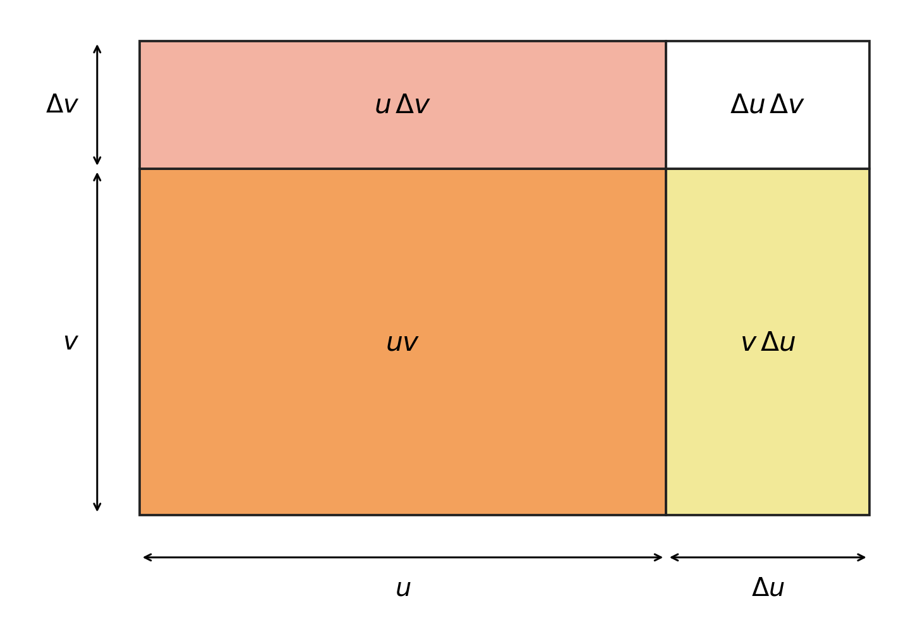

<a id="p01"></a>

[P01] Derivatives of products, quotients, sine and cosine

<a id="p02"></a>

[P02] You already have the standard derivative rules. This lecture connects them to the difference quotient: why a changing product has two contributions, why a quotient has a minus sign and a squared denominator, and why the sine and cosine formulas depend on angle units. The aim is to justify and use the rules, including cases where only values and rates at one point are known.

<a id="p03"></a>

[P03] Read [P04–P28](#p04) in order, pausing at attempts A–C. [P29–P31](#p29) give later retrieval and a new application. All attempts are original practice written for these notes. Each has links to a useful hint and a complete solution. The [hints](#p33) are grouped separately from the [solutions](#p39); follow a return link to resume the core reading.

<a id="p04"></a>

[P04] Specific derivative formulas concern named functions such as a power or a reciprocal. General rules describe how to differentiate combinations of functions. In the general rules, $`u`$ and $`v`$ are real-valued functions of the same input. Thus $`(u+v)(x)=u(x)+v(x)`$, $`(uv)(x)=u(x)v(x)`$, and $`(u/v)(x)=u(x)/v(x)`$ where $`v(x)\ne0`$. Multiplication here combines two outputs at the same input; it is not composition $`u(v(x))`$. For example, with $`u(x)=x`$ and $`v(x)=\sin x`$, the product is $`x\sin x`$. To construct a quotient from “the output of $`u`$ divided by the output of $`v`$”, put both outputs at the same input and retain the denominator restriction. We write $`h`$ for the lecture’s input increment $`\Delta x`$; during a derivative calculation, $`x`$ stays fixed while $`h`$ tends to zero.

<a id="p05"></a>

[P05] Recall the definition below. The fraction is the average rate over the increment $`h\ne0`$; a finite limit as $`h`$ approaches zero from either side is the derivative at $`x`$. Functions are assumed defined on an open interval around the point unless a restriction is stated. We use these finite-limit laws: a sum, a constant multiple and a product of quantities with finite limits have the corresponding sum, multiple and product as limits; a quotient has the quotient limit when the denominator’s limit is nonzero. These are analytic facts used in the proofs, not rules for substituting into an undefined expression. For instance, if $`A(h)\to3`$ and $`B(h)\to0`$, then $`A(h)B(h)\to0`$, whereas these facts alone do not determine $`A(h)/B(h)`$.

```math
f'(x)=\lim_{h\to0}\frac{f(x+h)-f(x)}{h}.
```

<a id="p06"></a>

[P06] Suppose $`u`$ and $`v`$ are differentiable at $`x`$. The sum rule follows because the difference in a sum is exactly the sum of its differences. Both resulting difference quotients have finite limits by the hypothesis, so the sum limit law applies:

```math
\frac{(u+v)(x+h)-(u+v)(x)}{h}=\frac{u(x+h)-u(x)}{h}+\frac{v(x+h)-v(x)}{h}.
```

```math
(u+v)'(x)=u'(x)+v'(x).
```

<a id="p07"></a>

[P07] If $`c`$ is constant as $`x`$ changes, it factors out of the difference quotient and its limit. Taking $`c=-1`$ also supplies subtraction. If the multiplier itself changes, this argument does not apply: the later product proof will account for that second change.

```math
\frac{cu(x+h)-cu(x)}{h}=c\frac{u(x+h)-u(x)}{h}\quad\longrightarrow\quad(cu)'(x)=cu'(x).
```

<a id="p08"></a>

[P08] A worked use: let $`r(t)=3a(t)-b(t)`$ be a calibrated reading, where $`a`$ and $`b`$ are differentiable voltage readings and the coefficient 3 is fixed. If, at one time, $`a'=0.2\ \mathrm{V\,s^{-1}}`$ and $`b'=0.5\ \mathrm{V\,s^{-1}}`$, then $`r'=3a'-b'=0.1\ \mathrm{V\,s^{-1}}`$ there. The positive sign means the combined reading has a positive instantaneous rate even though the subtracted reading is also increasing. The full formulas for $`a(t)`$ and $`b(t)`$ are unnecessary: the general rule uses their local rates.

<a id="p09"></a>

[P09] Attempt A: interpret a combined rate. A different calibration is $`r(t)=2a(t)-b(t)`$, with fixed coefficient 2. At $`t_0`$, $`a'=0.30\ \mathrm{V\,s^{-1}}`$ and $`b'=0.40\ \mathrm{V\,s^{-1}}`$. Find $`r'(t_0)`$ and state whether the reading has a positive or negative instantaneous rate. Give the derivative relation, signed value and units; a statement about this instant is sufficient, without claiming monotonic behaviour over an entire interval. [Hint A](#p34) · [Solution A](#p40) · [Continue](#p10).

<a id="p10"></a>

[P10] For trigonometric functions, take angles in radians. The two familiar limits below are the starting premises used by this lecture. The fractions need not be defined at $`h=0`$ to have limits there. Directly in the derivative definition, $`\sin0=0`$ and $`\cos0=1`$ show that they give the sine derivative 1 and cosine derivative 0 at the origin. They do not yet give the derivatives at other inputs; angle addition makes that connection.

```math
\lim_{h\to0}\frac{\sin h}{h}=1,\qquad \lim_{h\to0}\frac{\cos h-1}{h}=0.
```

<a id="p11"></a>

[P11] For a general fixed $`x`$, use $`\sin(x+h)=\sin x\cos h+\cos x\sin h`$. Subtracting $`\sin x`$ and dividing by $`h`$ produces the two known limit forms. The factors $`\sin x`$ and $`\cos x`$ are constants with respect to $`h`$, which is why they stay outside those limits:

```math
\frac{\sin(x+h)-\sin x}{h}=\sin x\frac{\cos h-1}{h}+\cos x\frac{\sin h}{h}\quad\longrightarrow\quad\sin x\cdot0+\cos x\cdot1=\cos x.
```

Thus $`(\sin x)'=\cos x`$ for every real $`x`$ measured in radians.

<a id="p12"></a>

[P12] The corresponding cosine identity is $`\cos(x+h)=\cos x\cos h-\sin x\sin h`$. Its minus sign survives the subtraction and the limit:

```math
\frac{\cos(x+h)-\cos x}{h}=\cos x\frac{\cos h-1}{h}-\sin x\frac{\sin h}{h}\quad\longrightarrow\quad\cos x\cdot0-\sin x\cdot1=-\sin x.
```

So $`(\cos x)'=-\sin x`$. At $`x=\pi/3`$, for example, the sine graph has slope $`1/2`$, while the cosine graph has slope $`-\sqrt3/2`$. The latter is descending; the sign is part of the result.

<a id="p13"></a>

[P13] Angle units are a condition on the input, not a calculator preference that leaves a derivative unchanged. If $`d`$ is a numerical angle in degrees, define $`s(d)=\sin(\pi d/180)`$, where the sine on the right takes radians. In the difference quotient for $`s`$, put $`k=\pi\delta/180`$, where $`\delta`$ is the change in degrees. Then $`\delta=180k/\pi`$ and $`k\to0`$ with $`\delta\to0`$; the quotient is $`\pi/180`$ times the radian sine difference quotient at $`\pi d/180`$. Consequently $`s'(d)=(\pi/180)\cos(\pi d/180)`$. In particular, the slope at zero is $`\pi/180`$ per degree, instead of 1 per radian. The same input conversion gives $`-(\pi/180)\sin(\pi d/180)`$ for the degree-input cosine.

<a id="p14"></a>

[P14] The product proof will use continuity at a point. Here that means $`u(x+h)\to u(x)`$ as $`h\to0`$: nearby inputs have outputs approaching the value at the point. Differentiability supplies this property. For nonzero $`h`$,

```math
u(x+h)-u(x)=h\frac{u(x+h)-u(x)}{h}\quad\longrightarrow\quad0\cdot u'(x)=0.
```

The second factor has a finite limit because $`u`$ is differentiable at $`x`$, so the product limit law justifies the step. Adding $`u(x)`$ gives the required continuity statement. We have used a product law for numerical limits, not the derivative product rule we are about to prove.

<a id="p15"></a>

[P15] Now let $`u`$ and $`v`$ be differentiable at $`x`$. A product changes because either factor can change. Start with its exact numerator, $`u(x+h)v(x+h)-u(x)v(x)`$. Insert and subtract the same intermediate product $`u(x+h)v(x)`$. This intermediate product uses the new value of $`u`$ and the old value of $`v`$; it splits the total change into two manageable changes without altering it:

```math
u(x+h)v(x+h)-u(x)v(x)=[u(x+h)-u(x)]v(x)+u(x+h)[v(x+h)-v(x)].
```

Expanding the right side cancels $`-u(x+h)v(x)+u(x+h)v(x)`$, recovering the original numerator. This verifies the regrouping.

<a id="p16"></a>

[P16] Divide that identity by $`h\ne0`$ and take the limit. The first difference quotient tends to $`u'(x)`$ and the second to $`v'(x)`$. By P14, $`u(x+h)\to u(x)`$. Hence all limits used below exist and are finite:

```math
\frac{(uv)(x+h)-(uv)(x)}{h}=\frac{u(x+h)-u(x)}{h}v(x)+u(x+h)\frac{v(x+h)-v(x)}{h}.
```

```math
(uv)'(x)=u'(x)v(x)+u(x)v'(x).
```

Each term pairs one rate with the other factor’s value at the same point. The right side is a sum of two contributions, not a product of two rates.

<a id="p17"></a>

[P17] For $`f(x)=x\sin x`$, choose $`u(x)=x`$ and $`v(x)=\sin x`$. Their derivatives are 1 and $`\cos x`$, so

```math
f'(x)=1\cdot\sin x+x\cos x.
```

At $`x=\pi`$, this is $`-\pi`$: the product is zero there, but its slope is not zero. A proposed rule $`(uv)'=u'v'`$ would instead give $`\cos x`$. A simpler counterexample also exposes it: $`u=v=x`$ gives $`uv=x^2`$ with derivative $`2x`$, whereas $`u'v'=1`$. At $`x=0`$ these disagree. This is an anticipated wrong rule, not a report of an error you have made.

<a id="p18"></a>

[P18] The lecture’s second view uses increments. For this calculation alone, abbreviate $`u=u(x)`$, $`v=v(x)`$, $`\Delta u=u(x+h)-u(x)`$, and $`\Delta v=v(x+h)-v(x)`$. Then the new values are $`u+\Delta u`$ and $`v+\Delta v`$. The symbols $`\Delta u`$ and $`\Delta v`$ denote finite output changes associated with the same input change $`h`$; neither is a derivative. Expanding the new product gives the exact identity

```math
\Delta(uv)=(u+\Delta u)(v+\Delta v)-uv=u\Delta v+v\Delta u+\Delta u\Delta v.
```

Here $`\Delta(uv)`$ means the change of the whole product; it differs from the product of the two changes, $`\Delta u\Delta v`$.

<a id="p19"></a>

[P19] The diagram redraws the source’s Figure 1. The orange rectangle has width $`u`$, height $`v`$ and area $`uv`$. Increasing height adds the top red strip $`u\Delta v`$; increasing width adds the right yellow strip $`v\Delta u`$. Doing both also adds the white corner $`\Delta u\Delta v`$. All four pieces together have area $`(u+\Delta u)(v+\Delta v)`$. This literal area picture assumes positive side lengths and positive increments. Negative increments would remove area, and negative function values need not be physical lengths; P18’s algebra remains valid for signed real values and changes.



<a id="p20"></a>

[P20] The corner is small, but the derivative is change divided by $`h`$. Its contribution must therefore be checked after division. By differentiability, $`\Delta u/h\to u'(x)`$; by P14 applied to $`v`$, $`\Delta v\to0`$. Thus

```math
\frac{\Delta u\Delta v}{h}=\left(\frac{\Delta u}{h}\right)\Delta v\quad\longrightarrow\quad u'(x)\cdot0=0.
```

Dividing the full identity in P18 by $`h`$ now gives the product rule again: $`u(\Delta v/h)+v(\Delta u/h)`$ tends to $`uv'+vu'`$, and the remaining term tends to zero. Merely knowing a numerator tends to zero would be insufficient: $`h\to0`$, but $`h/h=1`$ for every nonzero $`h`$. The diagram explains the terms; the scaled limit completes the justification.

<a id="p21"></a>

[P21] Attempt B: use signed rates and justify an approximation. A rectangle has differentiable side lengths $`u(t)`$ and $`v(t)`$. At $`t_0`$, $`u=3\ \mathrm m`$, $`v=4\ \mathrm m`$, $`u'=-0.2\ \mathrm{m\,s^{-1}}`$ and $`v'=0.5\ \mathrm{m\,s^{-1}}`$. Find its instantaneous area rate and interpret the sign. Then assess this argument: “The extra product-increment term can be discarded after dividing by $`h`$ merely because $`\Delta u\Delta v\to0`$.” Give a valid limiting justification instead. A complete response has units and distinguishes decreasing length from negative length. [Hint B](#p35) · [Solution B](#p41) · [Continue](#p22).

<a id="p22"></a>

[P22] For a quotient, the original function $`q=u/v`$ requires $`v(x)\ne0`$. Suppose also that $`u`$ and $`v`$ are differentiable at $`x`$. We must ensure that $`v(x+h)`$ stays nonzero for all sufficiently small $`h`$ so that nearby quotient values exist. Continuity gives this: choose $`h`$ small enough that $`|v(x+h)-v(x)|\lt |v(x)|/2`$. Then $`v(x+h)`$ lies within half the distance from $`v(x)`$ to zero, so it cannot equal zero. For example, if $`v(x)=2`$, keeping its change smaller than 1 in magnitude leaves the nearby values between 1 and 3. The same argument works when $`v(x)`$ is negative.

<a id="p23"></a>

[P23] Use P18’s abbreviations at the fixed point. Form the change of the quotient with a common denominator; the two unchanged products $`uv`$ cancel. The subtraction determines the minus sign:

```math
\frac{u+\Delta u}{v+\Delta v}-\frac uv=\frac{(u+\Delta u)v-u(v+\Delta v)}{(v+\Delta v)v}=\frac{v\Delta u-u\Delta v}{(v+\Delta v)v}.
```

Both denominators are nonzero by P22. For positive values, a numerator increase with the denominator held fixed raises the quotient; a denominator increase with the numerator held fixed lowers it. When both change, the two signed contributions must be combined, as the exact formula shows.

<a id="p24"></a>

[P24] Divide the exact change by $`h`$. The two increment quotients tend to their derivatives, and $`v+\Delta v\to v`$. The denominator’s limit is $`v^2\ne0`$, so the quotient limit law is legal:

```math
\frac1h\left(\frac{u+\Delta u}{v+\Delta v}-\frac uv\right)=\frac{v(\Delta u/h)-u(\Delta v/h)}{(v+\Delta v)v}\quad\longrightarrow\quad\frac{vu'-uv'}{v^2}.
```

Restoring the input labels makes the rule and its evaluation point explicit:

```math
\left(\frac uv\right)'(x)=\frac{u'(x)v(x)-u(x)v'(x)}{[v(x)]^2},\qquad v(x)\ne0.
```

The denominator is the square of the original denominator’s value, not the square of its derivative.

<a id="p25"></a>

[P25] A worked use is $`q(x)=(x^2+1)/(x+1)`$, with domain $`x\ne-1`$. Choose numerator $`u=x^2+1`$ and denominator $`v=x+1`$, giving $`u'=2x`$ and $`v'=1`$. Keeping the numerator grouped prevents a sign error:

```math
q'(x)=\frac{2x(x+1)-(x^2+1)\cdot1}{(x+1)^2}=\frac{x^2+2x-1}{(x+1)^2},\qquad x\ne-1.
```

At $`x=1`$, the slope is $`2/4=1/2`$. A check using division gives $`q(x)=x-1+2/(x+1)`$ on the same domain; its derivative is $`1-2/(x+1)^2`$, the same expression. The quotient rule works directly, but simplifying first can be shorter when the algebra permits it.

<a id="p26"></a>

[P26] Attempt C: choose a method and track the actual function. Let $`q(x)=(x^2-1)/(x-1)`$ be defined only for $`x\ne1`$. Find $`q'`$ wherever it exists and decide whether $`q'(1)`$ exists. Now define $`Q(x)=q(x)`$ for $`x\ne1`$ and separately set $`Q(1)=2`$. Is $`Q`$ differentiable at 1, and with what derivative? Justify the domains as well as the calculation. Algebra may suggest a simpler method, but it cannot silently supply a missing function value. [Hint C](#p36) · [Solution C](#p42) · [Continue](#p27).

<a id="p27"></a>

[P27] A nonzero denominator and existing component derivatives are sufficient conditions for the quotient rule; if a condition fails, do not apply that rule at the point. This is a statement about the rule’s justification. A separately defined function can still have a derivative there, as the extension in attempt C invites you to determine. Likewise, differentiability of both factors is sufficient for the product proof; the proof does not establish the converse. Always start with the actual function and its domain, then choose a representation whose operations are legal at the point in question.

<a id="p28"></a>

[P28] The proofs share one method: rewrite the exact difference quotient into quantities whose limits are available, then check the conditions before passing to a limit. Sum and constant-multiple changes split immediately; trigonometric changes need angle addition; a product needs an intermediate product or its exact increment expansion; a quotient needs a common denominator and local nonvanishing. These are decisions you can reconstruct, rather than additional formulas to memorise.

<a id="p29"></a>

[P29] For a later return, leave the next two attempts until after a break if that is useful. The length of the break is adjustable, not a prescribed optimal schedule. Attempt D asks for retrieval of material already studied, with the preceding text covered. Attempt E asks for transfer to a new combination and a changed representation; consulting the notes is appropriate. Comparing with the complete solutions can identify a missing condition or warrant even when a final number agrees.

<a id="p30"></a>

[P30] Attempt D: retrieve formulas and their warrant. Without looking back, state the sum, constant-multiple, product, quotient, sine and cosine derivative rules, including their differentiability, domain and angle-unit conditions. Write the exact product increment identity and show why its cross term contributes zero to the derivative. A satisfactory response includes both the rules and the limiting reason; recalling only the product formula does not complete the task. [Hint D](#p37) · [Solution D](#p43).

<a id="p31"></a>

[P31] Attempt E: combine rules and compare representations. With radians, let $`F(x)=\sin x/(1+\cos x)`$. Obtain its derivative formula and find $`F'(\pi/3)`$. A second expression is $`G(x)=(1-\cos x)/\sin x`$. Explain where both expressions are defined and equal. Can the defining quotient for $`F'(0)`$ be replaced by $`[G(h)-G(0)]/h`$? Determine $`F'(0)`$ by a valid route. Give the domain reasoning as well as the derivatives: equality on shared inputs does not automatically give equal domains. [Hint E](#p38) · [Solution E](#p44).

<a id="p32"></a>

[P32] Source: MIT OpenCourseWare, 18.01 Single Variable Calculus, Fall 2006, [Lecture 3: Derivatives of Products, Quotients, Sine, and Cosine](https://ocw.mit.edu/courses/18-01-single-variable-calculus-fall-2006/23c2c1b1ab31c9f10745b18e7b0bf131_lec3.pdf). The source’s four teaching pages follow its cover. P19 redraws its Figure 1; the explanations, added worked uses and practice here are newly written. On printed page 1, the constant-multiple listing and sum-proof title omit a prime on the left; the correct derivative statements are used here. The lecture’s cosine calculation and limiting/domain conditions have been made explicit. [Return to the reading route](#p03).

<a id="p33"></a>

[P33] Hints. Each hint advances one decision without displaying the complete solution. Choose [A](#p34), [B](#p35), [C](#p36), [D](#p37) or [E](#p38), then return to the attempt. The complete answers start separately at [P39](#p39).

<a id="p34"></a>

[P34] Hint A. Differentiate the two contributions before substituting the rates: the fixed multiplier stays on $`a'`$, and the subtraction stays on $`b'`$. Compare twice the first rate with the second rate; the difference has units of voltage per time. [Return to A](#p09) · [Solution A](#p40).

<a id="p35"></a>

[P35] Hint B. The area is $`A=uv`$. Pair each side’s rate with the other side’s present length, then add the signed contributions. For the limit argument, rewrite the scaled corner term as $`(\Delta u/h)\Delta v`$. One factor has a finite derivative limit; identify the limit of the other using continuity. [Return to B](#p21) · [Solution B](#p41).

<a id="p36"></a>

[P36] Hint C. Factor $`x^2-1`$ before selecting a derivative rule. Write the restriction next to the simplified expression. A derivative at 1 needs a value of the function at 1 in its difference quotient. For $`Q`$, check whether the separately assigned value agrees with the simplified formula. [Return to C](#p26) · [Solution C](#p42).

<a id="p37"></a>

[P37] Hint D. Rebuild the product change by expanding the new product and subtracting the old one. Besides the two strips, keep the product of the increments until after division by $`h`$. For the quotient rule, the exact common-denominator numerator has one term from the numerator’s change and one from subtracting the denominator’s change. Review your conditions by asking which finite limits and divisions each proof used. [Return to D](#p30) · [Solution D](#p43).

<a id="p38"></a>

[P38] Hint E. In the quotient-rule numerator, the denominator derivative is $`-\sin x`$, so subtracting its contribution gives $`\cos x(1+\cos x)+\sin^2x`$. Simplify with the Pythagorean identity. To compare $`F`$ and $`G`$, multiply $`F`$ by $`(1-\cos x)/(1-\cos x)`$ only where that multiplier is defined, and retain every excluded input. At zero, inspect both function values before choosing a difference quotient. [Return to E](#p31) · [Solution E](#p44).

<a id="p39"></a>

[P39] Complete solutions. Choose [A](#p40), [B](#p41), [C](#p42), [D](#p43) or [E](#p44). Check your reasoning as well as your answer: a disagreement in a condition can matter even when arithmetic agrees. These are model solutions, not claims about an observed attempt.

<a id="p40"></a>

[P40] Solution A. The sum and constant-multiple rules give $`r'(t_0)=2a'(t_0)-b'(t_0)`$. Thus $`r'(t_0)=2(0.30)-0.40=0.20\ \mathrm{V\,s^{-1}}`$. The reading has a positive instantaneous rate. We used the coefficient 2 as a fixed multiplier, not as another changing reading, and used local rates rather than the readings’ values. The data alone do not establish monotonicity on a whole interval. [Return to A](#p09) · [Resume core](#p10).

<a id="p41"></a>

[P41] Solution B. From $`A=uv`$ and the product rule,

```math
A'(t_0)=u'v+uv'=(-0.2)(4)+(3)(0.5)=-0.8+1.5=0.7\ \mathrm{m^2\,s^{-1}}.
```

The area has a positive instantaneous rate: the contribution from the increasing side exceeds the loss from the decreasing side. Both lengths are positive; the negative rate says that the first length is decreasing. For an increment $`h`$ in time, differentiability gives $`\Delta u/h\to-0.2`$ and continuity gives $`\Delta v\to0`$. Therefore $`(\Delta u\Delta v)/h=(\Delta u/h)\Delta v\to0`$. Alternatively, $`h(\Delta u/h)(\Delta v/h)\to0\cdot(-0.2)\cdot0.5=0`$. Both routes check the term after scaling. The quoted argument omits that check; a numerator tending to zero alone would not warrant it. [Return to B](#p21) · [Resume core](#p22).

<a id="p42"></a>

[P42] Solution C. For $`x\ne1`$, factorisation gives $`q(x)=(x-1)(x+1)/(x-1)=x+1`$. Hence $`q'(x)=1`$ at every point of its domain. The original $`q(1)`$ is undefined, so $`q'(1)`$ is undefined too: its defining difference quotient requires $`q(1)`$. The new function $`Q`$ equals $`x+1`$ for $`x\ne1`$ and also at 1, since the assigned value is 2. It is therefore the line $`Q(x)=x+1`$ for all real $`x`$. Directly,

```math
Q'(1)=\lim_{h\to0}\frac{Q(1+h)-Q(1)}{h}=\lim_{h\to0}\frac{2+h-2}{h}=1.
```

Cancelling a factor simplified the original formula on its domain; the separate definition of $`Q(1)`$ is what supplied the formerly missing value. [Return to C](#p26) · [Resume core](#p27).

<a id="p43"></a>

[P43] Solution D. For $`u,v`$ differentiable at the point, and $`c`$ fixed with respect to the input,

```math
(u+v)'=u'+v',\qquad(cu)'=cu',\qquad(uv)'=u'v+uv'.
```

For the quotient also require $`v\ne0`$ at that point:

```math
\left(\frac uv\right)'=\frac{u'v-uv'}{v^2}.
```

All values and derivatives on either right side refer to the same input. The trigonometric rules for radian inputs are $`(\sin x)'=\cos x`$ and $`(\cos x)'=-\sin x`$ for all real $`x`$. A degree-valued input introduces the conversion factor from P13. With $`\Delta u=u(x+h)-u(x)`$ and $`\Delta v=v(x+h)-v(x)`$, the exact product change is

```math
\Delta(uv)=u\Delta v+v\Delta u+\Delta u\Delta v.
```

Since $`\Delta u/h\to u'(x)`$ is finite and $`\Delta v\to0`$, the last term after division has limit $`(\Delta u/h)\Delta v\to0`$. The two remaining terms give the two contributions to the product derivative. A correct formula plus “the corner is small” leaves this last warrant unstated. [Return to D](#p30) · [Transfer attempt E](#p31).

<a id="p44"></a>

[P44] Solution E. The domain of $`F`$ excludes $`x=(2k+1)\pi`$, for integers $`k`$, because those and only those inputs give $`1+\cos x=0`$. On this domain the numerator and denominator are differentiable and the denominator is nonzero. The quotient rule and $`\sin^2x+\cos^2x=1`$ give

```math
F'(x)=\frac{\cos x(1+\cos x)-\sin x(-\sin x)}{(1+\cos x)^2}=\frac{1+\cos x}{(1+\cos x)^2}=\frac1{1+\cos x}.
```

The cancellation is legal on $`F`$’s domain. Thus $`F'(\pi/3)=1/(1+1/2)=2/3`$. The domain of $`G`$ excludes every $`x=k\pi`$ because its denominator is $`\sin x`$. Wherever $`\sin x\ne0`$, both $`1-\cos x`$ and $`1+\cos x`$ are nonzero, since $`\sin^2x=(1-\cos x)(1+\cos x)`$. Hence

```math
F(x)=\frac{\sin x(1-\cos x)}{(1+\cos x)(1-\cos x)}=\frac{\sin x(1-\cos x)}{\sin^2x}=\frac{1-\cos x}{\sin x}=G(x)
```

on their common domain $`x\ne k\pi`$. At zero, however, $`F(0)=0`$ is defined while $`G(0)`$ is not. We cannot replace the defining quotient for $`F'(0)`$ by $`[G(h)-G(0)]/h`$. Using the valid formula for $`F'`$ gives $`F'(0)=1/2`$. The definition gives an independent route: $`F(h)/h=(\sin h/h)/(1+\cos h)\to1/2`$, using P10 and the continuity of cosine, which follows from its differentiability. There is also a legitimate partial substitution: for sufficiently small nonzero $`h`$, $`G(h)=F(h)`$, so $`[G(h)-F(0)]/h`$ has the same limit. What fails is supplying an undefined $`G(0)`$, not every use of the alternative expression. [Return to E](#p31) · [Reading route](#p03).
