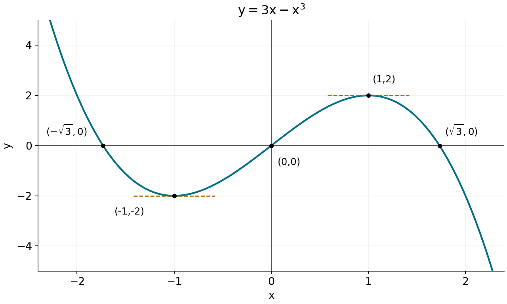
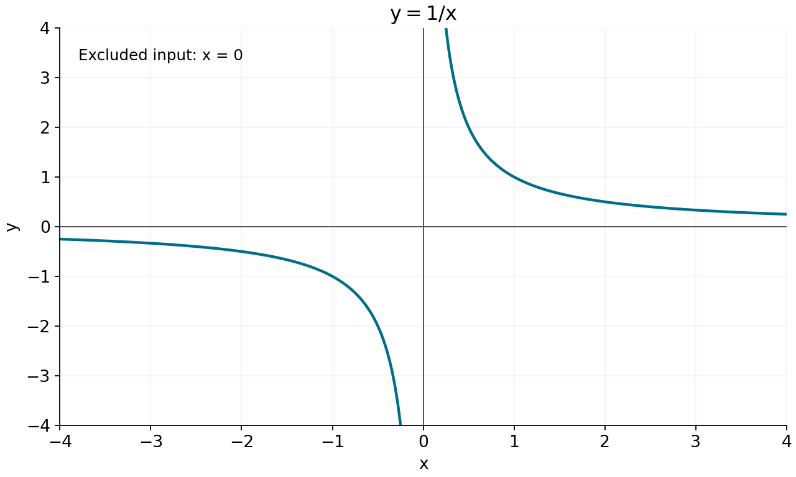
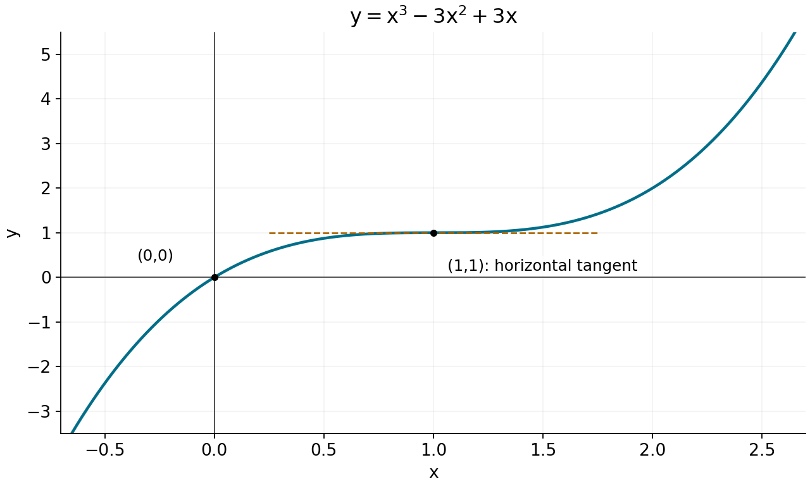
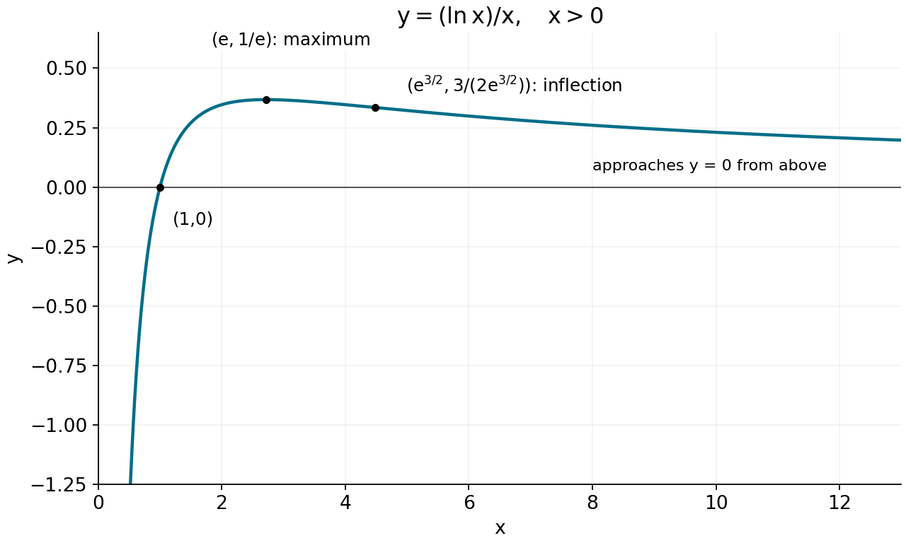

<a name="start"></a>

P001. Curve sketching: turning derivative information into a graph

P002. Read P003–P044 in order. Task A is an early supported application; Task B changes the classification question; Task C brings the checks together after a break. At each task, try as much as you can, then use its matched hint if needed. All [hints](#hints) are grouped before the separate [complete solutions](#solutions). Every help entry returns to its task. The four figures are part of these notes; their nearby descriptions give the same essential relationships.

P003. The aim is a qualitatively correct sketch: the right branches, rises and falls, turning points, intercepts, end behavior and bending. Exact scale is secondary. You already have polynomial algebra, logarithms, differentiation rules, sign inequalities, and elementary integration. Here we coordinate them so that a list of calculations becomes a justified curve. All four worked functions from MIT 18.01 Lecture 10 appear below; no earlier university lecture is needed.

P004. Throughout, $`y=f(x)`$ means that input $`x`$ determines vertical coordinate $`y`$. The prime in $`f'(x)`$ denotes the derivative, the tangent slope at that input. The second prime in $`f''(x)`$ denotes the derivative of that slope. The notation $`x_0`$ names one fixed input, and $`y_0=f(x_0)`$ its height; the corresponding graph point is $`(x_0,y_0)`$. A value such as $`f(x_0)=0`$ puts a point on the horizontal axis; $`f'(x_0)=0`$ makes its tangent horizontal. These are different statements.

P005. Read a graph from left to right. On an interval where $`f`$ is differentiable, $`f'\gt 0`$ throughout makes it increasing, and $`f'\lt 0`$ throughout makes it decreasing. “Increasing” means that a larger input has a larger output within that interval. The sign of the height does not decide this: a curve below the axis can be rising toward it. To build a sketch from a derivative sign, draw a rising or falling piece over that interval, then use actual function values to place that piece vertically.

P006. A stationary input has $`f'(x_0)=0`$. Lecture 10 calls this input a “critical point”; we will say stationary input and distinguish it from the graph point. For a continuous curve near it, a derivative change from negative to positive gives a local minimum: nearby values on both sides are higher. Positive to negative gives a local maximum: nearby values are lower. “Local” compares only nearby points; an absolute maximum or minimum compares the entire domain. A horizontal tangent by itself does not imply either sort of turn. Also check inputs where the derivative fails to exist, if any are in the domain: for example, $`|x|`$ has a minimum at its corner at zero. All four worked functions here are differentiable at every input in their domains.

P007. A useful order is: determine the domain and its breaks; find stationary inputs and any other places where differentiability fails; determine derivative signs on the resulting intervals; place accessible function values and intercepts; determine behavior at the domain ends, including infinities; then add concavity. A sign line is simply an ordered list of intervals with the derivative sign on each. Split it at excluded inputs as well as derivative zeros. A test value determines the sign throughout an interval only when the expression cannot change sign within it; factoring often shows exactly where such a change is possible. You need not find a complicated intercept exactly to establish the main shape, but any unresolved location must remain approximate or unspecified.

P008. Worked sketch: $`f(x)=3x-x^3`$. A polynomial is defined and continuous for every real input, so there are no domain breaks. Differentiation gives

```math
f'(x)=3-3x^2=3(1-x)(1+x).
```

P009. The derivative vanishes at $`x=-1`$ and $`x=1`$. If $`x\lt -1`$, the factors $`1-x`$ and $`1+x`$ have opposite signs, so $`f'\lt 0`$. If $`-1\lt x\lt 1`$, both factors are positive, so $`f'\gt 0`$. If $`x\gt 1`$, they again have opposite signs, so $`f'\lt 0`$. Thus the sign line, in increasing order of input, is negative on $`(-\infty,-1)`$, positive on $`(-1,1)`$, and negative on $`(1,\infty)`$.

P010. Substituting into the function, rather than into its derivative, gives $`f(-1)=-2`$ and $`f(1)=2`$. The decrease followed by increase makes $`(-1,-2)`$ a local minimum; increase followed by decrease makes $`(1,2)`$ a local maximum. Both tangents are horizontal. To find the horizontal-axis crossings, solve a different equation:

```math
f(x)=x(3-x^2)=0
\quad\Longleftrightarrow\quad
x=-\sqrt3,\ 0,\ \sqrt3.
```

P011. For the tails, write $`f(x)=-x^3(1-3/x^2)`$ when $`x\ne0`$. As the magnitude of $`x`$ grows, the factor in parentheses tends to $`1`$. Hence $`f(x)\to+\infty`$ as $`x\to-\infty`$, and $`f(x)\to-\infty`$ as $`x\to+\infty`$. The notation $`x\to+\infty`$ means arbitrarily large positive inputs; infinity is not an input at which to evaluate the formula. These tails show that neither local extremum is an absolute one.

P012. Now construct the curve. Starting far to the left, descend from large positive heights, cross at $`-\sqrt3`$, and level out at $`(-1,-2)`$. Rise through the origin to $`(1,2)`$, then descend through $`\sqrt3`$ and continue downward. Each connection uses the derivative sign on the intervening interval. This is stronger evidence than joining a few plotted points with an arbitrary smooth line. We will check the bending of this same curve in P030–P032.



P013. In the figure, horizontal position is $`x`$ and vertical position is $`y=f(x)`$. Filled black dots mark included points, not holes. The short dashed horizontal lines show the tangents at the local minimum and maximum. The curve continues beyond the displayed window with the tails established in P011.

<a name="task-a"></a>

P014. Task A — first supported application. Target: assemble a polynomial sketch and distinguish the roles of derivative zeros and function zeros. For $`r(x)=x^3-3x+2`$, you may use $`r(x)=(x-1)^2(x+2)`$. Give its derivative sign on the intervals separated by its stationary inputs, classify and locate the stationary points, find its $`x`$-intercepts, and describe both tails. Explain whether the graph crosses or merely touches the $`x`$-axis at each intercept. A successful response connects each rise/fall or turn to a derivative sign and uses the factor signs to justify the intercept behavior. A labelled sketch or an ordered written description is acceptable. [Hint A](#hint-a) · [Solution A](#solution-a).

P015. Worked sketch: $`q(x)=1/x`$. Its domain is $`(-\infty,0)\cup(0,\infty)`$: the union symbol joins the two sets of allowed inputs, and parentheses exclude their endpoints. There is no value at zero. Its derivative is $`q'(x)=-1/x^2\lt 0`$ at every allowed input because $`x^2\gt 0`$ there. We therefore obtain two decreasing pieces, one on each domain interval.

P016. We cannot join those pieces through zero. Nor is the function decreasing across its entire disconnected domain: $`-1\lt 1`$, but $`q(-1)=-1\lt 1=q(1)`$. A globally decreasing function would require the earlier value to be larger. The derivative sign rule in P005 applies on an interval of differentiability; the interval from $`-1`$ to $`1`$ would include the forbidden input zero. A single continuous descending curve would contradict both the domain and these values.

P017. Approach zero separately from the two sides. The notation $`x\to0^-`$ means inputs smaller than zero tending to zero; $`x\to0^+`$ means inputs larger than zero tending to zero. A reciprocal of a small negative number is a large negative number, whereas a reciprocal of a small positive number is a large positive number:

```math
\lim_{x\to0^-}\frac1x=-\infty,
\qquad
\lim_{x\to0^+}\frac1x=+\infty.
```

P018. The line $`x=0`$ is a vertical asymptote: at least one one-sided limit as the input tends to that line is $`+\infty`$ or $`-\infty`$. This means all sufficiently nearby inputs on that side have arbitrarily large positive, or arbitrarily large negative, values; isolated unbounded values alone do not establish the asymptote. Here both do, in opposite directions. There is no point “at infinity” joining the branches. At the other ends, $`1/x\to0`$ as $`x\to\pm\infty`$, from below on the negative side and from above on the positive side. The line $`y=0`$ is a horizontal asymptote, describing this tail behavior. A horizontal asymptote is not generally a line a graph may never cross, although this particular function cannot equal zero because its numerator is $`1`$.



P019. The left branch falls from heights close to zero below the axis to arbitrarily negative heights near $`0^-`$. The right branch falls from arbitrarily positive heights near $`0^+`$ toward zero above the axis. The coordinate axes are asymptotes in this example; neither belongs to the curve. There are no stationary inputs or extrema. Domain restrictions are therefore part of the shape, not a preliminary calculation to forget afterward.

P020. Worked sketch: $`s(x)=x^3-3x^2+3x`$. The domain is all real numbers, and

```math
s'(x)=3x^2-6x+3=3(x-1)^2.
```

P021. The derivative is zero at $`1`$ and positive on both sides. Its graph point is $`(1,1)`$. The curve rises toward this height from the left, becomes horizontal momentarily, and continues rising on the right. It does not reverse direction. The equivalent expression

```math
s(x)=(x-1)^3+1
```

also confirms the whole shape: subtracting $`1`$ shifts the cubic's input right by $`1`$, and adding $`1`$ shifts its output up by $`1`$. Expanding returns exactly the original polynomial. Since cubing preserves the order of real numbers, this expression also establishes strict increase across the stationary input itself. Solving $`(x-1)^3=-1`$ gives its only zero, $`x=0`$. Its left tail tends to $`-\infty`$ and its right tail to $`+\infty`$.



P022. The dashed line $`y=1`$ is the tangent at the filled point $`(1,1)`$. It is not an extra portion of the graph. The curve passes through that height rather than turning back. This gives a worked counterexample to “every stationary point is a maximum or minimum.”

P023. Concavity describes how the slope changes as we move right. Since $`f''`$ is the derivative of $`f'`$, positive $`f''`$ makes the slope increase; this is concave up, also called convex in the lecture. Negative $`f''`$ makes the slope decrease; this is concave down. Keep the two questions separate: the sign of $`f'`$ decides whether the height rises or falls, while the sign of $`f''`$ decides whether the slope rises or falls.

P024. For a concrete reading and construction, $`y=x^2`$ has slopes $`2x=-2,0,2`$ at inputs $`-1,0,1`$. As the tangent turns from downward-sloping through horizontal to upward-sloping, the curve bends upward. The curve $`y=-x^2`$ has slopes $`2,0,-2`$ at the same inputs and bends downward. To draw concave-up behavior on an interval where the slope remains negative, draw a descending curve that becomes less steep: slopes can increase from $`-4`$ to $`-1`$ without ever becoming positive. Thus concavity does not itself require a maximum or minimum.

P025. The second derivative test is a shortcut for classifying a stationary input. In the smooth situations here, if $`f'(x_0)=0`$ and $`f''(x_0)\gt 0`$, the input gives a strict local minimum; if $`f''(x_0)\lt 0`$, it gives a strict local maximum. To see the connection, suppose the second derivative is continuous near $`x_0`$ and positive there. Then $`f'`$ increases through its value zero, so it is negative just before and positive just after. P006 gives the minimum. Negative second derivative reverses the signs and gives a maximum. The test supplies local, not absolute, conclusions.

P026. If $`f''(x_0)=0`$, that test is inconclusive. Use signs on the two sides to find out what actually happens. Also, an inflection point is an included point on a continuous curve where concavity changes. For these smooth examples, checking the sign of $`f''`$ on each side settles that question. A zero of $`f''`$ is a candidate, not a sufficient condition. At an in-domain point where $`f''`$ is undefined, a change of concavity can also require investigation; an excluded input cannot be an inflection point of the graph.

P027. For the shifted cubic, $`s''(x)=6(x-1)`$ is negative before $`1`$ and positive after. Thus $`(1,1)`$ is an inflection point as well as a stationary point. It remains neither a maximum nor a minimum, as P021 already established. For the reciprocal, $`q''(x)=2/x^3`$ is negative on $`x\lt 0`$ and positive on $`x\gt 0`$. Its two branches have different concavities, but there is no inflection point between them because zero is outside the domain.

P028. Task B will distinguish a zero second derivative from an actual change of concavity. First return to the original cubic to see an inflection with a different slope.

P029. For $`f(x)=3x-x^3`$, differentiating again gives $`f''(x)=-6x`$. It is positive for $`x\lt 0`$, zero at zero, and negative for $`x\gt 0`$. The cubic is concave up throughout the negative half of its domain and concave down throughout the positive half.

P030. Combining this with P009 gives four pieces. Before $`-1`$ the curve decreases while its negative slope increases toward zero. Between $`-1`$ and $`0`$ it increases with increasing positive slope. Between $`0`$ and $`1`$ it still increases, but the positive slope decreases toward zero. After $`1`$ it decreases with increasingly negative slope. These statements explain the bending in the first figure, rather than adding an arbitrary visual flourish.

P031. The concavity change occurs at $`(0,0)`$, so this is an inflection point. Its slope is $`f'(0)=3`$, so an inflection need not have a horizontal tangent. At the two stationary inputs, $`f''(-1)=6\gt 0`$ and $`f''(1)=-6\lt 0`$, confirming the local minimum and maximum already found by first-derivative signs.

P032. The role of each test is now distinct: a root of $`f`$ locates an axis intersection, a root of $`f'`$ locates a horizontal tangent, and a root of $`f''`$ locates a possible change of concavity. A point may satisfy more than one condition, but one condition does not imply the others.

<a name="task-b"></a>

P033. Task B — changed application. Target: decide what a zero second derivative can and cannot establish. For $`v(x)=x^4`$ and $`w(x)=x^3`$, classify the origin as a local maximum, local minimum, or neither, and decide whether it is an inflection point. Use first- and second-derivative signs on both sides of zero; stating only their values at zero is insufficient. Explain what the second derivative test reports at zero for each function, and which additional evidence settles the classification. [Hint B](#hint-b) · [Solution B](#solution-b).

P034. Worked sketch: $`L(x)=(\ln x)/x`$. The numerator is the natural logarithm of $`x`$; the entire logarithm is divided by $`x`$. Real logarithms require $`x\gt 0`$, which also keeps the denominator nonzero. There is only one domain interval, $`(0,\infty)`$, and there is no vertical-axis intercept.

P035. The quotient rule, with numerator $`\ln x`$ and denominator $`x`$, gives

```math
L'(x)=\frac{x(1/x)-(\ln x)\cdot1}{x^2}
=\frac{1-\ln x}{x^2}.
```

The denominator is positive throughout the domain, so the numerator controls the sign. It is zero when $`\ln x=1`$, equivalently $`x=e`$.

P036. Because $`\ln x`$ increases, $`1-\ln x\gt 0`$ on $`0\lt x\lt e`$ and is negative on $`x\gt e`$. Thus $`L`$ rises up to $`(e,1/e)`$ and falls thereafter. This is the absolute maximum: every other allowed input lies on one of those two monotone pieces with a smaller value. The only zero is at $`x=1`$, since division by a nonzero $`x`$ gives $`L(x)=0`$ exactly when $`\ln x=0`$. Heights are negative before $`1`$ and positive after it.

P037. We still need the two ends of this interval. As $`x\to0^+`$, the numerator becomes negative with arbitrarily large magnitude and the denominator becomes small and positive. An explicit bound makes the conclusion secure: when $`0\lt x\lt e^{-1}`$, $`\ln x\lt -1`$, so

```math
L(x)\lt -\frac1x.
```

The right side falls below any chosen negative level for sufficiently small positive $`x`$. The left side is even smaller, so $`L(x)\to-\infty`$. The boundary line $`x=0`$ is a vertical asymptote, approached only from the right in this domain.

P038. For large positive $`x`$, both numerator and denominator grow; that alone does not decide the quotient's limit. Checking only selected values such as $`x=2^n`$ would not yet control all intervening inputs. We can instead bound the quotient for every $`x\ge1`$. On $`1\le t\le x`$, $`\sqrt t\le t`$, so taking positive reciprocals gives $`1/t\le1/\sqrt t`$. Here $`t`$ is the variable running through the integral, while $`x`$ is its upper endpoint. Integrating preserves this inequality because it compares areas under nonnegative curves:

```math
0\le\ln x=\int_1^x\frac{1}{t}\,dt
\le\int_1^x\frac{1}{\sqrt t}\,dt
=2(\sqrt x-1).
```

P039. The first integral is $`\ln x-\ln1=\ln x`$ by the antiderivative rule; the last uses $`t^{-1/2}`$. Dividing the bound by positive $`x`$ gives

```math
0\le\frac{\ln x}{x}
\le\frac{2(\sqrt x-1)}x
\le\frac{2}{\sqrt x}.
```

The last bound tends to zero. The quotient is trapped between zero and that shrinking positive bound, so it tends to zero too. Since it is positive for $`x\gt 1`$, the curve approaches the horizontal asymptote $`y=0`$ from above.

P040. To complete the bending, differentiate $`L'(x)=(1-\ln x)x^{-2}`$ using the product rule:

```math
L''(x)=(-1/x)x^{-2}-2(1-\ln x)x^{-3}
=\frac{2\ln x-3}{x^3}.
```

The denominator is positive. The numerator changes from negative to positive at $`x=e^{3/2}`$, so the curve is concave down on $`(0,e^{3/2})`$ and concave up on $`(e^{3/2},\infty)`$. Its inflection point is $`(e^{3/2},3/(2e^{3/2}))`$. Since $`e^{3/2}\gt e`$, the inflection is on the descending branch, after the maximum. At the maximum itself, $`L''(e)=-1/e^3\lt 0`$, consistent with the local second derivative test.



P041. Build the figure in that order: enter from arbitrarily negative heights near the excluded boundary zero, cross at $`(1,0)`$, rise to $`(e,1/e)`$, then descend toward zero without crossing it. The descending part first becomes steeper, then after the marked inflection becomes less steep. The finite picture cannot show the entire tail; P039 establishes its endpoint behavior beyond the picture. The two marked special points have different roles: the first changes the direction of height change; the second changes how the slope varies.

P042. Before finishing a sketch, reconcile the evidence. Every drawn piece must occupy allowed inputs; an excluded input must not be filled by a smooth join. Every labelled height comes from the original function. A turn must agree with the first-derivative signs, and bending must agree with the second-derivative signs. Check one-sided limits at each domain break and the tails at both extremes that belong to the domain. This checks the whole graph, including regions between the special points.

<a name="task-c"></a>

P043. Task C — later retrieval and integrated transfer. Target: choose and coordinate the sketching checks for a new function with a disconnected domain. Return after a break, at a time that suits your study. First, without looking back, state what the signs of $`f'`$ and $`f''`$ tell you and why the domain comes before a derivative sign line. Then analyse $`h(x)=(x-1)/x^2`$. Give the domain, intercepts, one-sided behavior at every excluded input, behavior as $`x`$ tends to each infinity, stationary points with classification, increasing/decreasing intervals, concavity intervals and inflection points. Supply a labelled sketch or an ordered description of every branch, with enough reasoning to distinguish a maximum from an inflection and an excluded input from a graph point. The preliminary explanation checks recall; the new rational function checks transfer. If stuck, record the last justified fact and use [Hint C](#hint-c). [Solution C](#solution-c).

P044. A break is an adjustable study suggestion, not a prescribed optimum interval. When checking your response, separate a calculation slip from a missing connection: correct derivative arithmetic still needs its signs interpreted over the correct domain. You may return to P007 for the workflow, P023 for the two meanings of sign, or P037–P039 for how a bound justifies an endpoint limit.

P045. Source: MIT OpenCourseWare, [18.01 Single Variable Calculus, Fall 2006, Lecture 10: Curve Sketching](https://ocw.mit.edu/courses/18-01-single-variable-calculus-fall-2006/d41418f410d1e11d0e606a0fc8441b82_lec10.pdf), all eight PDF pages, including the cover. The four worked functions follow that lecture. This recovery revision preserves the earlier draft’s explanations and Tasks A–C, with four newly constructed replacement plots; these are not recovered original images. The help below is part of this document, so no external source is needed to complete the tasks.

<a name="hints"></a>

P046. Hints. These give intermediate steps without the complete classifications. Use the entry matching your task, then return to your attempt before opening the solutions section.

<a name="hint-a"></a>

P047. Hint A. Start with $`r'(x)=3(x-1)(x+1)`$ and split the real line at the zeros of its two factors. Determine the sign of each factor on each interval. For the intercept at $`1`$, the factor $`(x-1)^2`$ has the same sign on both sides, while $`x+2`$ is positive nearby. Use that information to decide what the graph does at height zero. Substitute the stationary inputs into $`r`$, not $`r'`$, for their heights. [Return to Task A](#task-a) · [Solution A](#solution-a).

<a name="hint-b"></a>

P048. Hint B. The first derivatives are $`4x^3`$ and $`3x^2`$; differentiating these gives $`12x^2`$ and $`6x`$. An even power is positive on both sides of zero, whereas an odd power changes sign. First compare the two first-derivative sign patterns for turns; then compare the two second-derivative sign patterns for changes of concavity. [Return to Task B](#task-b) · [Solution B](#solution-b).

<a name="hint-c"></a>

P049. Hint C. Retain the restriction $`x\ne0`$ while rewriting $`h=x^{-1}-x^{-2}`$. This makes power-rule differentiation short. After differentiating, put each derivative over one denominator so its sign can be inspected. An odd power of $`x`$ in a denominator changes sign at zero; an even power does not. For the limits near zero, the original numerator is close to $`-1`$ and the denominator is positive and close to zero. For the tails, the rewritten terms each tend to zero; use the original numerator to decide the side of approach. [Return to Task C](#task-c) · [Solution C](#solution-c).

<a name="solutions"></a>

P050. Complete solutions. Compare the first consequential difference from your attempt, if there is one, rather than replacing correct parts of your work. The routes below are reasoned examples; an equivalent justified sign analysis and accurate labelled sketch are also acceptable.

<a name="solution-a"></a>

P051. Solution A. The domain is all real numbers. From $`r'(x)=3(x-1)(x+1)`$, both variable factors are negative when $`x\lt -1`$, so the derivative is positive. Between $`-1`$ and $`1`$ the factors have opposite signs, making the derivative negative. After $`1`$ both are positive. Thus the curve increases on $`(-\infty,-1)`$, decreases on $`(-1,1)`$, and increases on $`(1,\infty)`$. The positive-to-negative change gives a local maximum at $`(-1,r(-1))=(-1,4)`$; the negative-to-positive change gives a local minimum at $`(1,r(1))=(1,0)`$.

P052. The factorization $`r(x)=(x-1)^2(x+2)`$ gives roots $`-2`$ and $`1`$. Near $`-2`$, the squared factor stays positive and $`x+2`$ changes from negative to positive, so the curve crosses the axis. Near $`1`$, the squared factor is positive on either side and $`x+2\gt 0`$, so both neighboring heights are positive: the curve touches the axis at its minimum and turns upward. Its tails follow the leading term $`x^3`$: negative infinity on the left and positive infinity on the right. Neither local extremum is absolute.

P053. An ordered sketch therefore rises from the lower left, crosses at $`(-2,0)`$, reaches $`(-1,4)`$, falls through $`(0,2)`$ to touch at $`(1,0)`$, and rises to the upper right. The relation $`r=2-f`$ to the worked cubic gives a separate check: reflection in the horizontal axis swaps rises and falls, and the upward shift by $`2`$ changes the labelled heights. The stationary input $`-1`$ is not a root; the input $`1`$ happens to be both. [Return to Task A](#task-a) · [Hints](#hints).

<a name="solution-b"></a>

P054. Solution B. Both functions are continuous at the origin. For $`v=x^4`$, $`v'=4x^3`$ is negative to the left of zero and positive to the right, so the origin is a strict local minimum. It is also an absolute minimum because $`x^4\ge0`$ for every real input. But $`v''=12x^2`$ is positive on both sides: the curve stays concave up. Thus zero is not an inflection point.

P055. For $`w=x^3`$, $`w'=3x^2`$ is positive on both sides of zero, so there is no turn: the origin is neither a local maximum nor a local minimum. The second derivative $`w''=6x`$ changes from negative to positive, so the origin is an inflection point. Since $`w'(0)=0`$ too, it is a stationary inflection.

P056. For both functions, the derivative at zero is zero and the second derivative there is zero. Therefore the second derivative test reports “inconclusive” in both cases. The neighboring signs give the different answers. An anticipated wrong route would call both points inflections simply because their second derivatives vanish; the $`x^4`$ sign check is a direct counterexample. [Return to Task B](#task-b) · [Hints](#hints).

<a name="solution-c"></a>

P057. Solution C. Recall: $`f'`$ is the slope of the height graph, so its sign decides rise or fall on an interval. The second derivative describes change of that slope; positive means concave up, negative concave down. The domain must come first because a derivative sign does not authorize a curve through an excluded input or a monotonicity argument across a gap.

P058. For $`h(x)=(x-1)/x^2`$, the domain consists of $`x\lt 0`$ and $`x\gt 0`$. There is one horizontal-axis intercept, $`(1,0)`$, and no vertical-axis intercept. As $`x\to0`$ from either side, the numerator tends to $`-1`$ and the squared denominator approaches zero positively. Thus both one-sided limits are $`-\infty`$, giving vertical asymptote $`x=0`$. More explicitly, for $`0\lt |x|\lt 1/2`$, the numerator is less than $`-1/2`$, so $`h(x)\lt -1/(2x^2)`$; this bound tends to negative infinity on either side.

P059. At the far ends, write $`h=x^{-1}-x^{-2}`$. Both terms tend to zero as $`x\to\pm\infty`$, so $`y=0`$ is a horizontal asymptote. The original denominator is positive and the numerator has the sign of $`x-1`$. Hence the left tail approaches zero from below, while the right tail approaches it from above.

P060. Differentiating the power form gives

```math
h'(x)=-x^{-2}+2x^{-3}=\frac{2-x}{x^3}.
```

For $`x\lt 0`$, the numerator is positive and the denominator negative, so the derivative is negative. For $`0\lt x\lt 2`$, both are positive. For $`x\gt 2`$, the numerator is negative and the denominator positive. Therefore $`h`$ decreases on $`(-\infty,0)`$, increases on $`(0,2)`$, and decreases on $`(2,\infty)`$. Its only stationary point is $`(2,1/4)`$, a local maximum. It is also the absolute maximum: every left-branch value is negative, while the right branch rises to $`1/4`$ and then falls. The values near zero are unbounded below, so there is no absolute minimum, and the sign pattern gives no local minimum.

P061. Differentiating again gives

```math
h''(x)=2x^{-3}-6x^{-4}=\frac{2(x-3)}{x^4}.
```

Since $`x^4\gt 0`$ at every allowed input, this is negative for $`x\lt 3`$ within the domain and positive for $`x\gt 3`$. Concavity is therefore down on each of $`(-\infty,0)`$ and $`(0,3)`$, and up on $`(3,\infty)`$. At $`x=3`$ there is a graph point and a change of concavity, so $`(3,2/9)`$ is an inflection point. Its slope is $`h'(3)=-1/27`$, not zero. The excluded input zero is neither a stationary input nor an inflection point.

P062. To assemble the branches: on the left, begin just below the horizontal axis and descend, becoming steeper, toward negative infinity near $`0^-`$. On the right, begin at arbitrarily negative heights near $`0^+`$, rise through $`(1,0)`$ to the maximum $`(2,1/4)`$, and then descend toward the horizontal asymptote from above. The descending branch is concave down until $`(3,2/9)`$ and concave up afterward, so after that point its negative slope becomes less negative. Leave a gap at zero. This description accounts for every domain interval and distinguishes the maximum at $`2`$ from the inflection at $`3`$. [Return to Task C](#task-c) · [Hints](#hints) · [Start](#start).
