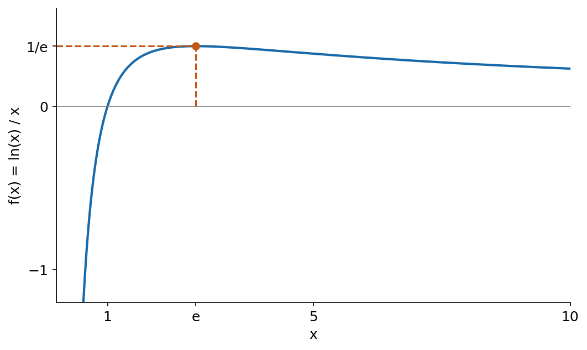
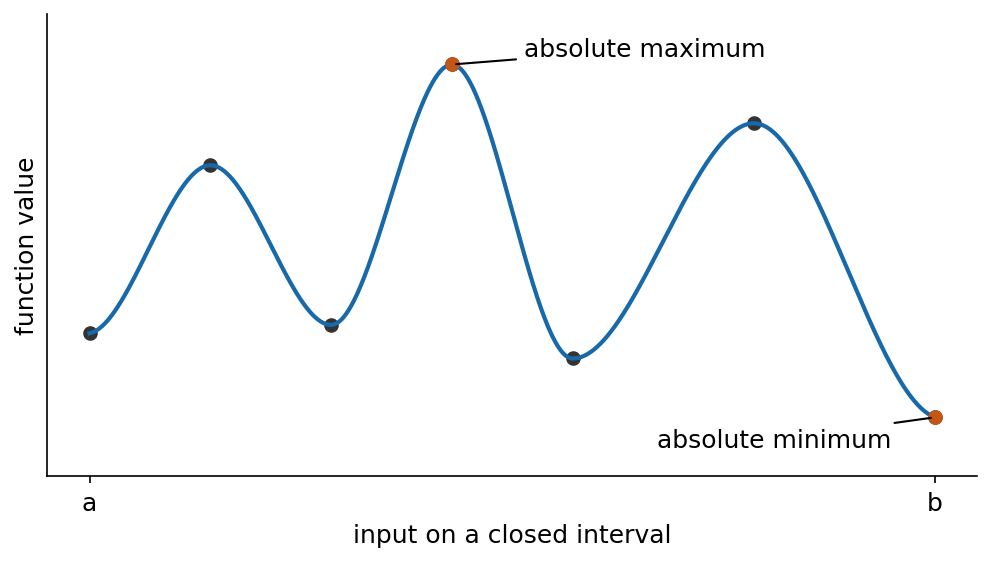
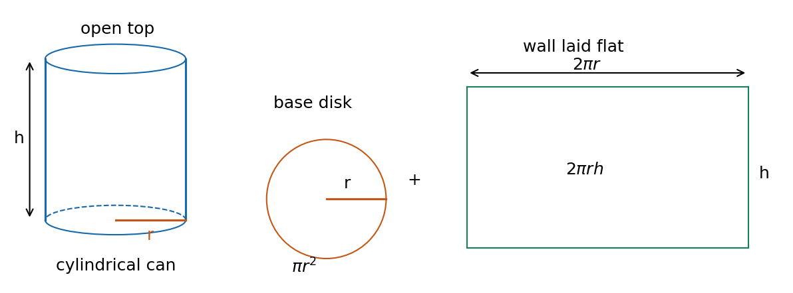
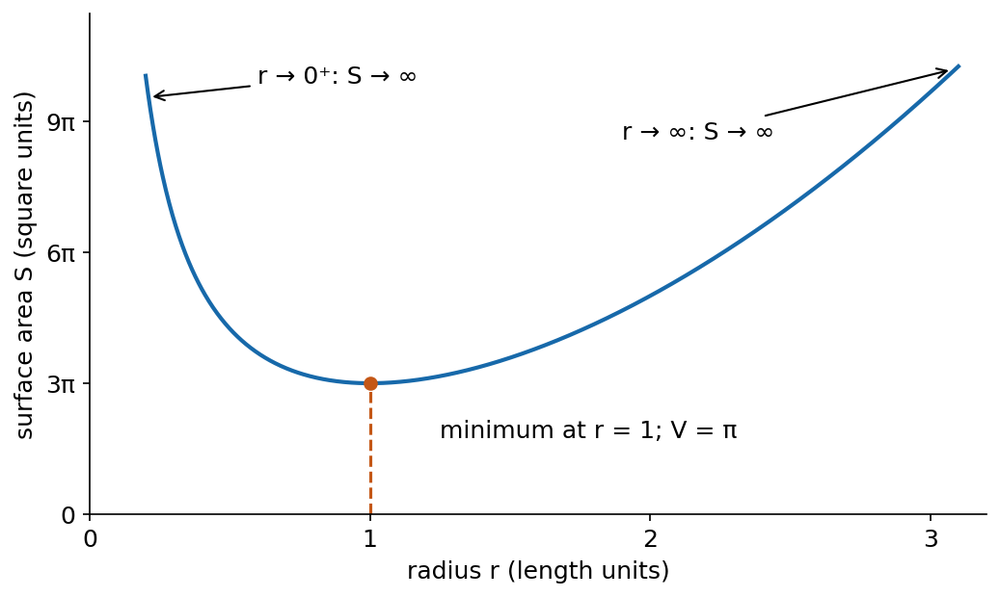
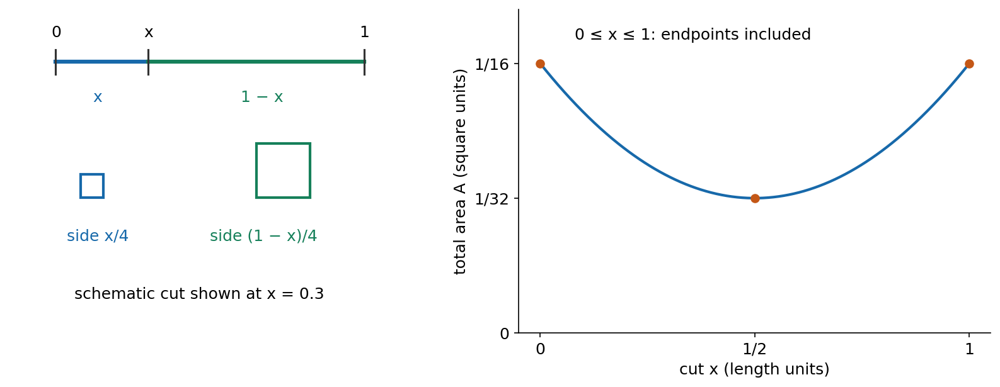

P001. Max/min problems — MIT 18.01, Lecture 11, Fall 2006

P002. The aim is to turn a description into a function on the correct domain, find its greatest or least attainable value, and report the configuration that produces it. Read P003–P039 in order, pausing at Q1, Q2 and Q3. [Hints](#hints) and [solutions](#solutions) are in separate groups after the main route; each has a return link. The differentiation, algebra and elementary geometry used here belong to the stated starting baseline. No earlier MIT lecture is required.

P003. A maximum value is an output. Its location is an input. For a function $`f`$ on a domain $`D`$, an absolute maximum at $`c`$ means that $`c`$ is allowed and $`f(c)\ge f(x)`$ for every $`x`$ in $`D`$. An absolute minimum reverses that inequality. “Absolute” means over the whole specified domain; a local maximum or minimum compares only nearby allowed inputs. There can be several inputs giving the same absolute value. Finding a stationary input, where $`f'(c)=0`$, only finds a candidate.

P004. For the lecture's first example, let $`f(x)=\ln x/x`$ with $`x\gt0`$. The denominator is $`x`$, so the entire logarithm is divided by $`x`$. The quotient rule gives

```math
f'(x)=\frac{x(1/x)-\ln x}{x^2}=\frac{1-\ln x}{x^2}.
```

P005. The denominator is positive. Since $`\ln x`$ increases and $`\ln e=1`$, the numerator is positive for $`0\lt x\lt e`$, zero at $`e`$, and negative for $`x\gt e`$. Thus the function increases all the way to $`e`$ and decreases thereafter. Every other allowed input gives a smaller value: the absolute maximum is $`f(e)=1/e`$, attained at $`x=e`$. The point on the graph is $`(e,1/e)`$; these three answers name different objects.

P006. Figure 1 connects the horizontal coordinate $`e`$ to the vertical height $`1/e`$. The curve crosses the axis at $`x=1`$, because $`\ln1=0`$. As $`x\to0^+`$, its values fall without a finite lower bound: for $`0\lt x\lt e^{-1}`$, we have $`\ln x\lt-1`$ and therefore $`f(x)\lt-1/x`$. There is no absolute minimum. The right-hand tail approaches zero from above. To see this without recalling a previous lecture, put $`t=\ln x`$. For $`t\ge0`$, the positive-term expansion of $`e^t`$ gives $`e^t\ge t^2/2`$, so $`0\le t/e^t\le2/t`$ for $`t\gt0`$; the upper bound tends to zero. Here $`t/e^t`$ is exactly $`\ln x/x`$.



P007. Finding all candidates. An interior input has allowed points on both sides. If a differentiable function has a local maximum at an interior input $`c`$, then for small positive $`h`$ its difference quotient $`[f(c+h)-f(c)]/h`$ is nonpositive, whereas for small negative $`h`$ it is nonnegative. If the two-sided derivative exists, its common limit must be both nonpositive and nonnegative, hence zero. The same argument with signs reversed works for a minimum. This explains why setting the derivative to zero is useful, and why that argument does not cover endpoints or inputs where the derivative fails to exist.

P008. In these notes a critical input is an interior input where the function is defined and its derivative is zero or does not exist. A corner can be an extremum: $`f(x)=|x|`$ has its minimum at zero, where its left and right slopes are $`-1`$ and $`1`$. Conversely $`f(x)=x^3`$ has derivative zero at zero but keeps increasing, so that stationary input is neither a maximum nor a minimum. Both examples warn against treating the equation $`f'=0`$ as the answer.

P009. For a continuous function on a finite closed interval $`[a,b]`$, the extreme value theorem guarantees an absolute maximum and minimum. “Continuous” here means no break: the limiting value as the input approaches any point of the interval agrees with the function value there, using the one allowed side at an endpoint. We use this theorem as a stated mathematical result. Together with P007 it gives the candidate method: find all interior critical inputs and the two endpoints, evaluate the function at each, and compare the outputs. When there are finitely many candidates, this is a finite comparison. The largest candidate value is the absolute maximum; the smallest is the absolute minimum.

P010. Figure 2 represents a continuous curve on a closed interval. Each black or coloured dot is an endpoint or turning-point candidate. The highest dot is an interior peak; the lowest is the right endpoint. A local valley need not be the absolute minimum, and another local peak need not be the absolute maximum. The picture illustrates which heights to compare; it does not give an equation or numerical extremum values. Calculus lets us make the comparison without first drawing the entire curve.



P011. Check the domain and continuity before using that guarantee. For $`f(x)=x`$ on $`(0,1)`$, there is no maximum: every allowed input has a larger allowed input, for example $`(x+1)/2`$. The function approaches 1 but never equals it. The number 1 is a least upper bound, meaning a bound that can be approached arbitrarily closely from below. It is not a maximum. At a discontinuity, compare any actual assigned value and the behavior on each side separately. For example, define $`g(x)=x`$ for $`0\le x\lt1`$ and $`g(1)=0`$. On $`[0,1]`$ it still has no maximum, because of the jump at 1. Its minimum is 0, attained at both 0 and 1. A closed domain by itself is not enough.

<a id="q1"></a>

P012. Q1 — supported application, generated. For $`f(x)=\ln x/x`$ restricted to $`[1,\sqrt e]`$, find its maximum and minimum values and every input attaining them. Use P004's derivative, explain whether its stationary input belongs to this new domain, and justify your comparison. The target is to distinguish input from output while respecting a changed domain. A complete response gives both values, both locations and the domain-based reason. [Hint Q1](#h1) · [Solution Q1](#s1).

P013. A geometric optimisation problem. An open-topped cylindrical can must enclose a fixed volume $`V\gt0`$. Choose its radius $`r`$ and height $`h`$ to use the least surface area $`S`$. Assume an ideal thin can, no overlaps or seams, and equal area cost for its base and wall. The top is open, so only one circular disk contributes. Both lengths must be positive.

P014. The volume constraint and the quantity to minimise are

```math
V=\pi r^2h,\qquad S=\pi r^2+2\pi rh.
```

P015. In Figure 3 the base has area $`\pi r^2`$. Cutting the curved wall vertically and laying it flat produces a rectangle: its horizontal length is the circumference $`2\pi r`$, and its vertical length is $`h`$. Thus its area is $`2\pi rh`$. This is why the formula has one disk plus one rectangle. Here $`V`$ is fixed while $`r`$ and $`h`$ change together; we are not free to decrease both lengths independently.



P016. Solve the constraint for the height, then substitute into the area:

```math
h=\frac{V}{\pi r^2},\qquad
S(r)=\pi r^2+2\pi r\frac{V}{\pi r^2}
     =\pi r^2+\frac{2V}{r},\qquad r\gt0.
```

P017. Every positive radius gives exactly one positive height through that formula, so this one-variable problem still represents every feasible can. The two area terms describe a tradeoff. A smaller radius reduces the base, but the fixed volume requires a taller wall. A larger radius enlarges the base even though the height decreases. Zero radius cannot enclose positive volume, and infinity is not a radius at which to evaluate the formula.

P018. Differentiate with $`V`$ held constant and solve for the positive stationary radius:

```math
S'(r)=2\pi r-\frac{2V}{r^2}
     =\frac{2(\pi r^3-V)}{r^2},
\qquad
S'(r)=0\iff \pi r^3=V
\iff r=r_*:=\left(\frac V\pi\right)^{1/3}.
```

P019. The star in $`r_*`$ is a label for the chosen optimal radius, not multiplication. Since $`r^2\gt0`$, the sign of the derivative is the sign of $`\pi r^3-V`$. It is negative below $`r_*`$ and positive above it. Thus every smaller positive radius lies on a decreasing part leading to $`r_*`$, and every larger radius lies on the increasing part after it. This proves a global minimum, not just a local one.

P020. The behavior at the open ends checks the physical interpretation. As $`r\to0^+`$, $`2V/r\to+\infty`$; as $`r\to+\infty`$, $`\pi r^2\to+\infty`$. Area is unbounded above and has no maximum. Figure 4 shows the exact curve for the illustrative fixed volume $`V=\pi`$ cubic units, so $`r_*=1`$ length unit. Its two arms rise without bound; the lowest height is $`3\pi`$ square units. For other positive volumes the numerical scale changes, but P019 proves the same decreasing-then-increasing pattern.



P021. Recover the height and the actual minimum area, using $`V=\pi r_*^3`$ at the optimum:

```math
h_* =\frac{V}{\pi r_*^2}=r_*,\qquad
\frac{h_*}{r_*}=1,
\qquad
S_{\min}=\pi r_*^2+\frac{2V}{r_*}
        =3\pi r_*^2=3\pi^{1/3}V^{2/3}.
```

P022. The least-area open can is as high as its radius; its height is half its diameter. The ratio describes the shape independently of volume. The units also check: $`V^{1/3}`$ is a length and $`V^{2/3}`$ an area. In the original lecture's printed page 3, the first displayed height has a misprinted denominator, and the final surface-area simplification is also misprinted. P016 and P021 give the corrected results directly from the volume and area equations; the source itself is preserved.

<a id="q2"></a>

P023. Q2 — changed model, generated. The cylinder now has a lid as well as a bottom. Keep fixed $`V\gt0`$, positive lengths, negligible thickness and seams, and uniform area cost. Find the radius and height minimising its total surface area, the ratio $`h/r`$, and the minimum area. Construct the new area expression, use the volume constraint to reduce it to one variable, and justify a global minimum on the whole feasible domain. A complete response must account for the lid, give the valid domain, and interpret both dimensions and area. [Hint Q2](#h2) · [Solution Q2](#s2).

P024. A different outcome from the same search method. Take a wire of total length 1 length unit. Cut it into lengths $`x`$ and $`1-x`$ and bend each piece into a square, with no waste. We first allow $`0\le x\le1`$, where a zero-length piece is understood as a degenerate square of area zero. This convention lets us compare the boundary configurations with the ordinary two-square configurations. We will then impose two strictly positive pieces.

P025. A square with perimeter $`x`$ has side $`x/4`$, so its area is $`(x/4)^2`$. The second square has side $`(1-x)/4`$. Adding the areas gives

```math
A(x)=\left(\frac x4\right)^2+\left(\frac{1-x}{4}\right)^2
    =\frac{x^2+(1-x)^2}{16},\qquad 0\le x\le1.
```

P026. The two coloured wire segments in Figure 5 become the correspondingly coloured square perimeters. Neither segment length is a square's side length: dividing by four is essential. The plotted area curve uses the same $`x`$ as the cut position. Interchanging the pieces replaces $`x`$ by $`1-x`$ and leaves the area unchanged, explaining the graph's symmetry about $`x=1/2`$.



P027. The derivative calculation is

```math
A'(x)=\frac{2x-2(1-x)}{16}=\frac{2x-1}{8}.
```

P028. It vanishes at $`x=1/2`$. But it is negative before that point and positive after it, so this candidate is a minimum. Its area is $`A(1/2)=1/32`$ square units. The endpoints give $`A(0)=A(1)=1/16`$ square units. Continuity on the closed interval and the complete candidate comparison show that the maximum is $`1/16`$, attained at both endpoints. Using the whole wire for one square encloses twice as much area as splitting it equally between two squares.

P029. An algebraic check gives the same conclusion:

```math
A(x)=\frac1{32}+\frac{(x-1/2)^2}{8}.
```

P030. On $`[0,1]`$, the squared term is smallest at the midpoint and largest at the two endpoints. This is a simpler alternative to differentiation for this quadratic, once its square is completed. The derivative method remains useful for objectives such as the can's area that do not immediately have this form.

P031. If “two pieces” requires both lengths to be positive, the domain is $`0\lt x\lt1`$. The equal cut still attains the minimum $`1/32`$. There is no maximum: for any cut away from the midpoint, moving the shorter piece closer to zero raises the area, and even the midpoint can be improved by moving away from it. Areas approach $`1/16`$ as $`x\to0^+`$ or $`x\to1^-`$ but never attain it. Thus $`1/16`$ is the least upper bound in this model. Saying “cut at zero” would violate its requirement.

P032. Figure 5 uses filled dots for the closed model of P024, including both endpoints and the midpoint. For the strictly positive model, only the two endpoint dots would be removed; the midpoint remains allowed. The original lecture's Figure 6 draws hollow markers even at the midpoint, so their hollow style alone should not be used to infer its domain.

P033. The same five decisions connect both physical examples: identify the quantity to optimise, translate geometry into an objective and constraint, use the constraint to find one variable's feasible domain, obtain all relevant candidates and boundary behavior, then return to the requested value and dimensions. A stationary calculation supplies only one part of that chain. A constraint can exclude a tempting boundary value, and a minimum can be the worst answer to a maximum question.

<a id="q3"></a>

P034. Q3 — retrieval and changed constraints, generated. After a break, if useful, cover the explanation and state which categories of points and boundary behavior must be considered in a search for absolute extrema. Explain why $`f'=0`$ alone is insufficient. This part checks retained recall; the new wire conditions below check transfer. The timing of the break is an adjustable study suggestion.

P035. A wire of total length 1 is bent into two squares. Each piece must now have length at least $`1/4`$. Determine the allowed interval for $`x`$, construct total area from the perimeters, and find its maximum and minimum values and all attaining cuts. Then remove that minimum-length bound while requiring two strictly positive pieces: which extrema remain attained, and what happens to the greatest possible area? A complete response must connect each conclusion to the relevant domain and candidate comparison, distinguishing an approached bound from an achieved value. [Hint Q3](#h3) · [Solution Q3](#s3).

P036. Source. This lesson reconstructs all four examples and all six visual relationships in MIT OpenCourseWare, 18.01 Single Variable Calculus, Fall 2006, “Lecture 11: Max/Min Problems,” printed pages 1–5 plus the cover. The supplied [original PDF](../source/lec11.pdf) is retained unchanged. Figures here are new drawings from the stated equations or explicitly schematic relationships. Q1–Q3 are generated applications, not claimed MIT examination questions.

<a id="hints"></a>

P037. Hints. Use only the hint for the point where you are stuck. Full solutions are in the separate group below.

<a id="h1"></a>

P038. Hint Q1. Compare $`\ln x`$ with $`\ln\sqrt e=1/2`$ throughout the allowed interval. This tells you the derivative's sign without solving another equation. Then evaluate the two endpoint heights. [Return to Q1](#q1).

<a id="h2"></a>

P039. Hint Q2. The lid adds one more disk, so start with $`S=2\pi r^2+2\pi rh`$. After substituting the unchanged height constraint, multiply the derivative by the positive quantity $`r^2/2`$ to make its sign easier to read. [Return to Q2](#q2).

<a id="h3"></a>

P040. Hint Q3. “Each piece” gives two inequalities: $`x\ge1/4`$ and $`1-x\ge1/4`$. Use their intersection. Compare the stationary value with the values at the two admitted boundary cuts, then ask whether those boundary cuts are still boundaries of the final domain. For recall, a corner and an excluded endpoint illustrate why zero derivatives do not cover every case. [Return to Q3](#q3).

<a id="solutions"></a>

P041. Solutions. These give complete reasoning for comparison with your attempt; numerical slips and an incorrect domain are different problems to repair.

<a id="s1"></a>

P042. Solution Q1. On $`[1,\sqrt e]`$, $`0\le\ln x\le1/2`$, so $`1-\ln x\ge1/2\gt0`$. The derivative in P004 is positive throughout. The stationary input $`e`$ of the unrestricted function lies outside this interval because $`\sqrt e\lt e`$. The restricted function is increasing, so its minimum is $`f(1)=0`$, attained only at 1, and its maximum is $`f(\sqrt e)=1/(2\sqrt e)`$, attained only at $`\sqrt e`$. The values are outputs; the two stated inputs are their locations. [Return to Q1](#q1).

<a id="s2"></a>

P043. Solution Q2. Two disks and the wall give $`S=2\pi r^2+2\pi rh`$. The volume constraint still gives $`h=V/(\pi r^2)`$, so

```math
S(r)=2\pi r^2+\frac{2V}{r},\quad r\gt0,
\qquad S'(r)=4\pi r-\frac{2V}{r^2}
             =\frac{2(2\pi r^3-V)}{r^2}.
```

P044. Therefore $`r_*=(V/(2\pi))^{1/3}`$. The denominator in the derivative is positive, while its numerator changes from negative to positive there, giving a global minimum by the decreasing-then-increasing argument. The area diverges at both open ends, so no omitted end yields a smaller value. Since $`V=2\pi r_*^3`$,

```math
h_*=\frac{V}{\pi r_*^2}=2r_*,\qquad
\frac{h_*}{r_*}=2,
\qquad S_{\min}=6\pi r_*^2
=6\pi\left(\frac{V}{2\pi}\right)^{2/3}.
```

P045. The height now equals the diameter. Adding the lid increases the area cost of a large radius, so compared with the open can of the same volume the optimal radius is smaller and the can is taller. The added disk changes the controlling condition; reusing the open-can ratio would miss it. Length and area units agree as in P022. [Return to Q2](#q2).

<a id="s3"></a>

P046. Solution Q3, recall. Include interior stationary inputs and inputs where the defined function is not differentiable; inspect included endpoints, excluded boundaries and unbounded directions, and handle any discontinuities using assigned values and side behavior. On a continuous finite closed interval, comparing all critical and endpoint values finds attained absolute extrema. On other domains, existence needs a separate argument. For example, $`|x|`$ has a minimum at a corner, while $`x^3`$ shows that a zero derivative need not give an extremum. Equivalent wording and other correct examples using these principles are acceptable.

P047. Solution Q3, constrained wire. The inequalities give $`1/4\le x\le3/4`$. The objective remains $`A(x)=[x^2+(1-x)^2]/16`$ because the geometry has not changed. Its only stationary input is $`1/2`$, with area $`1/32`$. The allowed endpoint values are

```math
A(1/4)=A(3/4)=\frac{(1/4)^2+(3/4)^2}{16}=\frac5{128}.
```

P048. The continuous closed-interval comparison gives minimum $`1/32`$ only at $`x=1/2`$, and maximum $`5/128`$ at $`x=1/4`$ or $`3/4`$. Since $`1/32=4/128`$, the endpoint values are indeed larger. These cuts merely exchange which square is larger.

P049. With only strict positivity required, the domain becomes $`(0,1)`$. The minimum $`1/32`$ at the equal cut remains. The old cuts $`1/4`$ and $`3/4`$ are now ordinary interior cuts, not maximisers: smaller positive pieces are permitted and yield larger total area. There is no attained maximum. The least upper bound is $`1/16`$, approached as a piece tends to zero. This distinction follows from admissibility and the graph/derivative argument, not from rounding or measurement error. [Return to Q3](#q3) · [Return to reading route](#q1).
