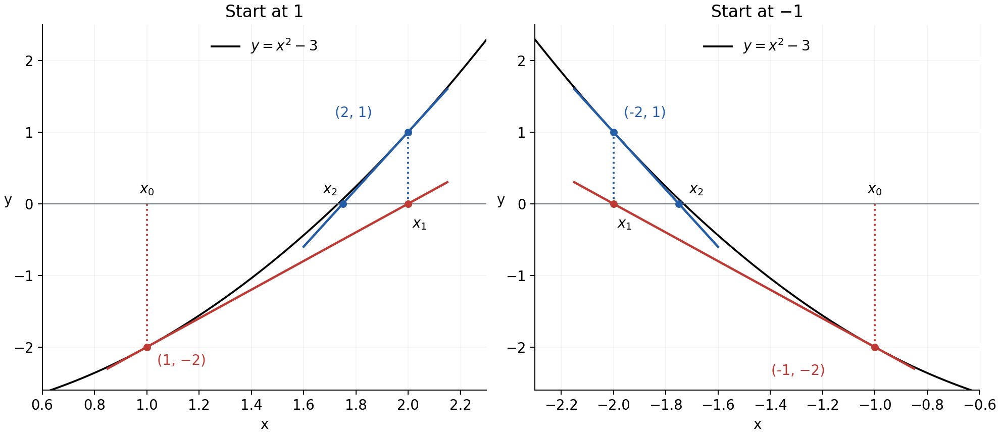
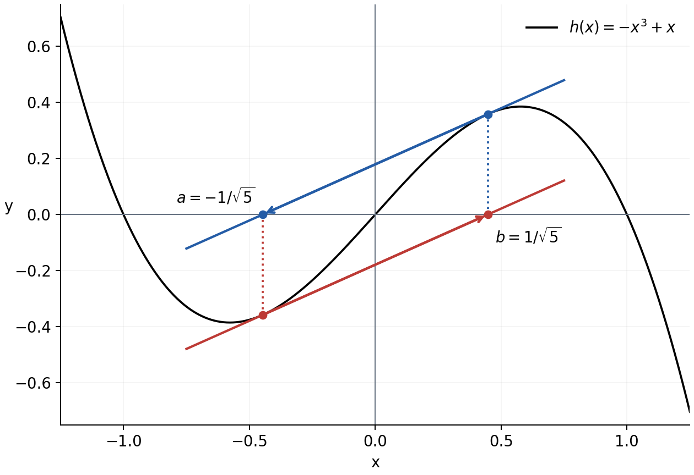
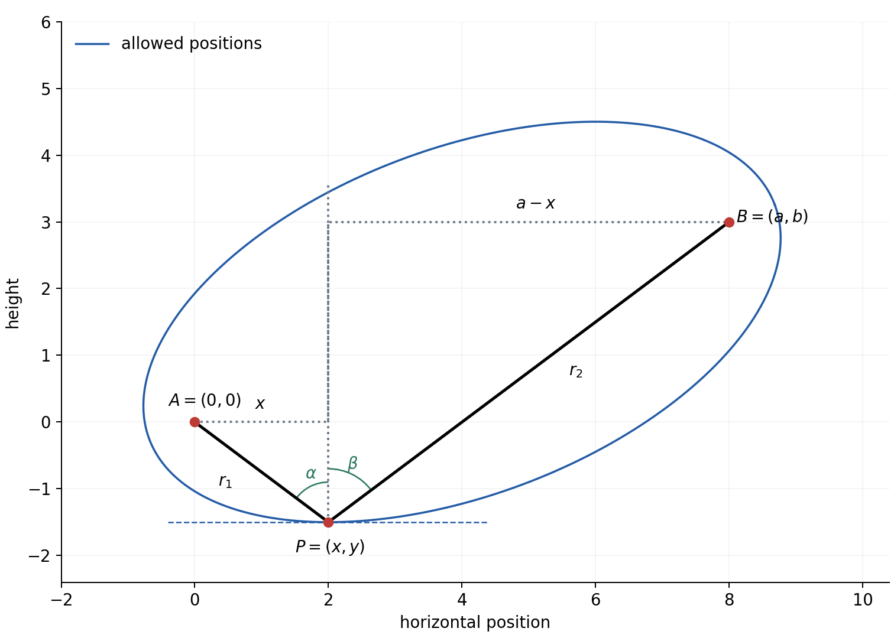
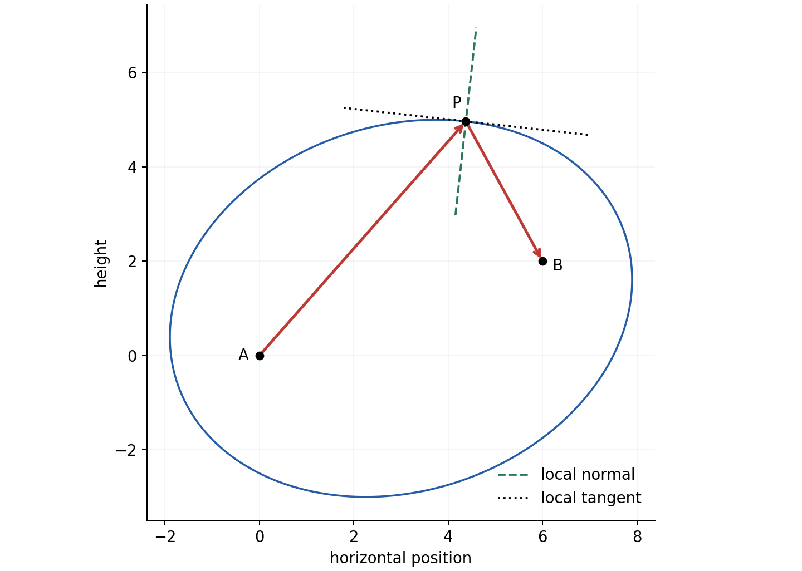

P001. Newton’s method and a ring on a string — Lecture 13

These notes follow MIT 18.01 Single Variable Calculus, Fall 2006, Lecture 13. The two goals are to use a tangent to improve an equation-solving estimate, and to use a derivative to find and justify a lowest position under a fixed-length constraint. Familiar algebra, differentiation, right-triangle trigonometry and force balance are assumed. The different roles of their equations matter: finding a zero of a function and finding a zero of a derivative answer different questions.

P002. Reading route

Read the [core](#core) in order and pause at Q1–Q3 when they appear. Q4 is a [later mixed revisit](#q4). Each question has a direct link to its hint; [all hints](#hints) are grouped separately from [all complete solutions](#solutions). A partial attempt is useful: compare its first uncertain connection with the hint, then use the solution if needed. The figures and their captions belong to the core. The [source note](#source) explains corrections to the original lecture.

P003. From a curve to an equation-solving step

A root of $`f(x)=0`$ is an input whose graph point lies on the horizontal axis. For $`f(x)=x^2-3`$, there are two roots, $`-\sqrt{3}`$ and $`+\sqrt{3}`$. We first seek the positive one. An estimate $`x_0=1`$ gives the curve point $`(x_0,f(x_0))=(1,-2)`$. The subscript is a step number, not a power; $`x_0`$ is the starting input, $`x_1`$ the next input, and $`f(x_0)`$ is the current height.

P004. The tangent supplies a simpler equation

Near the current point, replace the curve by its tangent line. The tangent has the same value and slope there. With slope $`m=f'(x_0)`$, its equation is

$$
y-f(x_0)=f'(x_0)(x-x_0).
$$

To construct the next estimate, put $`y=0`$ because we want the line's horizontal-axis intercept, and call that intercept's input $`x_1`$:

$$
-f(x_0)=f'(x_0)(x_1-x_0),
\qquad x_1=x_0-\frac{f(x_0)}{f'(x_0)}.
$$

The division requires a defined, nonzero derivative. This exactly solves the tangent-line equation. It only approximately solves the curve equation; a tangent and a curve usually meet the horizontal axis at different inputs.

P005. A complete first step

For $`f(x)=x^2-3`$, $`f'(x)=2x`$. At $`x_0=1`$ the tangent is $`y+2=2(x-1)`$, or $`y=2x-4`$. Its intercept is $`x_1=2`$. Checking the original function gives $`f(2)=1`$, so the step has not found an exact root. It has moved from a point below the axis to an estimate on the other side of the positive root. To repeat, move vertically from $`(2,0)`$ to the curve point $`(2,1)`$, then use the new tangent there. Do not reuse the old slope.

P006. Q1 — supported construction

For $`f(x)=x^2-5`$ and starting estimate $`x_0=2`$, write the tangent line at $`(2,f(2))`$, find its horizontal-axis intercept $`x_1`$, and explain why $`x_1`$ is a new estimate rather than the curve point's height. Give the exact fraction and check $`f(x_1)`$. Target: construct and interpret one Newton step. A complete response connects the tangent equation to the update and distinguishes an approximate root from an exact root. [Hint Q1](#h1) · [Solution Q1](#s1)

P007. Iterating the same construction

Newton’s method repeats P004 at the current input $`x_k`$:

$$
x_{k+1}=x_k-\frac{f(x_k)}{f'(x_k)}.
$$

Read the right side as “current input minus current value divided by current slope”; evaluate both function and derivative at the same input before updating. The left side is the newly produced input. For the square-root example this becomes

$$
x_{k+1}=x_k-\frac{x_k^2-3}{2x_k}
=\frac{x_k}{2}+\frac{3}{2x_k}.
$$

Thus $`x_2=2/2+3/4=7/4`$, and $`x_3=7/8+6/7=97/56`$. Each denominator uses the current estimate, and zero is excluded. This is a recurrence: the output of one step becomes the input of the next.

P008. Figure 1 — successive tangent intercepts

The left panel plots the actual curve $`y=x^2-3`$. The red tangent at $`(1,-2)`$ meets the axis at $`x_1=2`$; the blue tangent at $`(2,1)`$ meets it at $`x_2=7/4`$. The dotted vertical segments merely locate the next curve point; they are not tangents. The right panel shows the same construction starting at $`x_0=-1`$: its first intercept is $`x_1=-2`$. Axis intercepts, current curve points and tangent slopes have the same roles in the general update, even for a differently shaped function.

P009. Accuracy in this example

Continuing without premature rounding gives $`x_4=18817/10864`$. The absolute errors, measured as distance from the positive root, are approximately

$$
\begin{aligned}
|x_0-\sqrt{3}|&=0.7320508076,\\
|x_1-\sqrt{3}|&=0.2679491924,\\
|x_2-\sqrt{3}|&=0.0179491924,\\
|x_3-\sqrt{3}|&=0.0000920496,\\
|x_4-\sqrt{3}|&=0.0000000024.
\end{aligned}
$$

These are errors in the input estimates, not the residual heights $`f(x_k)`$. The original lecture's rough values are consistent with these scales. Close agreement of consecutive displayed decimals alone does not certify accuracy: rounding or a failed iteration can mislead. Here, as an independent check, squaring the decimal endpoints gives

$$
1.73205080^2=2.99999997378064<3,
\qquad
1.73205081^2=3.0000000084216561>3.
$$

Since squaring is continuous and increasing for positive inputs, the positive root lies between those endpoints. This bracket certifies the root rounded to seven decimal places as $`1.7320508`$.

P010. Why the errors shrink so quickly

Let $`r=\sqrt{3}`$ and let the signed error be $`e_k=x_k-r`$. Using $`r^2=3`$ in P007 gives the exact identity

$$
e_{k+1}=\frac{x_k^2+r^2-2rx_k}{2x_k}
=\frac{(x_k-r)^2}{2x_k}
=\frac{e_k^2}{2x_k}.
$$

Starting from $`x_1=2\gt r`$, this identity keeps every subsequent estimate above $`r`$. Also $`0\lt e_k\lt x_k`$, so $`0\lt e_{k+1}\lt e_k/2`$. Repeated halving bounds the errors by a geometric sequence tending to zero; hence these estimates really do converge to $`r`$. Once close to $`r`$, the factor $`1/(2x_k)`$ changes little and the next error is roughly a constant times the square of the current error. An error of order $`10^{-d}`$ then becomes roughly of order $`10^{-2d}`$. This explains the lecture's approximate doubling of correct digits here. It is not a promise for every function or starting value.

P011. What a limit calculation can establish

Write $`\bar x`$ for a proposed finite limit of the iterates. If the sequence converges and $`\bar x\ne0`$, continuity of addition and reciprocal away from zero lets us take limits in P007:

$$
\bar x=\frac{\bar x}{2}+\frac{3}{2\bar x}
\quad\Longrightarrow\quad
\frac{\bar x}{2}=\frac{3}{2\bar x}
\quad\Longrightarrow\quad
\bar x^2=3.
$$

This identifies possible nonzero limits; it does not by itself prove that a limit exists or select its sign. P010 supplies convergence for the positive start. For a negative start $`x_0=-1`$, write $`z_k=-x_k`$. Substitution into the recurrence shows $`z_{k+1}=z_k/2+3/(2z_k)`$, with $`z_0=1`$. Thus $`z_k\to\sqrt{3}`$ and $`x_k\to-\sqrt{3}`$. Newton’s method has solved the equation, but not the intended positive-root problem. At $`x_0=0`$, the derivative is zero and there is no Newton step at all.

P012. A step can exist without leading to convergence

A sequence can repeat two distinct estimates indefinitely. The lecture illustrates such a two-cycle schematically. Figure 2 supplies a concrete example, $`h(x)=-x^3+x`$, with starting input $`a=-1/\sqrt{5}`$ and second input $`b=1/\sqrt{5}`$. At either of these inputs, $`x^2=1/5`$, so $`h'(x)=1-3x^2=2/5`$ and $`h(x)=(4/5)x`$. Its Newton intercept is therefore

$$
x-\frac{(4/5)x}{2/5}=-x.
$$

The method alternates from $`a`$ to $`b`$ and back forever. Neither input is a root because $`h(x)=(4/5)x\ne0`$ there. The derivative is nonzero at every step; that condition makes each step legal but does not ensure convergence.

P013. Figure 2 — a two-cycle

The red tangent at the left curve point reaches the axis at $`b`$. Moving vertically to the curve there gives the blue tangent, whose intercept is $`a`$. Repeating exactly these operations returns to the same two inputs. This preserves the original lecture's failure mechanism; it is not convergence to a different root.

P014. Q2 — a changed behaviour

For $`f(x)=x^3-2x+2`$, start Newton's method at $`x_0=0`$. Compute $`x_1,x_2,x_3`$ and their function values. Does further repetition from this start approach a root? Explain. Then use the supplied facts $`f(-2)=-2`$, $`f(-1)=3`$ and continuity of this polynomial to choose a way to keep locating a root when this Newton start fails, and carry out its first interval-narrowing step. Target: diagnose a changed iteration behaviour and choose a supported alternative. A complete response identifies the repeated state, checks that it is not a root, and gives a justified smaller root-containing interval. [Hint Q2](#h2) · [Solution Q2](#s2)

P015. Choosing and checking an approximation

For root-finding, first identify the target and the function whose zero expresses it. Check the current derivative and original domain before each Newton step. Inspect the residual, the sequence and whether the intended root is being approached. When a continuous function has opposite signs at two endpoints, bisection offers a different guarantee: evaluate the midpoint and retain the half with opposite endpoint signs, or stop if the midpoint is exactly a root. Continuity keeps a root inside, and the interval width halves each time. It may take more steps than a successful Newton run, but its bracket makes the error control explicit. A sign change across a discontinuity is insufficient. Neither a small residual without further conditions nor a single legal Newton step proves proximity to the desired root.

P016. A different use of a derivative: the ring model

A string is fixed at $`A=(0,0)`$ and $`B=(a,b)`$. Take horizontal $`x`$ positive to the right, vertical $`y`$ positive upward, and $`a\gt 0`$. Its total length is $`L`$. A ring can slide freely along the string; we seek its lowest possible position $`P=(x,y)`$. Model the string as light, inextensible and taut in two straight segments, and the ring-string contact as frictionless. In uniform gravity the ring's potential energy is $`mgy`$, up to an arbitrary constant, with $`m,g\gt 0`$. Minimising that energy is therefore the same as minimising $`y`$. Small dissipative effects would let motion settle toward a stable lowest configuration; an exactly lossless moving system need not settle. Our calculation identifies the equilibrium geometry and energy minimum.

P017. Build the fixed-length equation

Call the segment lengths $`r_1=AP`$ and $`r_2=PB`$. The distance formula gives

$$
r_1=\sqrt{x^2+y^2},\qquad
r_2=\sqrt{(x-a)^2+(y-b)^2},\qquad
r_1+r_2=L.
$$

For example, the horizontal difference between $`P`$ and $`B`$ is $`x-a`$ and the vertical difference is $`y-b`$; both whole differences are squared. Their signs disappear in the lengths but will matter after differentiation. Every term in the length equation has length units. The locus, meaning the set of allowed ring positions, is an ellipse: by definition an ellipse has constant sum of distances to two fixed points, its foci. Here those foci are the supports, not the ring. We assume $`L\gt \sqrt{a^2+b^2}`$, so the string is longer than the straight support separation and the ellipse is nondegenerate. P027 will explain what happens at or below that boundary.

P018. Figure 3 — lengths and angles at the bottom

The drawing uses $`a=8\ \mathrm m,b=3\ \mathrm m,L=10\ \mathrm m`$; axis values are in metres. The solid segments connect the ring to the two supports. The dotted vertical through $`P`$ and horizontal construction lines make two right triangles. Their horizontal legs are $`x`$ and $`a-x`$; their vertical rises from the ring are $`-y`$ and $`b-y`$. At the lowest point shown, both rises are positive. Angles $`\alpha`$ and $`\beta`$ are measured from upward vertical to the left and right segments, respectively. The blue ellipse is the locus of possible ring positions, not additional string. Its tangent at the bottom is horizontal.

P019. Differentiate the constraint before imposing the minimum

Locally along the lower part of the ellipse, view height as a function $`y=y(x)`$. The prime $`y'`$ means $`dy/dx`$, the slope of that locus, not a string slope. Differentiating the constant-length equation with the chain rule gives

$$
\frac{2x+2yy'}{2\sqrt{x^2+y^2}}
+\frac{2(x-a)+2(y-b)y'}{2\sqrt{(x-a)^2+(y-b)^2}}=0,
$$

or

$$
\frac{x+yy'}{r_1}+\frac{x-a+(y-b)y'}{r_2}=0.
$$

For example, $`y^2`$ contributes $`2yy'`$ because $`y`$ changes with $`x`$, whereas the fixed endpoint coordinates $`a,b`$ and fixed total length $`L`$ have derivative zero. The segment lengths must be nonzero for these expressions. At a smooth interior lowest point, the tangent is horizontal and $`y'=0`$. Hence

$$
\frac{x}{r_1}=\frac{a-x}{r_2}.
$$

This gives a candidate condition; a stationary point alone need not be a global minimum. We will verify the global claim in P025.

P020. Read the stationary condition as geometry

For a point below both supports and horizontally between them, the triangles in Figure 3 give $`\sin\alpha=x/r_1`$ and $`\sin\beta=(a-x)/r_2`$. Thus P019 becomes $`\sin\alpha=\sin\beta`$. Both angles lie between zero and $`\pi/2`$, where sine is one-to-one, so $`\alpha=\beta`$. The equality of sines would not establish equality for arbitrary angles. We are constructing the bottom candidate in this region and will check that the resulting coordinates really lie there. The right-hand rise $`b-y`$ can differ from the left-hand rise $`-y`$: equal angles do not require equal segment lengths or equal endpoint heights.

P021. Check the force interpretation

Let $`T_1,T_2`$ be the positive tension magnitudes pulling the ring toward the left and right support. Horizontal equilibrium of the ring is

$$
-T_1\sin\alpha+T_2\sin\beta=0.
$$

Since the angles are equal with positive sine, $`T_1=T_2=T`$. This agrees with free sliding on one ideal light string. Vertical equilibrium then gives $`T\cos\alpha+T\cos\beta=mg`$, so $`2T\cos\alpha=mg`$. Gravity acts on the ring downward; the two tensions act along the string upward and sideways. It is their components, not a direct application of gravity “to each half”, that balance. If friction prevented free sliding, unequal tensions could occur and this particular equal-angle argument would not describe every static configuration.

P022. Obtain the height from the equal angles

The horizontal legs are $`x=r_1\sin\alpha`$ and $`a-x=r_2\sin\alpha`$. Adding and using $`r_1+r_2=L`$ gives

$$
a=L\sin\alpha,\qquad \sin\alpha=\frac aL.
$$

Likewise $`-y=r_1\cos\alpha`$ and $`b-y=r_2\cos\alpha`$, so

$$
b-2y=L\cos\alpha.
$$

Because the angle is acute, take the positive square root in $`\cos\alpha=\sqrt{1-\sin^2\alpha}`$. Define the positive length $`D=\sqrt{L^2-a^2}`$. It follows that $`L\cos\alpha=D`$ and

$$
y=\frac{b-D}{2}=\frac12\left(b-\sqrt{L^2-a^2}\right).
$$

The minus sign selects the bottom configuration: adding the two upward rises produced $`b-2y`$.

P023. Obtain the horizontal coordinate

The same triangles give

$$
\tan\alpha=\frac{x}{-y}=\frac{a-x}{b-y}.
$$

Cross-multiplying preserves both vertical rises:

$$
x(b-y)=(-y)(a-x)
\quad\Longrightarrow\quad
(b-2y)x=-ay.
$$

Now $`b-2y=D\gt 0`$, so

$$
x=-\frac{ay}{D}
=\frac a2\left(1-\frac bD\right)
=\frac a2\left(1-\frac b{\sqrt{L^2-a^2}}\right).
$$

Our assumption $`L^2\gt a^2+b^2`$ implies $`D\gt |b|`$. Thus $`0\lt x\lt a`$, $`y\lt 0`$ and $`y\lt b`$. This verifies the region and positive rises used to build the candidate, rather than relying only on the picture.

P024. Check that the candidate has the required string length

At these coordinates,

$$
x=\frac{a(D-b)}{2D},\quad -y=\frac{D-b}{2},
\qquad
a-x=\frac{a(D+b)}{2D},\quad b-y=\frac{D+b}{2}.
$$

Using $`a^2+D^2=L^2`$ and $`D\pm b\gt 0`$ in the distance formulas yields

$$
r_1=\frac{L(D-b)}{2D},\qquad
r_2=\frac{L(D+b)}{2D},\qquad r_1+r_2=L.
$$

Both segments are positive, so all divisions made above are legal. Their different lengths account for the unequal support heights.

P025. Prove that no allowed point is lower

For any allowed position, form the two vectors $`(x,-y)`$ and $`(a-x,b-y)`$. Their lengths are still $`r_1`$ and $`r_2`$, because changing the sign of a component does not change its square. Placed head to tail they have total displacement $`(a,b-2y)`$. The straight distance between a path's ends cannot exceed its broken-path length; this is the triangle inequality. Therefore

$$
\sqrt{a^2+(b-2y)^2}\ \le\ r_1+r_2=L.
$$

Squaring nonnegative quantities and using $`D^2=L^2-a^2`$ gives $`|b-2y|\le D`$. In particular $`b-2y\le D`$, or $`y\ge(b-D)/2`$. P024 provides an allowed point attaining that bound, so it is a global minimum, not merely a stationary candidate. This argument also covers allowed points outside the region used to construct the candidate. It is a geometric alternative to a second-derivative test and proves the stronger global claim directly.

P026. A connected numerical example

Take $`a=8\ \mathrm m`$, $`b=3\ \mathrm m`$ and $`L=10\ \mathrm m`$. The support separation is $`\sqrt{73}\ \mathrm m\lt 10\ \mathrm m`$, so the model is nondegenerate. Then $`D=\sqrt{100-64}=6\ \mathrm m`$, giving $`y=(3-6)/2=-1.5\ \mathrm m`$ and $`x=4(1-3/6)=2\ \mathrm m`$. The two lengths are $`\sqrt{2^2+1.5^2}=2.5\ \mathrm m`$ and $`\sqrt{6^2+4.5^2}=7.5\ \mathrm m`$, totaling $`10\ \mathrm m`$. The sine ratios are $`2/2.5=6/7.5=0.8`$, so both vertical angles are about $`53.13^\circ`$. P025 bounds every allowed height below by $`-1.5\ \mathrm m`$, and our point attains it. Notice that the minimum is not the midpoint of the two supports.

P027. Feasibility comes before calculus

Any broken path from $`A`$ through the ring to $`B`$ has length at least the straight distance $`AB=\sqrt{a^2+b^2}`$. If $`L\lt AB`$, no such taut string configuration exists. If $`L=AB`$, equality requires the ring to lie on the straight segment from $`A`$ to $`B`$. The ellipse has collapsed to that segment. Its lowest geometric point is the lower endpoint when heights differ; if the endpoints are level, every point of the segment has the same height. An endpoint puts one segment length at zero, so the interior smooth-branch differentiation and two positive-angle derivation do not apply there. Nor should this degenerate geometry be taken as a suspended, freely sliding massive ring in equilibrium without additional contact forces. If $`L\gt AB`$, the formulas and checks in P022–P025 apply. Keeping the supports fixed while changing string length can therefore change the kind of problem, not just its numerical answer.

P028. Q3 — geometry, minimum and a changed constraint

An ideal light inextensible string of length $`L=10\ \mathrm m`$ passes freely through a ring. Its fixed ends are $`A=(0,0)\ \mathrm m`$ and $`B=(6,2)\ \mathrm m`$. Gravity acts downward; consider the lowest-energy configuration, with straight taut string segments. Find the ring coordinates, both segment lengths, and the angles each segment makes with upward vertical. Check the length and equal-angle conditions and explain why this position is a global minimum. Now keep the endpoints but change $`L`$ first to $`\sqrt{40}\ \mathrm m`$ and then to $`6\ \mathrm m`$. What becomes of the configuration and of the nondegenerate lowest-point derivation? Target: connect constraint, stationary geometry and global/feasibility checks. A complete response supplies the position and checks for $`L=10`$, then distinguishes a degenerate straight segment from an impossible string length without dividing by a zero segment length. [Hint Q3](#h3) · [Solution Q3](#s3)

P029. Why the lecture also mentions a reflecting ellipse

At the bottom point, the vertical is normal to the ellipse, meaning perpendicular to its tangent. The equal angles in P020 mean that a ray arriving from one focus and leaving toward the other obeys the geometric-optics reflection rule: the incoming and outgoing rays make equal angles with the normal, on opposite sides. This rule is a physical premise for an ideal mirror. The ring calculation proves the geometry at the bottom. To justify the lecture's statement about other points of the ellipse, we need a local argument at an arbitrary point, not an assumption that its normal is always vertical.

P030. The same property at a general smooth point

At a point $`P`$ on the nondegenerate ellipse, let $`\mathbf u_1`$ and $`\mathbf u_2`$ be unit vectors from the two foci toward $`P`$, and let $`\mathbf t`$ be a tangent direction. The derivative of a distance along motion with velocity $`\mathbf t`$ is its radial component, $`\mathbf u_i\cdot\mathbf t`$. To see this, let $`s`$ be a parameter describing motion along the ellipse; primes in this paragraph mean derivatives with respect to $`s`$. Write the displacement from a fixed focus as $`\mathbf v(s)`$, with length $`r(s)=\sqrt{\mathbf v(s)\cdot\mathbf v(s)}`$. Differentiation gives $`r'=(\mathbf v/r)\cdot\mathbf v'=\mathbf u\cdot\mathbf t`$ when $`\mathbf v'=\mathbf t`$. Along the ellipse, $`r_1+r_2=L`$ is constant, so

$$
(\mathbf u_1+\mathbf u_2)\cdot\mathbf t=0.
$$

Thus $`\mathbf n=\mathbf u_1+\mathbf u_2`$ is a normal direction. It is nonzero on the nondegenerate ellipse: opposite unit vectors would put $`P`$ between the foci, where the distance sum is only $`AB\lt L`$. Because both unit vectors have length one,

$$
\mathbf n\cdot\mathbf u_1=1+\mathbf u_1\cdot\mathbf u_2
=\mathbf n\cdot\mathbf u_2.
$$

Dividing by $`|\mathbf n|`$ shows that the two angles with this normal have equal cosines and hence are equal. The sum lies between the two vectors, so they are on opposite sides of it (or coincide at a vertex). The incoming propagation direction is $`\mathbf u_1`$, whereas the outgoing direction toward the other focus is $`-\mathbf u_2`$. Equivalently, the two ray segments viewed from the reflection point point along $`-\mathbf u_1`$ and $`-\mathbf u_2`$, symmetric about the inward normal $`-\mathbf n`$. This is precisely the reflection geometry. It concerns an ideal elliptical mirror; the string itself need not reflect light.

P031. Figure 4 — the normal need not be vertical

This drawing uses $`A=(0,0),B=(6,2)`$ and $`L=10`$ in consistent length units. The arrows show travel from $`A`$ to $`P`$ and then to $`B`$. The dashed normal bisects the angle between the two ray segments as viewed from $`P`$; the dotted tangent is perpendicular to it. Figure 3 is the special lowest-point case with a vertical normal. A local normal, rather than the fixed vertical axis, is the reference for reflection elsewhere.

P032. Where the two applications meet

For Newton’s method, $`f(x)=0`$ is the desired equation, and $`f'(x_k)`$ supplies a slope for a new estimate. For the ring, the length equation first restricts the possible positions; the local derivative $`y'=0`$ then selects a candidate extremum of height. Feasibility and a global check complete the answer. The lecture previews Lagrange multipliers, a later method for constrained optimisation in several variables. Nothing here requires that later method: implicit differentiation, geometry and the bound in P025 suffice.

P033. Q4 — later mixed revisit

On a later study occasion, try this without opening the worked cases. One problem asks for the positive root of $`u^2-7=0`$ using a starting estimate $`u_0=3`$. Another asks for the lowest ring position with endpoints $`(0,0),(8,0)\ \mathrm m`$ and total string length $`10\ \mathrm m`$ under the same ideal model as Q3. Which quantity is required to be zero in each problem, and why are the two zero conditions different? Reconstruct the Newton update from a tangent equation, calculate one root estimate, and obtain the ring position with a check of its total string length. Target: retained construction plus transfer between root-finding and constrained minimisation. A complete response names each zero condition, explains its purpose, and gives both checked results. A later revisit, for example after a day, is an adjustable study suggestion rather than a required schedule. [Hint Q4](#h4) · [Solution Q4](#s4)

P034. End of core

Q4's tangent reconstruction checks recall of the method's reason, while choosing and interpreting the two zero conditions checks transfer between different problems. Neither reading a solution nor obtaining one correct numerical answer establishes lasting mastery. Use the [hints](#hints) for one intermediate step, or choose a [complete solution](#solutions) when you want to compare the full route.

P035. Hints — one step forward before the full solutions

P036. Hint Q1

The current curve point is $`(2,-1)`$ and the derivative there is $`4`$. Put those two facts into the point-slope line form, then set the line's height to zero. To check whether the new input is exact, substitute it in $`x^2-5`$, not back into the line. [Return to Q1](#q1)

P037. Hint Q2

Here $`f'(x)=3x^2-2`$. Compute the update at zero and then at the input it produces; keep those as exact integers. A repeated input gives the same next input under the same rule. For the interval part, evaluate the midpoint $`-3/2`$ and compare its sign with the two supplied endpoint signs. [Return to Q2](#q2)

P038. Hint Q3

First compare the string length with $`AB=\sqrt{6^2+2^2}`$. For the nondegenerate case, $`D=\sqrt{L^2-a^2}`$ is the sum of the two vertical rises, not one string segment. Use it to find $`y`$, then $`x`$. Check the two actual distances separately. At the boundary length, use the straight-distance argument before trying any derivative formula. [Return to Q3](#q3)

P039. Hint Q4

For the equation problem, ask where a tangent meets height zero. For the ring, ask where the allowed height has a horizontal tangent. Level supports simplify the ring formula through $`b=0`$; verify the length by the two right triangles. [Return to Q4](#q4)

P040. Complete solutions

The solutions below are separate from the hints. Return to the relevant question before reading farther if you want another attempt.

P041. Solution Q1

At the current input, $`f(2)=-1`$ and $`f'(2)=4`$. Thus the tangent is $`y+1=4(x-2)`$. At its horizontal-axis intercept, $`y=0`$, so $`1=4(x_1-2)`$ and $`x_1=9/4`$. This is an input coordinate. The old height is $`-1`$ and the line's intercept height is zero; neither is the new input. Substituting the new input in the curve gives

$$
f(9/4)=\frac{81}{16}-5=\frac1{16}\ne0.
$$

The estimate has a small positive residual but is not exact. Confusing $`f(x_0)`$ with $`x_1`$ would be a conceptual mismatch; an arithmetic slip after forming the correct line would be a different, local error. These are anticipated possibilities, not observations of your work. [Return to Q1](#q1) · [Hint Q1](#h1)

P042. Solution Q2

The derivative is $`f'(x)=3x^2-2`$. At zero, $`f(0)=2`$ and $`f'(0)=-2`$, so $`x_1=0-2/(-2)=1`$. At one, $`f(1)=1`$ and $`f'(1)=1`$, so $`x_2=1-1/1=0`$. The next step repeats the first: $`x_3=1`$. The successive function values are $`f(x_0)=2,f(x_1)=1,f(x_2)=2,f(x_3)=1`$. Returning to zero makes the deterministic rule repeat the same two steps indefinitely. Neither value is a root, so this start does not converge to a root despite every derivative used being nonzero.

For the second part, bisection is one supported choice. The continuous polynomial has a root in $`(-2,-1)`$ because its endpoint signs differ. At the midpoint,

$$
f(-3/2)=-\frac{27}{8}+3+2=\frac{13}{8}>0.
$$

Retain $`[-2,-3/2]`$, whose endpoints have opposite signs and whose width is half the original width. A different suitable Newton start might work, but that needs its own checks; merely changing the start does not supply the interval guarantee obtained here. [Return to Q2](#q2) · [Hint Q2](#h2)

P043. Solution Q3

For $`L=10\ \mathrm m`$, $`10\gt \sqrt{40}`$ verifies feasibility and nondegeneracy. We have $`D=\sqrt{100-36}=8\ \mathrm m`$. Therefore

$$
y=\frac{2-8}{2}=-3\ \mathrm m,
\qquad
x=\frac62\left(1-\frac28\right)=\frac94\ \mathrm m.
$$

The left length is $`\sqrt{(9/4)^2+3^2}=15/4\ \mathrm m`$; the right length is $`\sqrt{(15/4)^2+5^2}=25/4\ \mathrm m`$. They sum to $`10\ \mathrm m`$. The horizontal-to-length ratios are both $`3/5`$, so $`\sin\alpha=\sin\beta=3/5`$. Both angles are acute, giving $`\alpha=\beta=\arcsin(3/5)\approx36.87^\circ`$. P025 bounds every allowed height by $`y\ge(2-8)/2=-3\ \mathrm m`$; this feasible point attains the bound, proving the global minimum.

When $`L=\sqrt{40}\ \mathrm m=AB`$, every allowed geometric position lies on the straight segment from $`(0,0)`$ to $`(6,2)`$. Its lowest point is $`(0,0)`$. One string segment then has zero length: the nondegenerate two-segment stationary derivation is inapplicable, and an unconstrained suspended equilibrium there is not established. Although the final coordinate formulas have a limiting value here because $`D=2\ \mathrm m`$, their earlier divisions by segment lengths do not remain valid. When $`L=6\ \mathrm m\lt AB`$, the string is shorter than the support separation, so there is no allowed taut configuration at all. [Return to Q3](#q3) · [Hint Q3](#h3)

P044. Solution Q4

For the root problem define $`f(u)=u^2-7`$. The required zero is $`f(u)=0`$, a point on the horizontal axis; a stationary value $`f'(u)=0`$ would answer a different question. The tangent at a current estimate has equation $`y-f(u_k)=f'(u_k)(u-u_k)`$. Setting its height to zero and dividing by its nonzero slope gives $`u_{k+1}=u_k-f(u_k)/f'(u_k)`$. Since $`f(3)=2`$ and $`f'(3)=6`$, $`u_1=3-2/6=8/3`$. Its residual is $`64/9-7=1/9`$, so this is an estimate, not an exact root.

For the ring, the required zero at a smooth interior height minimum is $`dy/dx=0`$ along the fixed-length locus. The height itself need not be zero. Here $`a=8\ \mathrm m,b=0,L=10\ \mathrm m`$ and $`L\gt AB=8\ \mathrm m`$. Thus $`D=6\ \mathrm m`$, $`x=4\ \mathrm m`$ and $`y=-3\ \mathrm m`$. Each length is $`\sqrt{4^2+3^2}=5\ \mathrm m`$, totaling $`10\ \mathrm m`$. The global bound is $`y\ge-3\ \mathrm m`$, attained by this point. The two zero conditions therefore serve different aims: a function value identifies a root, whereas a derivative value identifies a stationary candidate subject to the constraint and subsequent checks. [Return to Q4](#q4) · [Hint Q4](#h4)

P045. Source and scope note

The source is [MIT OpenCourseWare, 18.01 Single Variable Calculus, Fall 2006, Lecture 13: Newton’s Method and Other Applications](https://ocw.mit.edu/courses/18-01-single-variable-calculus-fall-2006/fb8c24f09aba8413984f8ce5961586bd_lec13.pdf), all seven PDF pages, including the cover, six figures and the numerical table. Printed pages 1–6 correspond to PDF pages 2–7. The ring problem carries a David Jerison copyright attribution in the source. These notes include the position derivation that the source says was omitted in the live lecture. Q1–Q4 and the concrete cycle function are generated applications, not claimed exam questions.

P046. Corrections and boundaries

On printed page 2, the square-root update's denominator is evaluated at the current estimate, $`2x_0`$. On printed page 3, the table lists input estimates, so their error is $`|x_k-\sqrt{3}|`$; its digit-doubling remark is interpreted through the example's exact error identity. On printed page 4, Figure 5 shows a cycle rather than the “unexpected root” stated in its caption. In Figure 6 on printed page 5, the right segment length uses $`(b-y)^2`$, not $`b-y^2`$. The nonzero denominators, convergence premise, acute-angle range, physical model and global-minimum check have been made explicit. The ellipse reflection argument uses its local normal and the ideal reflection law, not a vertical normal at every point. No claim of human learning follows from these notes. [Return to the reading route](#start)
