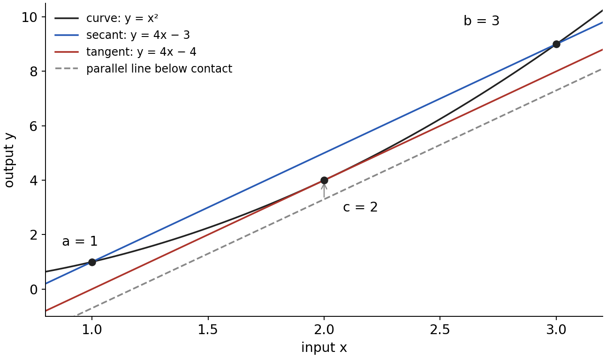
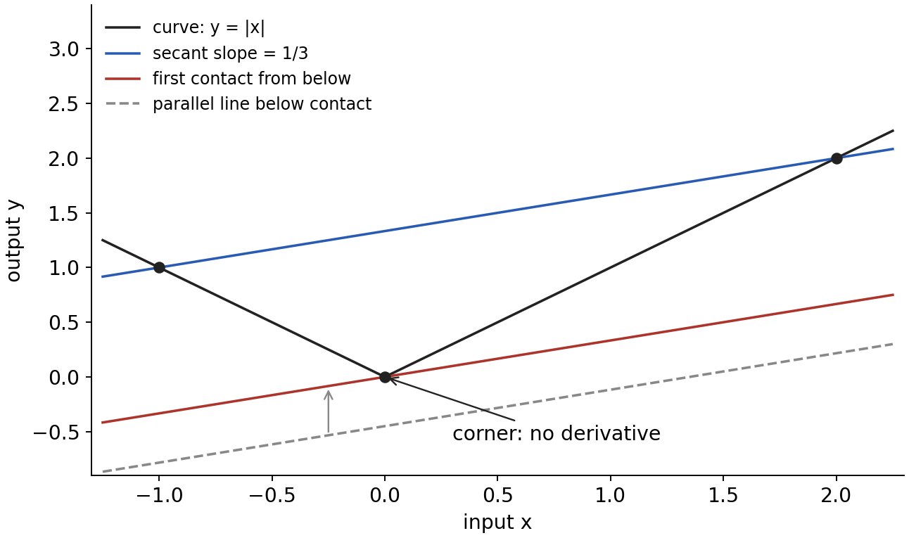
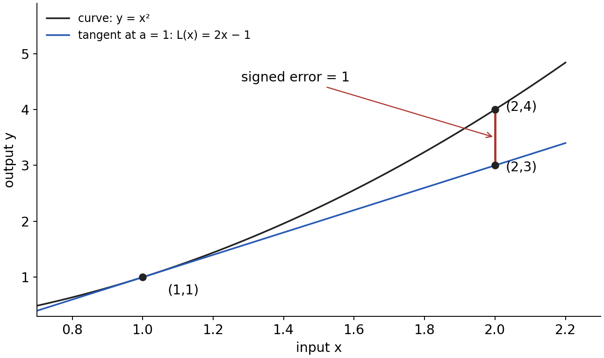

Mean Value Theorem and inequalities

MIT 18.01 Single Variable Calculus, Fall 2006, Lecture 14

Reading route

Read sections A–F in order, trying P1–P5 where they occur. [Hints](#hints) and [complete solutions](#solutions) are separate, so a hint need not reveal the answer. [P6](#p6) is a later revisit with recall and a changed application. You may stop with a partial attempt and compare the next justified step with its hint or solution.

The aim is to connect a derivative, which describes local change, to a finite change over an interval; then use that connection to prove monotonicity and inequalities. Familiar derivative rules, algebra, logarithms and exponentials are assumed. Continuity, the theorem's exact conditions and the extra premise used in its proof are stated here. The examples and tasks added to the lecture are original teaching examples, not MIT examination questions.

A. From an average slope to an actual tangent slope

Let a and b be fixed real numbers with $a\lt b$. The interval $[a,b]$ includes both endpoints; $(a,b)$ contains only the points strictly between them. The slope of the secant line through $(a,f(a))$ and $(b,f(b))$ is

$$m=\frac{f(b)-f(a)}{b-a}.$$

The numerator is the change in output and the denominator is the positive change in input. A secant uses two points. By contrast, the derivative $f'(c)$ is the tangent slope at one point c: it is the limit of secant slopes with one input fixed at c while the other approaches c. The Mean Value Theorem (MVT) connects these two scales of change.

Here continuity at an interior point means the limiting output as the input approaches that point equals the function's value there. At a or b, continuity is required from within the interval. Thus there can be no jump, hole or endpoint value detached from the approaching graph. Differentiability at a point means the derivative limit exists as a finite number there; a corner whose left and right slopes disagree fails this condition. Familiar polynomials, exponentials and logarithms are continuous and differentiable on their ordinary real domains. We use these standard regularity facts alongside their derivative rules.

The MVT states: if f is continuous on $[a,b]$ and differentiable on $(a,b)$, then at least one $c\in(a,b)$ satisfies

$$f'(c)=\frac{f(b)-f(a)}{b-a}.$$

The point c is an input, not an average output. Its tangent is parallel to the secant because the two lines have the same slope. The theorem guarantees existence, not a particular c, its uniqueness, or that it is the midpoint. No derivative at either endpoint is required. These are exactly the lecture's closed-interval continuity and open-interval differentiability conditions. [MIT source, printed p. 1](https://ocw.mit.edu/courses/18-01-single-variable-calculus-fall-2006/1a211af8e4860b63b801aa3d6e7a2e95_lec14.pdf).

Worked case. For $f(x)=x^2$ on $[1,3]$, both conditions hold because this is a polynomial. The endpoint values are 1 and 9, so $m=(9-1)/(3-1)=4$. Since $f'(x)=2x$, matching the required slope means solving $2c=4$. It gives $c=2$, which is strictly inside the interval. The secant line is $y=1+4(x-1)=4x-3$; the tangent at c is $y=4+4(x-2)=4x-4$. Equal slopes do not mean equal lines: their vertical offsets differ.

Figure 1. This exact plotted example reconstructs the lecture's parallel-line picture. The horizontal labels a, c and b denote inputs; the black points pair each input with its output on the curve. The dashed line and red tangent have the same slope as the blue secant. Shifting a line changes its intercept, not its slope. Section B explains why an interior tangent must occur under the stated hypotheses.

Task P1

For f(x)=x³ on [0,2], check the two Mean Value Theorem hypotheses, calculate the secant slope, and find every c in (0,2) with that derivative. State what the resulting c means geometrically and whether it is the midpoint. A complete response includes the hypothesis checks, the derivative equation, and the admissible value(s), not just a number.

[Hint P1](#h1) · [Solution P1](#s1)

B. Why the hypotheses give a point, and why they matter

The lecture suggests sliding a line parallel to the secant until it touches the graph. To justify both the existence of contact and its interior location, we make its vertical gap explicit. Use t for a varying input, keeping a, b and the secant slope m fixed. Construct the secant's output and the gap above it as

$$\ell(t)=f(a)+m(t-a),\qquad g(t)=f(t)-\ell(t).$$

The first formula builds the line from its value at a and its rise m times the input change. The second subtracts outputs at the same t; a positive g means the curve is above the secant. Because the secant passes through both endpoints, $g(a)=g(b)=0$. Subtracting a line preserves continuity and differentiability, and differentiating gives $g'(t)=f'(t)-m$. Consequently a point with $g'(c)=0$ gives the desired $f'(c)=m$. This translates the picture into a target we can prove.

We introduce one additional theorem as a premise: a real continuous function on a closed, bounded interval attains a greatest and a least value on that interval. This is the extreme value theorem. “Attains” means an actual input gives the value, rather than values merely approaching it. Its proof is beyond this lesson; it is the existence premise behind the sliding-line argument. [OpenStax, Calculus Volume 1, §4.3, Theorem 4.1](https://openstax.org/books/calculus-volume-1/pages/4-3-maxima-and-minima).

We also need the following consequence of the derivative definition, which we can justify here. At a differentiable interior maximum c, nearby differences $g(c+h)-g(c)$ are nonpositive. Dividing by $h\gt 0$ gives a nonpositive quotient; dividing by $h\lt 0$ gives a nonnegative quotient. Since the derivative exists, both one-sided limits must agree. A limit of nonpositive numbers is nonpositive, and a limit of nonnegative numbers is nonnegative. The common limit must therefore be zero. At an interior minimum the signs reverse and again force zero. The word interior matters because both directions must be available. This does not say every point with derivative zero is an extremum.

Now apply the existence premise to g. If g is identically zero, its derivative is zero throughout $(a,b)$, and any interior c works. Otherwise g has a nonzero value somewhere inside: its endpoint values are both zero. If some value is positive, its attained greatest value is positive and cannot be at either endpoint. At the interior point where it is attained, the preceding argument gives $g'(c)=0$. If no value is positive but g is not identically zero, some value is negative; its attained least value is then negative and interior, again giving $g'(c)=0$. These alternatives cover all possibilities, proving the MVT from the stated premise.

The construction also explains which way to slide. If g has a negative minimum, the line $y=\ell(t)+\min g$ is a parallel line below or on the curve and makes interior contact. Slide upward to it from farther below. If g has a positive maximum, $y=\ell(t)+\max g$ makes contact from above instead. In the worked parabola, $g(t)=t^2-(4t-3)=(t-2)^2-1$ has minimum −1 at t=2, giving the red line $4t-4$. This is why the lecture allows sliding from above or from below. The proof is an explicit reconstruction of its geometric argument; the standard difference-from-secant construction is also documented in [OpenStax §4.4, Theorem 4.5](https://openstax.org/books/calculus-volume-1/pages/4-4-the-mean-value-theorem).

A corner can defeat the conclusion. Consider $f(x)=|x|$ on $[-1,2]$. Its secant slope is $(2-1)/(2-(-1))=1/3$. On the negative branch the derivative is −1; on the positive branch it is 1. At zero the one-sided slopes disagree, so there is no derivative. None of these possibilities supplies derivative 1/3, despite continuity everywhere.

Figure 2. Contact at the corner does not give a tangent with the sliding line's slope. Here the line $y=x/3$ lies below $|x|$ and meets it at zero, but neither branch has slope 1/3. The lecture's phrase “no matter what its slope is” needs qualification: this corner-first-contact argument works for slopes strictly between −1 and 1, including secants with one endpoint on each side of zero. For a slope outside that range, first contact on a finite interval can instead occur at an endpoint.

A missing hypothesis does not always force failure; it removes this guarantee. For example, $|x|$ on $[0,2]$ meets the MVT hypotheses: within that interval it is x, it is continuous at zero from the right, and its interior derivative is 1. The corner in its extension outside the interval is irrelevant.

Task P2

Define q(x)=x for 0≤x<1 and q(1)=2. On [0,1], calculate the secant slope and all interior derivative values. Does a point c with the MVT conclusion exist? Identify precisely which hypothesis fails and explain why differentiability at every interior point does not repair it. A complete response connects the endpoint behaviour to the failure of the conclusion.

[Hint P2](#h2) · [Solution P2](#s2)

C. Interpreting and rewriting the exact result

The lecture's trip is an idealised model: take a fixed route from Boston to Chicago of length 1,000 miles, completed in 3 hours. These are stipulated example data. Let s(t) be progress along that route, in miles, with time t in hours, $s(0)=0$ and $s(3)=1000$. Assume s is continuous throughout the trip, differentiable at interior times, and the motion is forward so that its nonnegative rate is speed. The MVT then gives some time $0\lt c\lt 3$ at which

$$s'(c)=\frac{s(3)-s(0)}{3-0}=\frac{1000}{3}\text{ miles per hour}.$$

The output/input units are miles/hour. The conclusion is an instantaneous speed of exactly the average at some time; it does not claim the whole journey had that speed. If s instead denotes a signed position allowing backwards motion, its derivative is signed velocity and the direct MVT conclusion concerns average velocity. Using route progress avoids identifying a curving route length with straight-line distance from Boston.

Multiplying the MVT by the positive, nonzero quantity $b-a$ and then adding $f(a)$ gives two equivalent exact forms:

$$f(b)-f(a)=f'(c)(b-a),$$

$$f(b)=f(a)+f'(c)(b-a).$$

Changing the endpoint name b to x gives, for $x\gt a$,

$$f(x)=f(a)+f'(c)(x-a),\qquad a<c<x.$$

Here a is the chosen fixed starting input; x is the selected endpoint; and c may change when x changes. There is no single c promised for every endpoint. For $x\lt a$, applying the MVT to $[x,a]$ and rearranging gives the same equality with $x\lt c\lt a$. For $x=a$, $f(x)=f(a)$ directly; there is then no nonempty interval in which to seek c.

The similar-looking tangent approximation uses a specified slope at the starting point:

$$L(x)=f(a)+f'(a)(x-a),\qquad f(x)\approx L(x)\text{ for }x\text{ near }a.$$

This formula requires $f'(a)$, whereas the MVT itself need not require an endpoint derivative. The tangent formula is the line through $(a,f(a))$ with slope $f'(a)$. Its local justification is the derivative definition: $[f(a+h)-f(a)]/h$ approaches $f'(a)$ as h approaches zero. Thus the signed error $f(a+h)-L(a+h)$, divided by h, approaches zero. This gives local approximation, not equality at an arbitrary nonzero h and not a numerical error bound on its own.

For a concrete comparison take $f(x)=x^2$ at a=1. The tangent has $L(x)=1+2(x-1)=2x-1$. At x=2, the tangent output is 3 while the actual output is 4; the signed error, actual minus approximate, is 1. In fact $f(x)-L(x)=(x-1)^2$, so the error tends to zero quadratically as x approaches 1. In the exact MVT form for these endpoints, $4=1+2c(2-1)$ requires $c=3/2$. The slope 3 at this intermediate input makes the finite change exact; the tangent slope 2 at a does not.

Figure 3. The blue line is the approximation using the slope at a. At the common input x=2, the red vertical segment measures the error $f(2)-L(2)$. This reproduces the relationship in the lecture's third figure with a fully specified function. A vertical error is an output difference, not a horizontal input error.

Task P3

For f(x)=x², fix a=1 and take x=1.4. Write the tangent approximation L(x)=f(a)+f′(a)(x−a), evaluate L(1.4), and calculate the exact signed error f(1.4)−L(1.4). Separately find the c between 1 and 1.4 which makes f(1.4)=f(1)+f′(c)(1.4−1) exact. Explain why replacing c by a changes the kind of claim being made. A complete response distinguishes an exact identity with an intermediate slope from an approximation with a specified slope.

[Hint P3](#h3) · [Solution P3](#s3)

D. Derivative signs control finite changes on an interval

Strictly increasing on an interval means that every pair $a\lt b$ in it satisfies $f(a)\lt f(b)$. Strictly decreasing means every such pair satisfies $f(a)\gt f(b)$. This corrects the reversed decreasing inequality printed on lecture p. 3. “Every pair” is what distinguishes a statement about the whole interval from the slope at just one point.

Assume f is differentiable throughout an open interval I. Differentiability implies continuity there: for small nonzero h, $f(x+h)-f(x)$ is h times the derivative quotient, whose finite limit exists, so that difference tends to zero. Hence any closed subinterval $[a,b]$ within I satisfies the MVT hypotheses. If endpoints of a larger closed interval are included in the conclusion, also assume continuity at those endpoints.

Choose arbitrary $a\lt b$ in the interval and use

$$f(b)-f(a)=f'(c)(b-a),\qquad a<c<b.$$

If $f'\gt 0$ throughout the interior, both factors on the right are positive, so $f(b)\gt f(a)$. If $f'\lt 0$ throughout, the derivative factor is negative and $b-a$ is positive, so $f(b)\lt f(a)$. If $f'=0$ throughout, the right side is zero, so $f(b)=f(a)$. Because the pair was arbitrary, these prove respectively strict increase, strict decrease, and constancy on the interval. This supplies the lecture's omitted decreasing proof as well as the two displayed proofs.

For example $v(x)=x^3+2x$ has $v'(x)=3x^2+2\gt 0$ for every real input, so any two inputs in increasing order have outputs in increasing order. There is no need to find the unknown c: its derivative sign is already known wherever it could be. Likewise, if $w'(x)=0$ throughout an interval and $w(2)=7$ there, comparing any point with 2 shows w is identically 7 on that interval. A derivative of zero at just one point does not suffice: $x^2$ has derivative zero at zero but is not constant.

The non-strict condition $f'\geq0$ similarly proves $f(b)\geq f(a)$, called nondecreasing; it alone does not ensure strict increase, since a constant function meets it. Conversely, strict increase does not require a positive derivative at every point. For $x^3$, the derivative is zero at zero, yet when $a\lt b$,

$$b^3-a^3=(b-a)(b^2+ab+a^2)>0.$$

The second factor is $(b+a/2)^2+3a^2/4$, nonnegative and zero only if both a and b are zero, which is impossible when $a\lt b$. Thus the sufficient strict-sign condition is not a necessary one.

The interval condition also matters: it ensures the entire route from a to b lies in the domain. It cannot be replaced by “wherever the derivative happens to exist.” The MVT is precisely the justification connecting infinitesimally local slopes to a nonzero finite input change; that connection was the point of the lecture's warning about relying on an apparently obvious picture.

Task P4

(a) Prove that u(x)=−ln x is strictly decreasing on (0,∞) by choosing arbitrary 0<a<b and using the MVT. Your response must explain the sign of u(b)−u(a).

(b) Define k(x)=0 for x<0 and k(x)=1 for x>0; its domain omits 0. At every point of its domain k′(x)=0. Is k constant on its whole domain? Explain exactly why the zero-derivative conclusion for an interval cannot be applied between −1 and 1. A complete response preserves what can still be concluded on each of the two intervals.

[Hint P4](#h4) · [Solution P4](#s4)

E. Building inequalities by differentiating a difference

To prove that one expression is larger than another, subtract the proposed smaller expression from the proposed larger one. A positive difference is exactly the desired inequality. If that difference is zero at a known starting input and has positive derivative to its right, section D proves it becomes positive. This choice turns a comparison of values into a derivative-sign problem.

Use the familiar premises $e^x\gt 0$ for all real x, $e^0=1$, and $(e^x)'=e^x$. Positivity is a starting property of the exponential, not a consequence of the inequality we are about to prove. The lecture also explicitly takes it as given.

First set $R_0(x)=e^x-1$. The subscript is just a label for this difference; it is not a derivative. We have $R_0(0)=0$ and $R_0'(x)=e^x\gt 0$. The MVT sign result makes $R_0$ strictly increasing. Therefore for $x\gt 0$,

$$R_0(x)>R_0(0)=0,\qquad\text{so }e^x>1.$$

Next set $R_1(x)=e^x-(1+x)$. Again $R_1(0)=0$, and now

$$R_1'(x)=e^x-1=R_0(x)>0\quad\text{for }x>0.$$

Applying the MVT on $[0,x]$ uses only this derivative sign in its interior. It gives $R_1(x)\gt 0$, hence

$$e^x>1+x\quad(x>0).$$

This step uses the preceding inequality to establish a new derivative sign. It does not assume the conclusion it is trying to prove. Subtracting $1+x$ is useful because its derivative is 1, leaving the earlier difference.

For the next level choose $R_2(x)=e^x-(1+x+x^2/2)$. Differentiation removes the highest polynomial degree:

$$R_2(0)=0,\qquad R_2'(x)=e^x-(1+x)=R_1(x).$$

Since $R_1(x)\gt 0$ for $x\gt 0$, the same reasoning yields $R_2(x)\gt 0$. For the cubic level set $R_3(x)=e^x-(1+x+x^2/2+x^3/6)$. Its derivative is $R_2(x)$ because $(x^3/6)'=x^2/2$, and $R_3(0)=0$. Therefore

$$e^x>1+x+\frac{x^2}{2}>1+x,\qquad x>0,$$

$$e^x>1+x+\frac{x^2}{2}+\frac{x^3}{3!},\qquad x>0.$$

Here $3!=3\cdot2\cdot1=6$. Each added positive term makes a stronger lower bound for a fixed positive x. For example, at x=1 the cubic bound proves $e\gt 1+1+1/2+1/6=8/3$ without approximating e numerically. This is a bound, not an exact value.

The same construction works to any finite degree. For integer $n\geq0$, define the polynomial and its remainder (the exact difference, not an estimate) by

$$P_n(x)=\sum_{k=0}^{n}\frac{x^k}{k!},\qquad R_n(x)=e^x-P_n(x).$$

The sum means add the terms with k=0,1,…,n; k is a counting index, n fixes where the sum ends, and $0!=1$. Thus $P_0=1$ and $P_3=1+x+x^2/2+x^3/6$. For $n\geq1$, differentiating $x^k/k!$ gives $x^{k-1}/(k-1)!$ for each k≥1, while the constant k=0 term disappears. Consequently $P_n'=P_{n-1}$, $R_n'=R_{n-1}$, and $R_n(0)=0$. Starting with the proved positivity of $R_0$ for x>0, induction repeats the previous argument: positivity of $R_{n-1}$ makes $R_n$ increase from zero. Thus $e^x\gt P_n(x)$ for every finite n and every x>0.

The lecture ends by previewing

$$e^x=1+x+\frac{x^2}{2!}+\frac{x^3}{3!}+\cdots.$$

An infinite sum means the limit of its finite partial sums. This identity is also supplied by the Further Mathematics baseline. It is a further result, not proved merely by the finite inequalities above: those say the remainders are positive, not that they tend to zero. For example, the increasing sequence $1-1/n$ for positive integers n stays below 2 but tends to 1, not 2. To deduce the exponential identity by this route would require an additional proof that $R_n(x)$ tends to zero for fixed x. The lecture defers that work to Taylor series; none of our inequality proofs relies on it.

All strict inequalities in the positive-x ladder have equality at x=0 instead. Extending to negative x requires a fresh sign argument, because a negative input is to the left of the comparison point zero.

Task P5

The worked exponential bounds concern x>0. Determine whether eˣ>1+x and eˣ>1+x+x²/2 remain true for x<0. Use the differences R₁(x)=eˣ−1−x and R₂(x)=eˣ−1−x−x²/2, their values at zero, and derivative signs; do not rely on a plotted or decimal example as the proof. State what happens at x=0. A complete response gives the direction of each inequality and explains how comparing a negative input with zero changes the monotonicity argument.

[Hint P5](#h5) · [Solution P5](#s5)

F. Using the intermediate point without finding it

Often the unknown c is useful precisely because it lies in a controlled interval. Suppose $L\lt f'(t)\lt U$ for every $a\lt t\lt b$, with the MVT hypotheses on $[a,b]$. The derivative at its guaranteed c obeys the same bounds. Multiplying by $b-a\gt 0$ yields

$$L(b-a)<f(b)-f(a)<U(b-a).$$

L and U are bounds on slope, not function values. With non-strict derivative bounds the corresponding conclusions are non-strict. The function's regularity and the order of the endpoints must still be checked.

For example take $f(t)=\sqrt t$ on $[1,4]$. It is continuous on this interval and differentiable inside, with $f'(t)=1/(2\sqrt t)$. For $1\lt c\lt 4$, we have $1\lt \sqrt c\lt 2$, so $1/4\lt f'(c)\lt 1/2$. The MVT gives

$$\frac34<\sqrt4-\sqrt1<\frac32.$$

The exact difference is 1, which confirms both inequalities. In harder cases the same method bounds a value that is awkward to calculate. The square root is increasing here because it is the nonnegative number whose square is its input: for nonnegative numbers, squaring preserves order. Taking reciprocals of positive numbers reverses order, which is why the derivative bounds run from 1/4 to 1/2.

Task P6

Revisit this task after a break, with the core notes closed for the first attempt. Then consult the notes and distinguish anything recalled from anything reconstructed.

(a) State the Mean Value Theorem, including its hypotheses, the location of c, and the equality it guarantees. State whether it guarantees a unique c or identifies c in advance.

(b) For h>0, prove h/(1+h)<ln(1+h)<h. Choose a useful function and interval, verify the hypotheses, and explain how bounds on a derivative at the unknown intermediate point give strict bounds on the requested value. Do not use a decimal estimate or a power series as the proof.

(c) A differentiable function F on the real line satisfies F′(x)=2 for every real x and F(0)=3. Find F(x) for all real x and justify uniqueness using a function with zero derivative. A complete response explains why the interval condition holds and checks the proposed formula against both given conditions.

[Hint P6](#h6) · [Solution P6](#s6)

A revisit later today or on another day is an adjustable study suggestion, not a fixed optimum schedule. Part (a) asks for retention of the statement. Parts (b) and (c) ask for transfer: selecting an interval for a new bound and turning a specified derivative into a uniquely determined function. Success on a written task alone does not establish durable retention.

Hints — separated from the complete solutions

[Return to reading route](#route) · [Go to complete solutions](#solutions)

Hint P1

The numerator of the secant slope is the difference between $f(2)$ and $f(0)$. After finding that slope m, use $f'(c)=3c^2=m$ and keep only solutions inside (0,2). Being inside an interval is a separate check from solving the equation. [Return to P1](#p1)

Hint P2

The derivative at an interior input uses only the local formula q(x)=x. The secant uses q(1) as actually defined. Compare that value with the limit of q(x) as x approaches 1 from the left. [Return to P2](#p2)

Hint P3

The tangent uses $f'(1)=2$ throughout. The exact finite change instead obeys $1.4^2-1=2c(0.4)$. These are two different equations for two different purposes. Keep actual minus approximate as the sign convention for the error. [Return to P3](#p3)

Hint P4

For (a), the interior c is positive, so evaluate the sign of $-1/c$ before multiplying by $b-a$. For (b), the interval joining −1 and 1 contains the missing input zero. The two halves of the domain can each be an interval even though their union is not. [Return to P4](#p4)

Hint P5

Since $e^x$ is strictly increasing and $e^0=1$, its value is below 1 for x<0. Hence $R_1'(x)\lt 0$ there. Compare $R_1(x)$ with $R_1(0)$ by moving from x up to 0. Then use $R_2'=R_1$ on the same interval. [Return to P5](#p5)

Hint P6

For (a), keep endpoint continuity separate from interior differentiability; the theorem promises at least one point. For (b), use $f(t)=\ln t$ between 1 and 1+h: an intermediate c satisfies $1\lt c\lt 1+h$, and $f'(c)=1/c$. For (c), subtract the function 2x from F; its derivative is zero, and the value at zero fixes the remaining constant. [Return to P6](#p6)

Complete reasoned solutions

[Return to reading route](#route) · [Return to hints](#hints)

Solution P1

The polynomial is continuous on [0,2] and differentiable on (0,2). Its secant slope is $(8-0)/(2-0)=4$. The equation matching the tangent slope to the secant slope is $3c^2=4$, giving algebraic roots $c=\pm2/\sqrt3$. Only $c=2/\sqrt3$ is positive, and it is below 2 because $\sqrt3\gt 1$; it is therefore the only admissible value. Its tangent is parallel to the endpoint secant. It is not the midpoint 1, whose derivative is 3 rather than 4. Treating c as a midpoint automatically would be an anticipated conceptual mistake; the defining equation and interior restriction determine it here. [Return to P1](#p1) · [Hint P1](#h1)

Solution P2

The secant slope is $(q(1)-q(0))/(1-0)=(2-0)/1=2$. At every interior point q is locally the identity function, so $q'(c)=1$. No c in (0,1) gives derivative 2. The left-hand limit at 1 is 1, but q(1)=2; continuity on the closed interval fails at the right endpoint. Interior differentiability holds and cannot constrain an arbitrarily changed endpoint value. This is a distinct failure from the interior corner in section B: the theorem checks both conditions. [Return to P2](#p2) · [Hint P2](#h2)

Solution P3

The tangent formula is $L(x)=1+2(x-1)=2x-1$, so $L(1.4)=1.8$. The actual value is $1.4^2=1.96$; the signed error is $1.96-1.8=0.16$, also given by $(1.4-1)^2$. To make the MVT identity exact, solve $1.96=1+2c(0.4)$. Thus $0.96=0.8c$ and c=1.2, which lies strictly between 1 and 1.4. The MVT chooses an intermediate slope 2.4 to produce the exact change. Replacing it by the fixed slope 2 at a gives the tangent approximation; its error here is nonzero. Both quantities can be correct for their different claims. [Return to P3](#p3) · [Hint P3](#h3)

Solution P4

(a) Choose any $0\lt a\lt b$. The logarithm is continuous on [a,b] and differentiable on (a,b), so the same is true of $u=-\ln x$. The MVT gives $u(b)-u(a)=u'(c)(b-a)$ for some positive $c\in(a,b)$. Since $u'(c)=-1/c\lt 0$ and $b-a\gt 0$, their product is negative. Thus u(b)<u(a) for every such pair, proving strict decrease on (0,∞).

(b) k is not constant on its whole domain: k(−1)=0 and k(1)=1. The zero derivative on each branch agrees with its constant local value. But [−1,1] is not contained in its domain, since k(0) is undefined. It therefore cannot meet the MVT hypotheses on that interval. On (−∞,0) the function is constant 0, and on (0,∞) it is constant 1; the theorem applies within either interval separately. There is no contradiction. A missing domain point is a failure of the required route between endpoints, not an arithmetic slip. [Return to P4](#p4) · [Hint P4](#h4)

Solution P5

Because the exponential has positive derivative everywhere, it is strictly increasing. Hence $e^x\lt e^0=1$ when x<0. It follows that $R_1'(x)=e^x-1\lt 0$ on the negative interval. To compare its value at a chosen negative x with zero, apply the MVT on [x,0]: for an interior c<0,

$$R_1(0)-R_1(x)=R_1'(c)(0-x)<0.$$

Since $R_1(0)=0$, this means $R_1(x)\gt 0$, so $e^x\gt 1+x$ remains true for x<0. A decreasing function can be above its later value zero; decreasing does not mean negative.

Now $R_2'(x)=R_1(x)\gt 0$ for x<0, so the MVT on [x,0] gives $R_2(0)-R_2(x)\gt 0$. Since $R_2(0)=0$, we get $R_2(x)\lt 0$. Thus for negative x the quadratic inequality reverses:

$$e^x<1+x+\frac{x^2}{2}\quad(x<0).$$

At x=0 both differences vanish: both comparisons have equality, not strict inequality. This changed side of the base point is why the positive-x ladder cannot simply be copied for negative inputs. [Return to P5](#p5) · [Hint P5](#h5)

Solution P6

(a) For real $a\lt b$, if f is continuous on [a,b] and differentiable on (a,b), there exists at least one $c\in(a,b)$ with $f'(c)=[f(b)-f(a)]/(b-a)$. The MVT neither identifies c beforehand nor guarantees uniqueness. A linear function already shows why uniqueness is not promised: every interior tangent has its constant secant slope.

(b) Take $f(t)=\ln t$ on [1,1+h]. Since h>0, the interval is in the positive domain of the logarithm; f is continuous on the closed interval and differentiable inside. The MVT gives

$$\ln(1+h)-\ln1=\frac{1}{c}h,\qquad 1<c<1+h.$$

Here $\ln1=0$. Taking reciprocals of the positive inequalities gives $1/(1+h)\lt 1/c\lt 1$. Multiplying by the positive h preserves their order:

$$\frac{h}{1+h}<\ln(1+h)<h.$$

Strictness comes from the strictly interior c and strict order of positive reciprocals. Knowing c's location is sufficient; solving for c would not improve this proof.

(c) Define $G(x)=F(x)-2x$. Differentiation gives $G'(x)=2-2=0$ on the entire real line. The real line is an interval, so section D makes G constant. Evaluating at zero gives $G(0)=3$, hence $G(x)=3$ and $F(x)=2x+3$ for all real x. Conversely this formula has derivative 2 and value 3 at zero. Every function satisfying the stated conditions has been forced to this formula, so the solution is unique. Integrating F′=2 and fixing the integration constant is another valid route; the zero-derivative argument explains why there are no additional possibilities on this interval. [Return to P6](#p6) · [Hint P6](#h6)

Source and scope note

The core follows the complete five-page MIT OCW PDF, including its cover and all four printed lecture pages: [Lecture 14: Mean Value Theorem and Inequalities, 18.01, Fall 2006](https://ocw.mit.edu/courses/18-01-single-variable-calculus-fall-2006/1a211af8e4860b63b801aa3d6e7a2e95_lec14.pdf). Figures here are exact newly plotted examples explaining the same relationships as all three source diagrams. Source slips are corrected where they matter: the decreasing inequality, the slope qualification for absolute-value contact, and the strict exponential bounds' domain and equality at zero. OpenStax supplies the explicitly introduced extreme-value premise and corroborates the difference-from-secant proof. No previous lecture is needed as an unstated input. The infinite exponential series is identified as a further result; a Taylor-remainder proof is outside this lecture's stated scope.
