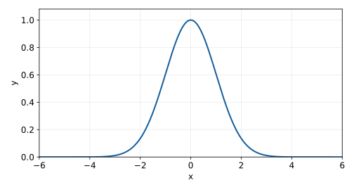
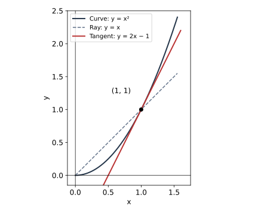
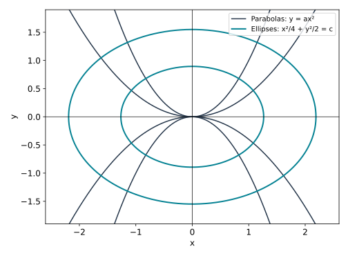

Lecture 16 — Differential equations and separation of variables

MIT 18.01, Fall 2006 · Reconstructed study notes

Reading route. Read sections 1–5 in order, trying Q1 after section 2 and Q2–Q4 where they appear. The short historical exam notice closes the core. Q5 is a later retrieval and method-choice task. [Hints](hints.md) and [complete solutions](solutions.md) are separate; each has a return link to its question. The notes use familiar algebra, differentiation, antiderivatives, logarithms, inverse functions and coordinate gradients. All new operator and curve-family notation is explained here.

The goal is to turn a statement about a curve's slope into an equation, solve suitable equations without losing solutions, and interpret the resulting family of curves. All five practice tasks are generated for these notes, not taken from a historical examination. The source is [MIT's Lecture 16](https://ocw.mit.edu/courses/18-01-single-variable-calculus-fall-2006/991e10d17c527483d3d41d83a7313536_lec16.pdf); printed page numbers below exclude its cover.

<a name="s1"></a>
Section 1 — An equation whose unknown is a function

An ordinary differential equation, or ODE, relates an unknown function of one independent variable to its derivatives. Here the independent variable is $`x`$, the unknown function is $`y(x)`$, and $`y'=dy/dx`$ is its tangent slope. A solution must be differentiable and satisfy the equation at every point of a stated interval; matching one point alone does not suffice. A first-order equation uses the first derivative but no higher derivative.

For the source's first example, $`y'=f(x)`$, the slope depends only on $`x`$. Choose an antiderivative $`F`$ with $`F'=f`$; then $`y=F(x)+c`$. The constant $`c`$ moves the curve vertically without changing its derivative. For example, $`y'=2x`$ gives $`y=x^2+c`$. If $`y(1)=3`$, substitution gives $`3=1+c`$, hence $`y=x^2+2`$. This is a particular solution selected from a general family by an initial condition, a supplied value of the function at one input. Direct integration is the simplest method when the right-hand side depends only on $`x`$.

The second source example looks different:

```math
\left(\frac{d}{dx}+x\right)y=0.
```

The parenthesised object is an operator: a rule taking a function as input and producing another function. The derivative part differentiates the input; the $`x`$ part multiplies that same input by $`x`$; the plus sign adds the two outputs. Write $`L[u]=u'+xu`$ to make its action explicit. For $`u(x)=x`$, the two outputs are $`1`$ and $`x^2`$, so $`L[x]=1+x^2`$. Conversely, “differentiate $`y`$, add $`x`$ times $`y`$, and require zero” constructs $`L[y]=0`$. It means

```math
\frac{dy}{dx}+xy=0,
\qquad\text{or equivalently}\qquad y'=-xy.
```

The $`d/dx`$ acts on $`y`$, not on the preceding $`x`$ term as though the whole parentheses were an ordinary number. Unlike the first example, the required slope depends on the unknown value $`y(x)`$ as well as on $`x`$.

The source's quantum-mechanics aside calls this an annihilation operator. More precisely, after choosing a suitable scaled coordinate for the quantum harmonic oscillator, its annihilation operator is proportional to “differentiate, then add coordinate times the function”. An annihilation operator lowers the oscillator's energy level; on its lowest-energy state it produces the zero function. The zero-output equation therefore has the same mathematical form as this example. This is physical context, not a premise needed to solve the ODE; no quantum-state interpretation is required here. The scaling qualification is supported by [MIT 22.51, chapter 9, sections 9.1.2–9.1.3, printed pages 80–81](https://ocw.mit.edu/courses/22-51-quantum-theory-of-radiation-interactions-fall-2012/7290342f83e64ea532f20aa0c8d9a63a_MIT22_51F12_Ch9.pdf).

<a name="s2"></a>
Section 2 — Separate dependence, integrate, and restore an excluded case

To solve $`y'=-xy`$, first consider an interval on which $`y\ne0`$. Dividing by $`y`$ gives $`y'/y=-x`$. The chain rule says that the left side is the derivative with respect to $`x`$ of $`\ln\lvert y(x)\rvert`$. Thus integration gives

```math
\ln\lvert y\rvert=-\frac{x^2}{2}+c.
```

The usual separation notation abbreviates that reasoning:

```math
\frac{dy}{y}=-x\,dx,
\qquad
\int\frac{1}{y}\,dy=-\int x\,dx.
```

It places all dependence on $`y`$ with $`dy`$ and all dependence on $`x`$ with $`dx`$. It is justified here by the chain rule, rather than by treating a derivative as a quotient of two independent numbers. Only one arbitrary constant is needed: if both integrals receive constants, moving one across combines them into their difference.

Exponentiating uses $`e^{r+s}=e^r e^s`$ and gives

```math
\lvert y\rvert=e^c e^{-x^2/2},
\qquad y=ae^{-x^2/2},\qquad a=\pm e^c.
```

On the current nonzero interval a continuous $`y`$ cannot change sign without passing through zero. Its sign is therefore absorbed into the fixed constant $`a`$. This derivation initially allows every nonzero real $`a`$. It cannot produce $`a=0`$, since $`e^c>0`$. Check the excluded case in the original equation: $`y=0`$ has $`y'=0=-x\cdot0`$, so it is also a solution. The final family allows every real $`a`$, including zero.

Verification is direct: differentiating $`ae^{-x^2/2}`$ gives $`-xae^{-x^2/2}=-xy`$. To see that no solutions crossing zero were missed, use a check that never divides by $`y`$: the product rule and the original equation give

```math
\frac{d}{dx}\left(e^{x^2/2}y\right)
=e^{x^2/2}(y'+xy)=0.
```

A differentiable function with derivative zero is constant on an interval. Hence $`e^{x^2/2}y=a`$ for any solution, including one that takes the value zero. This yields the same family. Separation found the family; the product-rule check establishes its completeness without the division restriction.

At $`x=0`$, $`e^0=1`$, so $`y(0)=a`$. In particular, $`y(0)=1`$ chooses $`y=e^{-x^2/2}`$. Positive $`a`$ scales the height of the curve, negative $`a`$ reflects it below the axis as well as scaling it, and zero gives the axis itself. These are dimensionless mathematical examples; no physical units for $`x`$ or $`y`$ are assigned.



Figure 1. Computed redraw of the source's Figure 1: $`y=e^{-x^2/2}`$. The curve is symmetric because replacing $`x`$ by $`-x`$ leaves $`x^2`$ unchanged. Its derivative $`-xy`$ is positive for $`x<0`$ and negative for $`x>0`$. Its maximum is therefore $`1`$ at $`x=0`$; it tends to zero as $`\lvert x\rvert`$ grows, without reaching zero at a finite input.

<a name="q1"></a>
Q1. For $`L[u]=u'+xu`$, write $`L[x^2]`$ explicitly. Then solve $`L[y]=0`$ with $`y(0)=-2`$, and separately with $`y(0)=0`$. Check each solution in the original equation and explain why division by $`y`$ requires special care in the second case.

A complete response distinguishes the input function from the output function, satisfies both equation and initial condition, and recovers any excluded solution. [Hint Q1](hints.md#h1) · [Solution Q1](solutions.md#a1)

<a name="s3"></a>
Section 3 — The general template and its limits

An equation is separable when it can be written as

```math
\frac{dy}{dx}=f(x)g(y).
```

Here $`f`$ is a known function of the independent variable and $`g`$ a known function of the unknown function's value. Their product gives the required slope. For example $`y'=x(1+y^2)`$ has $`f(x)=x`$ and $`g(y)=1+y^2`$. Constructing a separable equation works in the opposite direction: a slope equal to an $`x`$-factor times a $`y`$-factor is represented by that product.

On a region where $`g(y)\ne0`$, define $`h(y)=1/g(y)`$. Choose antiderivatives $`H`$ and $`F`$ satisfying $`H'=h`$ and $`F'=f`$. Capital letters label antiderivatives here; they do not denote inverse functions. The chain rule gives

```math
\frac{d}{dx}H(y(x))
=H'(y)y'
=\frac{y'}{g(y)}
=f(x).
```

Integrating therefore yields

```math
H(y)=F(x)+c.
```

This is an implicit relation: it relates $`x`$ and $`y`$ without necessarily isolating $`y`$. If $`H`$ has an inverse on the chosen branch and $`F(x)+c`$ lies in that inverse's domain, apply the inverse to obtain the explicit form

```math
y=H^{-1}(F(x)+c).
```

Read it from the inside outward: compute $`F(x)`$, add $`c`$, then apply the branch of the inverse of $`H`$. The symbol $`H^{-1}`$ means an inverse function, not $`1/H`$. An implicit answer can be useful even when no simple explicit inverse exists. Differentiating the implicit relation reverses the reasoning where the stated functions and division are defined. This also supplies a way to verify it.

Before dividing, test each constant $`y=b`$ with $`g(b)=0`$ in the original equation: $`y'=0`$, and the right side is $`f(x)g(b)=0`$ wherever defined. These constant solutions are absent from the divided equation. Work on intervals where all expressions are defined; the template alone does not justify crossing a singularity or joining independently chosen branches.

For the Gaussian example the consistent identification is

```math
f(x)=-x,\quad F(x)=-\frac{x^2}{2},\quad
 g(y)=y,\quad h(y)=\frac1y,\quad H(y)=\ln\lvert y\rvert.
```

The source's printed page 2 lists $`f(x)=x`$ alongside $`F(x)=-x^2/2`$. The sign is a source typo: differentiating that $`F`$ gives $`-x`$, as required by $`y'=-xy`$. Also, $`\ln\lvert y\rvert`$ on all nonzero reals is not one-to-one: $`y`$ and $`-y`$ have the same output. Its positive branch has inverse $`e^z`$; its negative branch has inverse $`-e^z`$. These branches explain the two signs in the separated solution rather than letting inverse notation silently choose one.

A branch-choice example. If an implicit relation gives $`y^2=x+1`$, the positive initial value $`y(0)=1`$ selects $`y=\sqrt{x+1}`$ near zero. The negative branch would fail that initial condition. A real square root requires $`x+1\ge0`$, and differentiability may require a stricter interval: its derivative is $`1/(2\sqrt{x+1})`$, undefined at $`x=-1`$. Both the formula and the differential equation must be checked.

<a name="q2"></a>
Q2. Solve $`y'=x(1+y^2)`$, $`y(0)=0`$, on an interval containing zero. Identify $`f(x)`$, $`g(y)`$, $`h(y)`$, $`H(y)`$ and $`F(x)`$ in the separation template. Give the implicit relation first, then select an inverse branch and the largest open interval containing zero on which your explicit solution remains finite. Explain why no constant solution was discarded.

A complete response matches each function to its role, preserves the inverse range, and checks the original equation and domain. You may use the familiar antiderivative $`\int (1+y^2)^{-1}\,dy=\arctan y`$, whose range is $`(-\pi/2,\pi/2)`$. [Hint Q2](hints.md#h2) · [Solution Q2](solutions.md#a2)

<a name="s4"></a>
Section 4 — From a geometric condition to parabolas

At a point $`(x,y)`$ with $`x\ne0`$, the line from the origin to the point has slope $`(y-0)/(x-0)=y/x`$. The tangent to a solution graph has slope $`y'`$. Thus the source's condition “tangent slope is twice the ray slope” becomes

```math
y'=\frac{2y}{x},\qquad x\ne0.
```



Figure 2. Exact illustrative redraw of the source's schematic Figure 2. The chosen curve is $`y=x^2`$ and the chosen point is $`(1,1)`$. The dashed ray has slope $`1`$; the red tangent has slope $`2`$ and equation $`y-1=2(x-1)`$. It is twice the slope, not twice the angle. The source schematic is not used as a scale drawing.

For nonzero $`y`$, separation and antiderivatives give

```math
\frac{dy}{y}=2\frac{dx}{x},\qquad
\ln\lvert y\rvert=2\ln\lvert x\rvert+c.
```

Exponentiating gives $`\lvert y\rvert=e^c\lvert x\rvert^2=e^c x^2`$. Absorb the fixed sign into a nonzero real constant, and restore $`y=0`$ by testing it in the original equation. The family is

```math
y=ax^2,\qquad a\in\mathbb R,
```

on an interval avoiding zero. Direct differentiation gives $`y'=2ax=2y/x`$ on that interval. Completeness, including the zero case, follows without dividing by $`y`$:

```math
\frac{d}{dx}\left(\frac{y}{x^2}\right)
=\frac{xy'-2y}{x^3}=0\qquad(x\ne0).
```

So $`y/x^2=a`$ is constant on each such interval. Positive $`a`$ gives an upward-opening parabola, negative $`a`$ a downward-opening one, and $`a=0`$ a horizontal line. The source examples correspond to $`a=1,2,-1,0,-2,100`$, giving $`x^2,2x^2,-x^2,0,-2x^2,100x^2`$. Its printed $`y=-2y^2`$ in the $`a=-2`$ entry is corrected to $`y=-2x^2`$.

Although the polynomial $`ax^2`$ extends smoothly across zero, $`2y/x`$ is undefined there. The original ODE does not hold at that input, and its ray-slope interpretation also fails at the origin. Solutions on $`x>0`$ and $`x<0`$ can have independent constants unless additional requirements connect them. A plot may show both sides of a polynomial without changing the equation's domain.

<a name="q3"></a>
Q3. A curve through $`(2,-4)`$ has tangent slope twice the slope of the ray from the origin at every point where $`x`$ is nonzero. Construct and solve its differential equation on $`x>0`$. At $`(2,-4)`$, find the ray and tangent slopes. Explain what the equation does and does not say at $`x=0`$.

A complete response obtains the equation from geometry, uses the initial point, and distinguishes extending a formula from satisfying an equation at a forbidden input. [Hint Q3](hints.md#h3) · [Solution Q3](solutions.md#a3)

<a name="s5"></a>
Section 5 — Curves crossing a family at right angles

Now seek curves that cross the parabolas $`y=ax^2`$ perpendicularly, meaning their tangent lines at an intersection form a right angle. At a point with $`x\ne0`$, the member through that point has $`a=y/x^2`$; its derivative is $`2ax=2y/x`$. This eliminates the family parameter and expresses the slope at the intersection using just its coordinates.

For two finite, nonzero perpendicular slopes $`m`$ and $`n`$, $`mn=-1`$. Consequently, where $`x\ne0`$ and $`y\ne0`$, the sought curve must satisfy

```math
y'=-\frac{1}{2y/x}=-\frac{x}{2y}.
```

Separating gives $`y\,dy=-(x/2)\,dx`$. Integration produces

```math
\frac{y^2}{2}=-\frac{x^2}{4}+c,
\qquad\frac{x^2}{4}+\frac{y^2}{2}=c.
```

Verify the slope by differentiating the last relation: $`x/2+yy'=0`$, hence $`y'=-x/(2y)`$ where $`y\ne0`$. It meets the earlier slope at a right angle since $`(2y/x)(-x/(2y))=-1`$ wherever both formulas are defined.

For $`c>0`$, dividing by $`c`$ rewrites the relation as

```math
\frac{x^2}{(2\sqrt c)^2}+\frac{y^2}{(\sqrt{2c})^2}=1.
```

This is an ellipse centred at the origin: a unit circle stretched horizontally by $`2\sqrt c`$ and vertically by $`\sqrt{2c}`$. To see the mapping, put $`X=x/(2\sqrt c)`$, $`Y=y/\sqrt{2c}`$; the equation becomes $`X^2+Y^2=1`$. The semiaxes, the distances from the centre to the horizontal and vertical ends, are therefore $`2\sqrt c`$ and $`\sqrt{2c}`$. Their ratio is $`\sqrt2`$; the horizontal one is longer. For $`c=0`$, only the origin satisfies the relation, so it is a point rather than an ellipse curve. For $`c<0`$, there are no real points because the left-hand side is nonnegative.



Figure 3. Computed redraw of the source's Figure 3 with equal scales on the axes. Dark curves use $`a=\pm0.4,\pm1`$; teal curves use $`c=0.4,1.2`$. Perpendicularity at intersections away from the axes follows from the slope product, not from estimating the drawing. The unplotted degenerate family member $`a=0`$ is the horizontal axis.

Solving the ellipse equation for $`y`$ gives two branches:

```math
y=\pm\sqrt{2c-\frac{x^2}{2}}
=\pm\sqrt{2\left(c-\frac{x^2}{4}\right)}.
```

For $`c>0`$, the plus sign describes the upper half and the minus sign the lower half. Each branch is a differentiable solution of $`y'=-x/(2y)`$ for $`-2\sqrt c<x<2\sqrt c`$. It has a real value at both endpoints too, but there $`y=0`$, so the slope formula is undefined and the tangent is vertical. For example the ellipse with $`c=1`$ has endpoints $`(\pm2,0)`$, vertical semiaxis $`\sqrt2`$, and upper branch $`y=\sqrt{2-x^2/2}`$ on $`(-2,2)`$. At $`(\sqrt2,1)`$ its slope is $`-1/\sqrt2`$, while the parabola through the point has $`a=1/2`$ and slope $`\sqrt2`$; their product is $`-1`$.

The endpoint tangent can also be checked without an infinite slope: locally solve for $`x`$ as a function of $`y`$ and differentiate the implicit relation to get $`dx/dy=-2y/x`$. At $`(\pm2\sqrt c,0)`$ this is zero, so the tangent direction is vertical.

The full ellipse is a closed geometric curve, not the graph of one function $`y(x)`$: most interior $`x`$ values correspond to two different $`y`$ values. At the horizontal endpoints its vertical tangents are perpendicular to the horizontal line $`y=0`$, the $`a=0`$ family member. That geometric observation extends the right-angle interpretation to those endpoints; it does not make division by $`y=0`$ legal. At the vertical-axis points $`(0,\pm\sqrt{2c})`$, no finite-parameter parabola $`y=ax^2`$ passes through the point. There is therefore no parabola intersection to test there, even though the ellipse branch and its ODE are regular there. The right-angle requirement determines the family away from these exceptional points; the implicit curves supply its geometric continuation.

<a name="q4"></a>
Q4. Find the curve through $`(2,1)`$ that meets the family $`y=ax^2`$ perpendicularly. Give its implicit equation, horizontal and vertical semiaxis lengths, and its explicit branch through $`(2,1)`$. State where that branch satisfies $`y'=-x/(2y)`$. Identify the member of the parabola family through $`(2,1)`$, and check the two slopes there. Explain the status of the full closed ellipse and its points on the $`x`$-axis.

A complete response connects family slope to perpendicular slope, integrates correctly, selects the branch and domain from the point, and distinguishes a geometric curve from a single differentiable graph. [Hint Q4](hints.md#h4) · [Solution Q4](solutions.md#a4)

<a name="exam"></a>
Section 6 — The source's closing exam notice

The lecture ends by announcing these topics for that course's Exam 2:

1. Linear and/or quadratic approximations.
2. Sketches of $`y=f(x)`$.
3. Maximum/minimum problems.
4. Related rates.
5. Antiderivatives and separation of variables.
6. The mean value theorem.

It refers students to a separate Exam 2 review sheet and warns that the second exam will be harder than the first. This is a historical course notice, not a prediction about your own examination or a claim that these notes teach all six topics. The assigned Lecture 16 develops separation and its geometric applications; the list is retained here as its closing scope notice.

<a name="q5"></a>
Section 7 — Later retrieval and a changed application

After a gap that suits your study schedule, try Q5 without first rereading the worked examples. Later the same day or on another day is an adjustable suggestion, not a fixed optimum. Stating the conditions from memory is retrieval; selecting and checking methods in the two cases tests application. Difficulty with either is a reason to return to the relevant step, not evidence of a fixed ability.

Q5. Solve (i) $`y'=3x^2`$, $`y(1)=2`$, and (ii) $`y'=2y/x`$, $`y(-1)=2`$ on $`x<0`$. For each, choose a method and state what feature of the equation justifies that choice. Check both answers by differentiation and initial data. A proposed solution of (ii) is $`y=2x`$: identify the first condition it fails. Finally state the nonzero conditions that must be checked before separating $`y'=f(x)g(y)`$.

A complete response discriminates direct integration from separation, uses a negative-$`x`$ interval consistently, and distinguishes a correct initial value from a correct differential equation. [Hint Q5](hints.md#h5) · [Solution Q5](solutions.md#a5)
