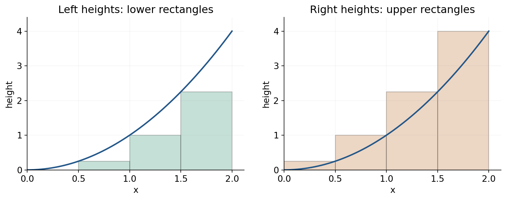
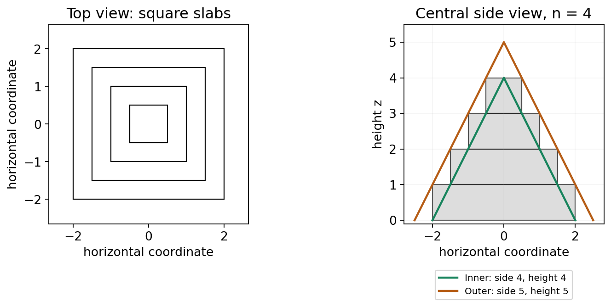
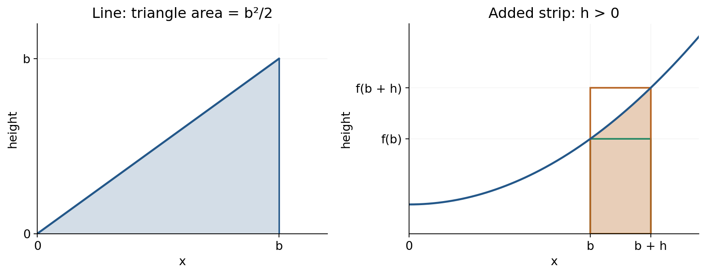
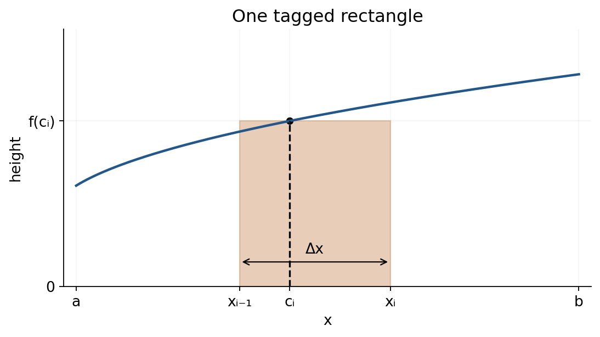

Definite integrals: from small contributions to a total

Reading route

Read this file in order, trying P1–P3 where they occur. P4 is a later revisit. Each task links to its own entry in [hints](hints.md); complete [solutions](solutions.md) are in a separate file. All four tasks are generated applications, not transcribed MIT assessment questions. The figures are part of the explanation.

The aim is to construct a definite integral from contributions, justify the rectangle limit in two examples, and adapt the construction when contributions accrue interest for different lengths of time. Familiar algebra, limits of elementary expressions, differentiation, power antiderivatives, and finite arithmetic sums are used. No previous university lecture is required.

C1. A rectangle records a contribution

An integral accumulates a quantity that varies across an interval. For nonnegative height $`f(x)`$ between $`a`$ and $`b`$, with $`a<b`$, the target is the area between the graph and the horizontal axis. A strip of width $`\Delta x`$ and chosen height $`f(c)`$ contributes rectangle area $`f(c)\Delta x`$. Multiplication matters: height alone does not measure an area. If both axes measure lengths, the product has square-length units. If the vertical axis is a rate and the horizontal axis is time, their product has the units of the accumulated quantity instead.

Divide the interval into $`n`$ equal strips. Their width is $`\Delta x=(b-a)/n`$. Using a height from each strip gives an approximation; increasing $`n`$ shrinks every width. Figure 1 makes the approximation and its direction visible for an increasing nonnegative function.



Figure 1. Both panels have the same axes and strip boundaries. A left rectangle uses the curve's height at its left edge; a right rectangle uses the height at its right edge. Because the curve rises through each strip, every point of the curve lies between these two heights. Thus adding the lower rectangles gives a lower bound and adding the upper rectangles gives an upper bound. These are bounds justified by monotonicity, not just visual guesses.

C2. A worked area: the square function

Take $`f(x)=x^2`$ on $`[0,b]`$, with fixed $`b>0`$. The right edge of strip $`i`$ is $`ib/n`$, where $`i=1,2,\ldots,n`$. Its width is $`b/n`$ and its height is $`(ib/n)^2`$. The right-endpoint total is therefore

```math
R_n=\frac bn\left(\frac bn\right)^2
+\frac bn\left(\frac{2b}n\right)^2+\cdots
+\frac bn\left(\frac{nb}n\right)^2
=\frac{b^3}{n^3}\sum_{i=1}^{n}i^2.
```

The summation symbol adds one term for each strip. The factor $`b^3/n^3`$ comes from one width factor and two height factors. Conversely, given the compact expression, its term $`(b/n)(ib/n)^2`$ reconstructs the rectangle at the right edge of strip $`i`$. We need the limit of the square sum divided by $`n^3`$.

The lecture's geometric route builds a staircase solid. Stack square slabs of thickness 1, with side lengths $`n,n-1,\ldots,1`$ from bottom to top. Each is centred above the preceding slab. The volumes are $`n^2,(n-1)^2,\ldots,1`$, so the solid's volume is the square sum. This three-dimensional model represents a sum; it does not mean the original area problem has become a volume problem.



Figure 2. The top view shows square footprints of sides 4, 3, 2 and 1. Each corresponds to one unit-thick slab. The side view is a central vertical slice; the whole solid has square horizontal sections. The green inner pyramid has base side $`n`$ and height $`n`$. The orange outer pyramid has base side $`n+1`$ and height $`n+1`$. Their bases lie in the same plane, and their axes pass through the common centre.

Here is the containment warrant. At height $`z`$ in the slab $`k\le z<k+1`$, where $`k=0,\ldots,n-1`$, the slab's square side is $`n-k`$. The inner pyramid's square side is $`n-z`$ and the outer pyramid's is $`n+1-z`$, by similar triangles in the side view. Thus

```math
n-z\ \le\ n-k\ \le\ n+1-z.
```

The squares are concentric, so comparing their sides really does compare containment of their whole cross-sections. Slab boundaries do not alter volume. The outer pyramid also extends from height $`n`$ to $`n+1`$. The strict volume bounds follow because the gaps have positive volume.

Use the geometric volume rule: a pyramid has volume one third of its base area times perpendicular height. This is a geometry premise for the comparison, not a result inferred from the area we are finding. Since these bases are squares,

```math
\frac{n^3}{3}<\sum_{i=1}^{n}i^2<\frac{(n+1)^3}{3},
\qquad
\frac13<\frac{1}{n^3}\sum_{i=1}^{n}i^2
<\frac13\left(1+\frac1n\right)^3.
```

The right bound approaches $`1/3`$, and the left bound is $`1/3`$. The middle cannot stay any fixed distance from that number once the two bounds are arbitrarily close. This squeezing establishes that the middle tends to $`1/3`$, hence $`R_n\to b^3/3`$.

To connect this limit to the actual region, also use left rectangles. Their total is

```math
L_n=\frac{b^3}{n^3}\sum_{i=0}^{n-1}i^2,
\qquad R_n-L_n=\frac{b^3}{n^3}(n^2-0^2)=\frac{b^3}{n}.
```

The intermediate squares cancel in the difference. Since this gap tends to zero, $`L_n`$ tends to the same limit as $`R_n`$. The region is enclosed between them for every $`n`$, so its area is

```math
A(b)=\frac{b^3}{3}.
```

The exact square-sum identity $`\sum_{i=1}^n i^2=n(n+1)(2n+1)/6`$ offers a shorter algebraic check. Dividing by $`n^3`$ gives $`1/3+1/(2n)+1/(6n^2)`$, again tending to $`1/3`$. The geometric comparison explains why the sum grows on the scale of $`n^3`$ without needing its exact finite formula. At $`b=0`$ the area is zero; the positive-width rectangle construction above assumed $`b>0`$.

<a name="p1"></a>
P1. First attempt

For $`f(x)=x^2`$ on $`[0,2]`$, use four equal strips. Construct the right-endpoint sum $`R_4`$ and left-endpoint sum $`L_4`$. Give a justified interval containing the area and its width. Explain why the ordering holds. The target is to build and interpret finite rectangle bounds: include sample positions, products, both sums and the monotonicity warrant. [Hint P1](hints.md#h1).

C3. Compare a line, then move the endpoint

For $`f(x)=x`$ on $`[0,b]`$, $`b>0`$, the right rectangles instead have heights $`ib/n`$:

```math
R_n=\frac{b^2}{n^2}\sum_{i=1}^{n}i
=\frac{b^2}{n^2}\frac{n(n+1)}2
=\frac{b^2}{2}\left(1+\frac1n\right)
\longrightarrow\frac{b^2}{2}.
```

This agrees with the triangle of base $`b`$ and height $`b`$ under the line. The left-right gap here is $`b^2/n`$, so the same enclosure argument connects the sum limit to area. Both examples can now be compared by differentiating their area with respect to the moving endpoint:

```math
\frac{d}{db}\left(\frac{b^3}{3}\right)=b^2,
\qquad
\frac{d}{db}\left(\frac{b^2}{2}\right)=b.
```

In each case the rate of increase of area is the current height at the endpoint.



Figure 3. The left triangle checks the line's area directly. On the right, the shaded strip is the new area $`A(b+h)-A(b)`$. Its horizontal width is $`h`$, and its heights lie between $`f(b)`$ and $`f(b+h)`$. These rectangles explain how an area change becomes a height after division by width.

For an increasing continuous curve and $`h>0`$, the strip bounds give

```math
f(b)h\le A(b+h)-A(b)\le f(b+h)h,
\qquad
f(b)\le\frac{A(b+h)-A(b)}h\le f(b+h).
```

Continuity means the endpoint heights approach one another as $`h\to0`$. For $`h<0`$, the removed strip lies from $`b+h`$ to $`b`$; taking both the negative area change and negative width leaves the quotient between $`f(b+h)`$ and $`f(b)`$. Thus the two-sided derivative is $`A'(b)=f(b)`$ at an interior endpoint position. This gives the mechanism behind the lecture's pattern. Below we state the general version for continuous functions, including signed accumulation.

C4. Any sample inside its own strip

An endpoint is convenient but not compulsory. Set the boundaries

```math
x_i=a+i\Delta x,\qquad\Delta x=\frac{b-a}{n},\qquad i=0,1,\ldots,n.
```

Here $`x_0=a`$ and $`x_n=b`$. In each strip $`[x_{i-1},x_i]`$, select a point $`c_i`$, called its tag. The tag is an input to $`f`$; $`f(c_i)`$ is the corresponding height. Each tag must be in its own strip, not just somewhere in the whole interval. Tags may differ in relative position from strip to strip and may change when $`n`$ changes.



Figure 4. The dashed line locates the selected input $`c_i`$; the dot is on the curve at height $`f(c_i)`$. The rectangle uses that height across the entire strip, so its top generally differs from the curve at other inputs. The two strip boundaries, the selected input, and the rectangle height have distinct roles.

Add the signed contributions to form the Riemann sum

```math
S_n=f(c_1)\Delta x+f(c_2)\Delta x+\cdots+f(c_n)\Delta x
=\sum_{i=1}^{n}f(c_i)\Delta x.
```

For instance, on $`[1,3]`$ with two strips, the widths are 1 and the strips are $`[1,2]`$ and $`[2,3]`$. Choosing $`c_1=1.2`$, $`c_2=2.8`$ constructs $`S_2=f(1.2)\cdot1+f(2.8)\cdot1`$. Reading that expression back reveals exactly which heights were sampled. Neither tag is an endpoint, and they are not the midpoints.

Definition and existence condition. For the continuous functions on closed finite intervals used here, the sums have one common limit as widths tend to zero, independent of all permissible tags. This existence and tag-independence is a standard theorem of integration, stated here as a premise. The definite integral denotes that limit:

```math
\int_a^b f(x)\,dx
=\lim_{n\to\infty}\sum_{i=1}^{n}f(c_i)\frac{b-a}{n}.
```

The lower and upper limits give the interval, $`f(x)`$ supplies the values being accumulated, and $`dx`$ identifies the variable whose widths are used. The integral sign represents the limiting accumulation. A finite $`\Delta x`$ is not being set to zero inside the sum; the number of contributions grows while their widths shrink. Renaming the variable changes nothing: $`\int_a^b f(u)\,du`$ is the same number. For a discontinuous function, the existence of such a tag-independent limit needs checking; it is not guaranteed merely by writing an integral sign.

For increasing $`x^2`$ on $`[0,b]`$, each tag height lies between its left and right heights, so $`L_n\le S_n\le R_n`$. C2 already showed the outer sums approach $`b^3/3`$. Thus arbitrary tags give the same value in this example. For a decreasing function the right endpoint supplies the lower height; the names “left” and “right” alone do not specify an error direction.

<a name="p2"></a>
P2. Change the controlling condition

For $`f(x)=2-x`$ on $`[0,2]`$, use $`n`$ equal strips and any selected point $`c_i`$ in strip $`i`$. Construct $`R_n`$, $`L_n`$ and $`S_n`$. Evaluate the common limit using $`\sum_{i=1}^{n}i=n(n+1)/2`$. Explain why $`R_n\le S_n\le L_n`$ for every permissible selection and why this establishes the integral independently of tags. The target is to transfer bounds when monotonicity reverses: give the finite formulas and shrinking enclosure, not only an antiderivative. [Hint P2](hints.md#h2).

C5. Signed accumulation and efficient evaluation

If $`f`$ is nonnegative, its integral is the geometric area under its graph above the axis. If $`f`$ is negative on a strip, the product $`f(c_i)\Delta x`$ is negative; the integral subtracts below-axis area. For example a constant height $`-2`$ across width 3 contributes $`-6`$ to the integral, although its geometric area is 6. For geometric area between curve and axis, split at sign changes and add the positive magnitudes. The rate-to-total interpretation works in the same signed way: velocity integrates to displacement, whereas speed integrates to distance.

An indefinite integral specifies antiderivatives and a constant; a definite integral over fixed limits is a single signed number. The fundamental theorem supplies an efficient evaluation rule for continuous $`f`$: if $`F'=f`$, then

```math
\int_a^b f(x)\,dx=F(b)-F(a).
```

For example, $`\int_1^2 x^2\,dx=[x^3/3]_1^2=7/3`$. The bracket means evaluate at 2 and subtract the value at 1. It also equals the difference between the areas $`8/3`$ and $`1/3`$ already obtained by rectangles. The theorem connects this calculation to accumulation; an antiderivative calculation does not on its own explain how to build a new accumulation model.

Its variable-endpoint form is $`A(b)=\int_a^b f(x)\,dx`$ and $`A'(b)=f(b)`$ wherever $`f`$ is continuous. With fixed $`a`$, $`x`$ is the integration variable inside the expression, whereas $`b`$ is the variable endpoint outside it. For a curve that decreases or crosses the axis this $`A`$ is signed accumulation, so it need not increase. C3 explained the local strip mechanism in the increasing positive case; the theorem extends the result beyond that case.

An average value is total accumulation divided by interval length: $`\bar f=\frac1{b-a}\int_a^b f(x)\,dx`$. It is the constant height whose rectangle has the same signed integral. For $`f(x)=x`$ on $`[0,b]`$, the area $`b^2/2`$ therefore gives average height $`b/2`$. This is why the same integral can describe a total, an area, or an average after the appropriate division.

C6. Borrowing: each contribution has a different age

Use the lecture's idealised simple-interest model. An amount $`P`$ dollars borrowed for duration $`s`$ years owes $`P(1+rs)=P+Prs`$ dollars, where $`r`$ has units per year. Interest is proportional to elapsed time; there is no compounding, repayment or fee in this model. For example $`r=0.06`$ per year means six percent of the original amount per year. This model is a supplied mathematical assumption, not a statement of a real lending contract.

Let $`t`$ measure elapsed time in years and let $`f(t)`$ be the borrowing rate in dollars per year during the first year. A rate of 1000 dollars per month corresponds to 12000 dollars per year. The rate is not itself the amount borrowed.

For twelve equal months, set $`\Delta t=1/12`$ year and $`t_i=i/12`$ years. Treating $`f(t_i)`$ as representative of month $`i`$ gives the contribution $`f(t_i)\Delta t`$ dollars. The sum

```math
\sum_{i=1}^{12}f(t_i)\Delta t
```

approximates the total continuous borrowing. It is exact if the rate stays at that value during each month. If instead a model specifies discrete loans of those amounts at the month ends, it is their exact sum, but that is a different timing model. For a varying continuous rate, refine beyond twelve months: with $`n`$ strips, $`\Delta t=1/n`$ year and $`t_i=i/n`$ years, the limit is the borrowed principal

```math
B=\int_0^1 f(t)\,dt.
```

The bounds are times in years. Rate times time gives dollars, so $`B`$ has dollars as its units.

To find the debt at the end of the year, a contribution borrowed at time $`t_i`$ accrues interest for $`1-t_i`$ years. Multiply that contribution by its own simple-interest factor before summing:

```math
D_n=\sum_{i=1}^{n}\bigl[f(t_i)\Delta t\bigr]
\bigl[1+r(1-t_i)\bigr],
\qquad
D=\int_0^1 f(t)\bigl[1+r(1-t)\bigr]\,dt.
```

When numerical times are written as 0 and 1, years are understood consistently; $`r(1-t)`$ is rate times duration, hence dimensionless. The full integrand has units dollars per year, and $`D`$ has dollars. At $`t=0`$ the weight is $`1+r\times1\text{ year}`$; at $`t=1`$ it is 1. Earlier borrowing costs more under this model. The finite debt sum is a representative-time approximation to continuous borrowing, even when its principal sum is exact for a piecewise constant rate.

Worked case. Borrow uniformly at 12000 dollars per year, and let $`r=0.06`$ per year. Using year-valued numerical times,

```math
B=\int_0^1 12000\,dt=12000\text{ dollars},
```

```math
D=12000\int_0^1(1.06-0.06t)\,dt
=12000[1.06t-0.03t^2]_0^1
=12360\text{ dollars}.
```

Interest is $`D-B=360`$ dollars. Uniform borrowing spreads the loans across the year, giving average interest duration one half year. Charging the entire 12000 dollars for a full year would instead model borrowing it all at the start, giving 720 dollars interest; that is not the continuous uniform model. With $`r=0`$, the formula reduces to $`D=B`$, as it should.

<a name="p3"></a>
P3. Construct the accumulation

In a generated one-year model, $`t`$ is elapsed time in years, $`0\le t\le1`$. Borrow continuously at $`f(t)=6000t`$ dollars per year; the coefficient carries the corresponding units if $`t`$ is written with units. The simple interest rate is $`r=0.06`$ per year, without compounding or repayments. An amount $`dP`$ borrowed at time $`t`$ owes $`dP[1+r(1-t)]`$ at year end, with time differences in years.

Construct and evaluate integrals for principal $`B`$ and final debt $`D`$; identify $`D-B`$ and its units. Compare $`D`$ with the debt from borrowing the same total principal uniformly through the year, explaining the timing effect. The target is a weighted accumulation: explain the amount per strip and remaining interest time before evaluating. [Hint P3](hints.md#h3).

<a name="p4"></a>
P4. Later revisit

On a later study occasion, initially try this without rereading. A delay of a day or two is one adjustable study suggestion, not a universal optimum. Part (a) checks retained recall; parts (b,c) require transfer of the meaning to signed accumulation.

(a) State the equal-width arbitrary-tag definition of the definite integral of a continuous function on $`[a,b]`$, defining each symbol and stating what must be independent of the tags.

(b) For $`f(x)=3-2x`$ on $`[0,2]`$, find both the definite integral and geometric area between graph and axis, choosing an efficient method and explaining the difference.

(c) Set $`A(b)=\int_0^b(3-2x)\,dx`$. Find $`A'(b)`$ and say whether $`A`$ is increasing at $`b=2`$; reconcile this with the nonnegative geometric area in (b).

A successful response distinguishes signed and unsigned quantities and supplies the sign-change location and warrants. [Hint P4](hints.md#h4).

Source and scope

Based on MIT OpenCourseWare, 18.01 Single Variable Calculus, Fall 2006, “Lecture 18: Definite Integrals,” source PDF pages 1–6 (cover plus five numbered teaching pages). The [original PDF](../source/lec18.pdf) contains the area and pyramid construction, line comparison, arbitrary tags, and borrowing example. These notes reconstruct all of those portions and supply their local warrants. The square-sum comparison uses pyramids; the source calls them “prisms,” despite using the pyramid formula. The borrowed total is in dollars; the source's “dollars per year” after the integral is a units error. The nonnegative-area condition and simple-interest assumptions are made explicit here. The new figures and tasks were constructed for these notes.
