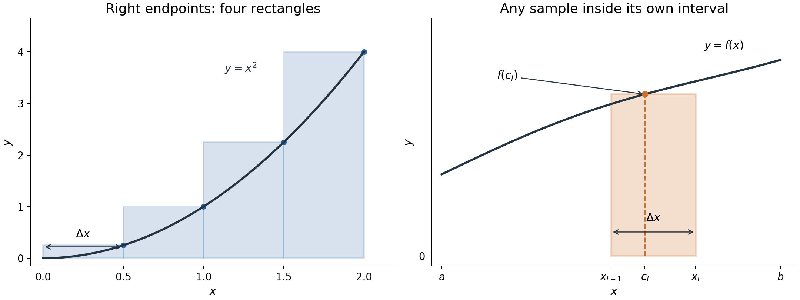
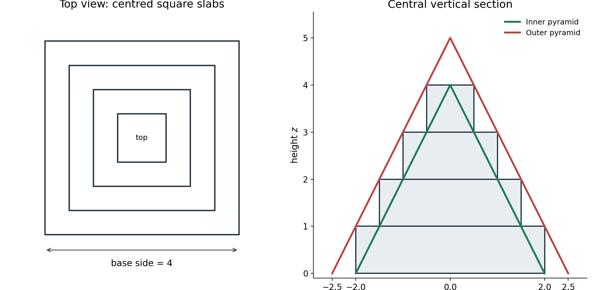
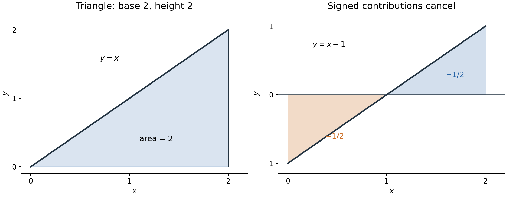

Definite integrals: from small contributions to a total

MIT 18.01, Fall 2006, Lecture 18 · D016

Read this file in order. Attempt P1–P5 where they appear; P6 is a later opportunity to recall the construction and apply it under changed conditions. All practice here is newly written. [Hints](hints.md) are grouped in a separate file, and [complete solutions](solutions.md) are in another file. Each uses the same P1–P6 labels.

You already have antiderivatives, summation notation, elementary limits, signed areas and the fundamental theorem of calculus in the supplied starting knowledge. Here the aim is to construct the integral from the quantity being added, justify a geometric limit, and decide what contribution each borrowing time makes to a final debt.

1. Build a sum from one rectangle

For a nonnegative function, a thin vertical rectangle approximates part of the area between its graph and the horizontal axis. Its area is height times width. Add the rectangles, then let their widths approach zero.

Take $`f(x)=x^2`$ on $`[0,b]`$, with fixed $`b\gt 0`$. Split the interval into $`n`$ equal pieces, where $`n`$ is a positive integer. The width is $`b/n`$. The right endpoint of piece $`i`$ is $`ib/n`$, so that rectangle has height $`(ib/n)^2`$. The first two contributions and the full right-endpoint sum are

```math
\frac bn\left(\frac bn\right)^2,\qquad
\frac bn\left(\frac{2b}{n}\right)^2,
\qquad
R_n=\sum_{i=1}^{n}\left(\frac{ib}{n}\right)^2\frac bn
=\frac{b^3}{n^3}\sum_{i=1}^{n}i^2.
```

The index $`i`$ runs through the rectangles; it is not a further spatial coordinate. Read the last expression as “a common scale factor times the sum of the squares from 1 to $`n`$.” To construct it, multiply one height by one width before summing. The two powers of $`b/n`$ in the height and the one in the width explain the cube.



Figure 1. Left: $`b=2`$ and $`n=4`$; each marked right endpoint supplies its rectangle's height. Right: the orange rectangle illustrates a sample $`c_i`$ anywhere inside its own interval. The curve in this right panel is schematic; the construction does not require its particular formula.

Because $`x^2`$ increases on this interval, a right rectangle is at least as high as the curve throughout its piece. A left rectangle is no higher than the curve. Thus the left sum $`L_n`$ is a lower bound and $`R_n`$ is an upper bound for the area. These statements depend on monotonicity; an arbitrary sample in the right panel need not give either bound.

P1. For $`f(x)=x^2`$ on $`[0,2]`$, use four equal intervals. Write the width and the four right endpoints, then calculate the right sum $`R_4`$ and left sum $`L_4`$. Give an interval containing the exact area and explain which monotonicity fact makes the two bounds valid. A complete response includes the height-times-width products, not just two numbers. [Hint P1](hints.md) · [Solution P1](solutions.md).

2. Why the sum of squares has the required limit

The source obtains the leading size of $`1^2+\cdots+n^2`$ through a three-dimensional construction. Build a centred stack of square slabs, each 1 unit thick: bottom side $`n`$, next side $`n-1`$, down to top side 1. Each slab's volume is its square area times thickness, so the stack volume is

```math
S_n=n^2+(n-1)^2+\cdots+1^2.
```

A square pyramid has a square base and straight sides meeting at one apex. We use the geometric volume rule $`V=(\text{base area})(\text{perpendicular height})/3`$. This is a supplied geometric fact, not the prism rule, which lacks the factor $`1/3`$.



Figure 2. The drawing uses $`n=4`$. The inner pyramid is green and has base side 4 and height 4. The outer pyramid is red and has base side 5 and height 5. All square cross-sections share the same centre and orientation. The right drawing is a central section through the solids, not their volume by itself.

Here is why the containment really holds. Let $`z`$ be height above the base. Between heights $`j`$ and $`j+1`$, the stack has square side $`n-j`$, for $`j=0,\ldots,n-1`$. Similarity makes the inner pyramid's square side $`n-z`$ and the outer pyramid's side $`n+1-z`$. Throughout that slab,

```math
n-z\le n-j\le n+1-z.
```

Thus each horizontal square of the inner pyramid fits inside the slab, and each slab fits inside the outer pyramid. The outer pyramid also extends above the stack. Comparing volumes gives

```math
\frac{n^3}{3}\le S_n\le\frac{(n+1)^3}{3},
\qquad
\frac13\le\frac{S_n}{n^3}\le\frac13\left(1+\frac1n\right)^3.
```

Both bounds approach $`1/3`$. The squeeze principle says that a quantity trapped between two bounds with the same limit approaches that limit too: any eventual gap from their common value is no larger than the shrinking gap allowed by the bounds. Therefore

```math
\lim_{n\to\infty}\frac{S_n}{n^3}=\frac13,
\qquad
\lim_{n\to\infty}R_n=\frac{b^3}{3}.
```

This is a limit statement, not an equality $`S_n=n^3/3`$ at finite $`n`$. The familiar exact formula $`S_n=n(n+1)(2n+1)/6`$ is a quicker algebraic check if available; the geometric argument explains the limit without requiring that formula.

To connect the right sum to the actual area, compare it with the left sum. All intermediate heights cancel in their difference:

```math
R_n-L_n
=\frac bn\left[\left(\frac{nb}{n}\right)^2-0^2\right]
=\frac{b^3}{n}.
```

The area lies between the two sums, and their difference tends to zero. Hence

```math
\text{area under }x^2\text{ on }[0,b]=\frac{b^3}{3}.
```

For example, on $`[0,2]`$ the area is $`8/3`$, consistent with the finite bounds in P1. The case $`b=0`$ has zero area directly; the positive-width construction above assumed $`b\gt 0`$.

P2. Change the staircase solid: its centred square slabs still have side lengths $`n,n-1,\ldots,1`$ from bottom to top, but every slab is now 2 units thick. Call its volume $`V_n`$. Using square-pyramid comparisons, identify an inner pyramid and an outer pyramid by base side and perpendicular height. Bound $`V_n/n^3`$ and find its limit. Explain why changing the slab thickness changes the pyramid heights; do not just quote a sum-of-squares formula. [Hint P2](hints.md) · [Solution P2](solutions.md).

3. Read and construct the definite integral

For a general function $`f`$ on a finite interval $`[a,b]`$, with $`a\lt b`$, write

```math
\Delta x=\frac{b-a}{n},\qquad
x_i=a+i\Delta x,\qquad i=0,\ldots,n.
```

The numbers $`x_0=a,\ldots,x_n=b`$ are the interval boundaries. Choose a sample $`c_i`$ in the $`i`$th piece $`[x_{i-1},x_i]`$. Its contribution is $`f(c_i)\Delta x`$, and the sum is

```math
\sum_{i=1}^{n}f(c_i)\Delta x
=f(c_1)\Delta x+\cdots+f(c_n)\Delta x.
```

This is a Riemann sum. Right endpoints mean $`c_i=x_i`$; left endpoints mean $`c_i=x_{i-1}`$; midpoints mean $`c_i=(x_{i-1}+x_i)/2`$. Figure 1's orange rectangle shows the sample, its height and the interval's width separately.

If these sums approach one common finite value as $`n`$ increases, regardless of the choices of samples in their own pieces, that value is the definite integral:

```math
\int_a^b f(x)\,dx
=\lim_{n\to\infty}\sum_{i=1}^{n}f(c_i)\Delta x.
```

The lower and upper limits give the interval; $`f(x)`$ is the quantity sampled; $`dx`$ indicates the variable and the shrinking widths represented by $`\Delta x`$. It does not instruct you to multiply by a width equal to zero. The index and sample choices disappear from the result because the common limit does not depend on them.

The existence statement we will use is a theorem: a continuous function on $`[a,b]`$ has this common limit. Continuity means that, at each point $`c`$, the values $`f(x)`$ approach $`f(c)`$ when $`x`$ approaches $`c`$ within the interval; at an endpoint use the available side. There is no jump or missing value at that point. For a polynomial you can check this from its finite sums and products: for example, $`x^2-c^2=(x-c)(x+c)`$ tends to zero as $`x`$ approaches a fixed $`c`$. Both $`x^2`$ and $`2x-3`$ therefore satisfy the condition. We are using the existence theorem, not proving it from these examples, and we are not claiming that every discontinuous function fails to have an integral.

When $`f`$ is nonnegative, the integral is ordinary geometric area. For negative values, $`f(c_i)\Delta x`$ is a signed contribution. Below-axis parts subtract. The ordinary area between the curve and the axis is instead $`\int_a^b|f(x)|\,dx`$, or the sum of the nonnegative areas after splitting at sign changes.



Figure 3. Left: the triangle under $`y=x`$ has area 2. Right: for $`f(x)=x-1`$ on $`[0,2]`$, the left triangle contributes $`-1/2`$ and the right contributes $`+1/2`$. The integral is zero; the geometric area is 1. Cancellation is a property of the signed total, not disappearance of either region.

P3. Let $`g(x)=2x-3`$ on $`[1,3]`$. Construct its right-endpoint sum $`R_n`$ for $`n`$ equal intervals, simplify the sum and take its limit. Separately find the geometric area between this graph and the $`x`$-axis. Explain why the two results differ, using the sign change of $`g`$. You may use $`\sum_{i=1}^n i=n(n+1)/2`$. [Hint P3](hints.md) · [Solution P3](solutions.md).

4. The linear example, accumulation and average

For $`f(x)=x`$ on $`[0,b]`$, with $`b\gt 0`$, the right rectangles give

```math
R_n=\sum_{i=1}^{n}\frac{ib}{n}\frac bn
=\frac{b^2}{n^2}\frac{n(n+1)}2
=\frac{b^2}{2}\left(1+\frac1n\right).
```

The limit is $`b^2/2`$. This agrees with the triangle's base $`b`$, height $`b`$ and area $`b^2/2`$. Here the geometric area formula is simpler than summation; agreement checks the construction.

Now fix a lower limit $`a`$ and allow the upper endpoint $`b`$ to vary. Define the accumulation function

```math
A(b)=\int_a^b f(x)\,dx.
```

The $`x`$ inside the integral is a dummy variable used to add contributions. The input $`b`$ decides where accumulation stops. Renaming $`x`$ to $`u`$ changes nothing; changing $`b`$ usually changes the total.

For continuous $`f`$, the fundamental theorem already in the starting knowledge gives $`A(b)=F(b)-F(a)`$ when $`F'=f`$. Differentiating with respect to $`b`$ gives $`A'(b)=f(b)`$, because $`a`$ is fixed and $`F(a)`$ is a constant. For the two source examples, differentiating $`b^3/3`$ gives $`b^2`$, and differentiating $`b^2/2`$ gives $`b`$. The upper-endpoint value is the rate at which the total changes. No arbitrary additive constant remains in the definite total; $`A(a)=0`$ fixes the starting accumulation.

The average value on $`[a,b]`$ is the total divided by the interval length:

```math
f_{\mathrm{avg}}=\frac{1}{b-a}\int_a^b f(x)\,dx.
```

Multiplying this constant height by the width $`b-a`$ recovers the same signed total. For $`x^2`$ on $`[0,2]`$, the total is $`8/3`$ and the average height is $`4/3`$. An integral and an average have different units: the integral has units of $`f`$ times units of $`x`$; division by the interval length restores the units of $`f`$.

P4. Define $`A(b)=\int_1^b(2x+1)\,dx`$ for $`b\ge1`$. Find $`A(b)`$, check $`A(1)`$, and differentiate your expression with respect to $`b`$. Explain the different roles of $`x`$ and $`b`$. Also find the average value of $`2x+1`$ on $`[1,3]`$ and interpret it as the height of an equal-area rectangle. [Hint P4](hints.md) · [Solution P4](solutions.md).

5. From a borrowing rate to the amount owed

An integral adds more than areas. A borrowing rate $`f(t)`$, measured in dollars per year, multiplied by a short duration gives dollars borrowed. Assume no starting debt, no repayments and no fees. The borrowing rate is nonnegative.

First state the interest model. Simple interest adds interest on the original principal only. If an amount $`P`$ is borrowed for duration $`\tau`$, at annual rate $`r`$, the amount owed is $`P(1+r\tau)`$. The product $`r\tau`$ is dimensionless: for example, a rate of $`0.06\ \mathrm{year}^{-1}`$ acting for half a year gives $`0.03`$. This model does not include interest on accumulated interest.

For the formulas and calculations that follow, time symbols denote numerical times in years and $`r`$ denotes the numerical annual fraction. Thus $`T=1`$ means a final time one year after the start, and $`r=0.06`$ means 6 percent per year. Borrowing rates retain their dollars-per-year interpretation, and interval widths supply the years in the units calculation.

For monthly right samples in a one-year interval, $`\Delta t=1/12`$ and $`t_i=i/12`$. The contribution $`f(t_i)\Delta t`$ is exact when the rate is constant through that month and otherwise is a rectangle approximation. For a constant rate of 12,000 dollars per year, it gives 1,000 dollars per month. In the limit of smaller intervals, the total borrowed by time $`T`$ is

```math
B(T)=\int_0^T f(t)\,dt.
```

Its unit is dollars. The borrowing-rate graph has dollars per year vertically and years horizontally; the product of those units is dollars.

For the final debt, the same small principal borrowed at time $`t_i`$ remains outstanding for $`T-t_i`$ years. Its contribution to the final amount owed is approximately

```math
f(t_i)\Delta t\,[1+r(T-t_i)].
```

Earlier borrowing has a longer time to collect interest. Sum these contributions and take the limit:

```math
D(T)=\int_0^T f(t)[1+r(T-t)]\,dt
=B(T)+r\int_0^T f(t)(T-t)\,dt.
```

The second term is the interest. The square bracket is a dimensionless multiplier, so $`D(T)`$ is also dollars. This construction assumes that each borrowed amount follows the same simple-interest rule through the final time, with no repayments or changes in rate.

Worked case. Borrow at 12,000 dollars per year for one year, at $`r=0.06`$. Then

```math
B(1)=\int_0^1 12000\,dt=12000,
\qquad
D(1)=12000\int_0^1[1+0.06(1-t)]\,dt
=12000(1+0.03)=12360.
```

The principal is 12,000 dollars and the interest is 360 dollars. Multiplying all the principal by $`1.06`$ would wrongly give every dollar a full year of interest. With uniform borrowing through the year, the average time outstanding is half a year, which checks the $`0.03`$ factor.

A rate can also change abruptly. The existence theorem extends to a bounded function with only finitely many jump discontinuities and finite one-sided limits. “Bounded” means its magnitude stays below some finite constant throughout the interval. At a jump, the finite values approached from the two sides differ. Split at those jumps and add the integrals of the continuous pieces; changing the value at the isolated jump point does not change the integral. In P5 the rate is bounded by 24,000 and has one jump at half a year, so this extension applies. The value assigned at that one time contributes no interval of positive width.

For P5 and P6, time symbols denote numerical times in years, rates $`f(t)`$ are in dollars per year, and $`r`$ is the numerical annual simple-interest rate. Borrowing is continuous at the stated rate; there are no repayments, fees or interest on interest. A dollar borrowed at time $`t`$ is held until the stated final time $`T`$.

P5. Over one year, borrow at 24,000 dollars per year for $`0\le t\lt 1/2`$ and borrow nothing for $`1/2\le t\le1`$. With $`r=0.06`$, calculate the total borrowed, the interest and the final amount owed. Compare the final debt with borrowing at 12,000 dollars per year throughout the year under the same rules. Explain the difference through borrowing times, even though the principal totals agree. [Hint P5](hints.md) · [Solution P5](solutions.md).

6. A later return

P6. For later retrieval and transfer, close the teaching and use only this prompt. Over $`0\le t\le2`$, let $`f(t)=6000(1+t)`$ dollars per year and $`r=0.10`$. Construct and evaluate separate expressions for the total borrowed, the average borrowing rate and the amount owed at $`T=2`$. Explain the time-left factor in the debt expression and the units of each result. Would multiplying the total borrowed by $`1.20`$ give the correct debt? Justify your decision. Revisit when useful; no fixed delay is prescribed. [Hint P6](hints.md) · [Solution P6](solutions.md).

Recalling what belongs in one small contribution is the retrieval part. Applying it to a changing rate and a two-year endpoint is the transfer part. If a step is blocked, use its hint, then compare with the full solution and return to the construction that supplied the missing decision.

Source and conventions

Based on [MIT OpenCourseWare, 18.01 Single Variable Calculus, Fall 2006, Lecture 18: Definite Integrals](https://ocw.mit.edu/courses/18-01-single-variable-calculus-fall-2006/d1b3d809b6505825b5cde0cee823fa0f_lec18.pdf), printed pages 1–5 after the cover. The three figures here are new constructions of the source's relevant geometric relationships. The source calls the comparison solids “prisms”; its drawing and one-third volume formula describe pyramids, as used here. Its final page calls the borrowing integral dollars per year; integrating a rate over time gives dollars. The interest law is treated as simple interest throughout.

[Grouped hints](hints.md) · [Complete solutions](solutions.md)
