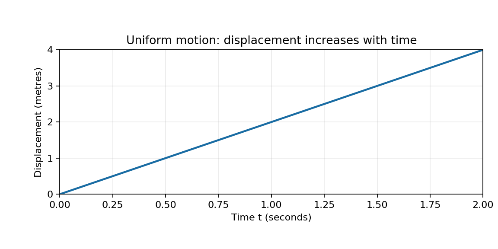
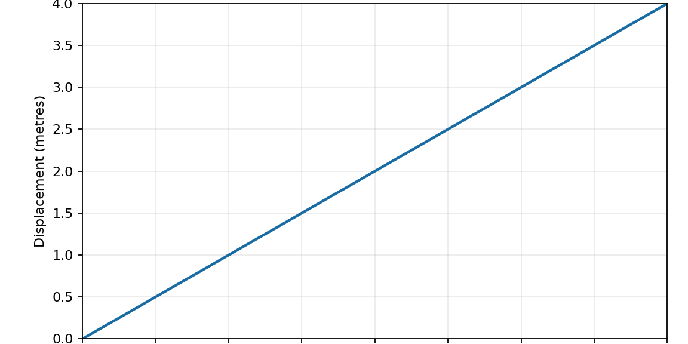

A short reference for interpreting totals

This is a reference excerpt, with no learner-response tasks. Prior knowledge includes ordinary definite integrals, average value and multiplication of units. Here q(u) is energy measured in joules and u is a dimensionless fraction from zero to one. The integral adds q(u) times the dimensionless width du. Its average on that interval is the integral divided by the dimensionless width one. Integrals and averages always have different units.

For comparison, integrating a power p(t) in watts over a duration t measured in seconds gives joules, and its time average is measured in watts.

The following two figures both represent displacement 2t metres at numerical time t seconds, for 0 to 2 seconds.

