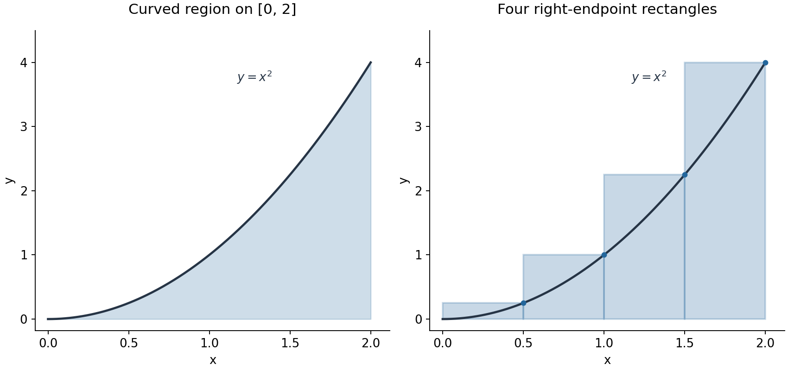
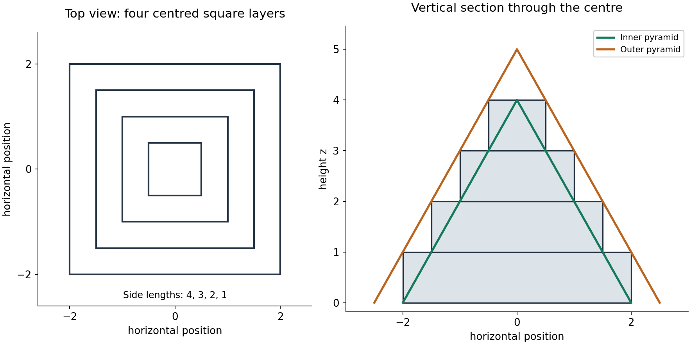
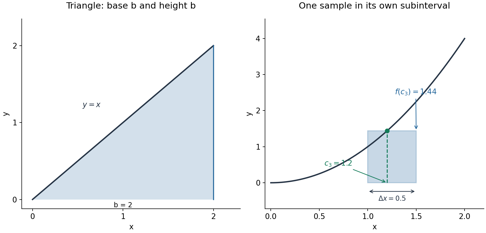

D016 · Definite integrals

MIT 18.01, Fall 2006, Lecture 18

An integral adds contributions that vary across an interval. The useful construction is to identify one small contribution, add those contributions, and then let their widths shrink. This lesson develops the lecture's rectangle and pyramid arguments, then uses the same construction to distinguish money borrowed from money owed.

Reading route: read Parts A–F in order and try P1–P4 where they appear. [Hints](hints.md) and [complete solutions](solutions.md) are separate files; each has return links. Keep P5 for a later study session, when you can first try it without reopening the explanation. You can adjust when to revisit it; its purpose is to separate remembered construction from use in a different setting.

We use familiar algebra, sums, limits, differentiation and antiderivative evaluation. The emphasis here is on what a sum represents and why its limiting value answers the question.

<a id="part-a"></a>

Part A. Build one rectangle before building the sum

First take $`f(x)=x^2`$ on $`[0,b]`$, with $`b\gt 0`$ fixed. Divide the interval into $`n`$ equal subintervals, where $`n`$ is a positive integer. Each rectangle has width $`b/n`$. For a right-endpoint choice, the first height is $`f(b/n)=(b/n)^2`$, the second is $`f(2b/n)=(2b/n)^2`$, and the last is $`f(b)=b^2`$.

The $`i`$th rectangle therefore contributes its width times its height. Write $`R_n`$ for the total from the right endpoints:

```math
R_n=\sum_{i=1}^{n}\frac bn\left(\frac{ib}{n}\right)^2
=\frac{b^3}{n^3}\sum_{i=1}^{n}i^2.
```

Here $`i`$ counts rectangles from 1 to $`n`$; it is not another horizontal coordinate. The coordinate is $`ib/n`$. Factoring out $`b^3/n^3`$ is legitimate because it is the same for every term of this finite sum.

For example, on $`[0,1]`$ with two right-endpoint rectangles, the width is $`1/2`$ and the heights are $`1/4`$ and $`1`$. Thus

```math
R_2=\frac12\left(\frac14+1\right)=\frac58.
```

The result is the total area of these two rectangles. Since $`x^2`$ increases on this interval, each right-endpoint height is at least every curve height in its own subinterval. The rectangles cover the curved region and extend above it. This makes $`R_2`$ an overestimate of the curved area. Choosing a left endpoint instead gives the lowest height in each subinterval and therefore an underestimate.



Figure 1. The right panel uses four subintervals on $`[0,2]`$. Each dot selects a height from the curve; the rectangle keeps that height across its whole base. The protruding parts explain the overestimate. These are area comparisons, not claims that each finite rectangle is itself the curved strip.

<a id="p1"></a>

P1. Use four equal subintervals and left endpoints to approximate the area under $`f(x)=x^2`$ on $`[0,2]`$. State the width, list the sampled $`x`$-values and their heights, and write and evaluate the rectangle sum. Is your estimate below or above the actual area? Justify the direction from the curve, without evaluating an antiderivative. Target: build a rectangle sum after changing the sampling rule.

[Hint P1](hints.md#h1) · [Solution P1](solutions.md#s1)

<a id="part-b"></a>

Part B. Why the sum of squares produces one third

The lecture estimates $`1^2+2^2+\cdots+n^2`$ using a solid. Make a stack of centred square layers, each one unit high. From bottom to top, their side lengths are $`n,n-1,\ldots,1`$. A layer with side $`k`$ has volume $`k^2\times1`$. The complete stack therefore has volume

```math
V_n=n^2+(n-1)^2+\cdots+1^2.
```

This is the same sum as in $`R_n`$, written in reverse order. The solid is a device for estimating that numerical sum; it is not the original curved region lifted unchanged into three dimensions.

A square-based pyramid has a square base and straight sides meeting at one apex. We use the elementary geometric volume theorem

```math
\text{pyramid volume}=\frac13\,(\text{base area})(\text{perpendicular height}).
```

This formula is a supplied geometry fact in this argument. A prism, whose cross-section stays constant, would instead have volume equal to base area times height. The source's comparison drawing and one-third factors concern pyramids.

Place the stack on the horizontal plane $`z=0`$. Compare it with an inner pyramid having base side $`n`$ and height $`n`$, and an outer pyramid having base side $`n+1`$ and height $`n+1`$. All three are centred on the same vertical line.



Figure 2. The drawing uses $`n=4`$. In the top view, each inner square is the top outline of a higher layer. In the side view, each grey rectangle is a one-unit-high layer cut through its centre. The green sloping edges belong to the inner pyramid, and the orange edges to the outer pyramid. The outer apex is one unit above the stack.

To justify containment, inspect any horizontal height, not just the picture's silhouette. In the layer with $`j\le z\lt j+1`$, where $`j=0,\ldots,n-1`$, the stack's square side is $`n-j`$. Similar triangles show that the inner pyramid's side at height $`z`$ is $`n-z`$: it decreases linearly from $`n`$ at the base to zero at height $`n`$. The outer side is similarly $`n+1-z`$. Throughout that layer,

```math
n-z\le n-j\le n+1-z.
```

Thus the inner square fits inside the stack square, which fits inside the outer square, at every height occupied by the stack. The outer pyramid also extends above it. Layer boundaries do not change their volumes. Comparing volumes gives

```math
\frac{n^3}{3}\le V_n\le\frac{(n+1)^3}{3}.
```

Multiply by the positive factor $`b^3/n^3`$ to return to the rectangle total:

```math
\frac{b^3}{3}\le R_n
\le \frac{b^3}{3}\left(1+\frac1n\right)^3.
```

The upper bound exceeds the lower by

```math
\frac{b^3}{3}\left(\frac3n+\frac3{n^2}+\frac1{n^3}\right),
```

which tends to zero as $`n`$ grows, since $`b`$ remains fixed. The trapped value must approach the common limit:

```math
R_n\longrightarrow\frac{b^3}{3}.
```

This is the squeeze argument: a quantity between two bounds cannot remain a fixed distance from their common limiting value. The known formula for the sum of squares also gives this limit directly; the pyramid construction explains the coefficient geometrically. Part D will connect this right-endpoint limit to the definite integral.

<a id="part-c"></a>

Part C. A straight line gives a simpler comparison

For $`f(x)=x`$ on $`[0,b]`$, the right-endpoint total is

```math
R_n=\frac{b^2}{n^2}(1+2+\cdots+n)
=\frac{b^2}{n^2}\frac{n(n+1)}2
=\frac{b^2}{2}\left(1+\frac1n\right).
```

It tends to $`b^2/2`$, exactly the area of a triangle of base $`b`$ and perpendicular height $`b`$. Here $`R_n`$ refers to this new function; the notation always describes the right-endpoint total for the function currently specified.

The left-endpoint total is $`L_n=(b^2/n^2)(0+1+\cdots+n-1)`$. Subtracting cancels the shared terms $`1,\ldots,n-1`$, leaving

```math
R_n-L_n=\frac{b^2}{n^2}(n-0)=\frac{b^2}{n}.
```

This gap also tends to zero. Any height sampled inside one of these subintervals lies between its left and right heights. Its whole sampled total therefore lies between $`L_n`$ and $`R_n`$ and approaches the same triangle area. The argument identifies why changing sample points stops mattering in the limit.



Figure 3. The left panel shows the triangle when $`b=2`$. The right panel shows how one rectangle can instead use an interior point: the third subinterval is $`[1,1.5]`$, its width is $`0.5`$, and $`c_3=1.2`$ gives height $`f(c_3)=1.44`$ for $`f(x)=x^2`$. The base covers the entire subinterval even though its height is sampled at one point.

<a id="part-d"></a>

Part D. The general construction and its conditions

Take a finite interval $`[a,b]`$ with $`a\lt b`$. For $`n`$ equal pieces, define

```math
\Delta x=\frac{b-a}{n},\qquad x_i=a+i\Delta x\quad(i=0,\ldots,n).
```

The endpoints are $`x_0=a`$ and $`x_n=b`$. Choose $`c_i`$ inside the $`i`$th subinterval $`[x_{i-1},x_i]`$. Its height is $`f(c_i)`$, so adding width times height gives the Riemann sum

```math
S_n=f(c_1)\Delta x+\cdots+f(c_n)\Delta x
=\sum_{i=1}^{n}f(c_i)\Delta x.
```

The endpoints, midpoints or other interior points are allowed. Each $`c_i`$ must belong to its own subinterval; selecting all samples from an unrelated part of the graph would no longer implement this construction.

One useful sufficient condition for these sums to settle to a common value is continuity. A function is continuous at an input $`u`$ when its nearby values approach its value $`f(u)`$ as the inputs approach $`u`$. This excludes a jump, hole or unbounded blow-up at that input. On $`[a,b]`$, check every interior point and approach an endpoint from within the interval.

For example, $`f(x)=x^2`$ is defined throughout any finite interval, and

```math
f(u+h)-f(u)=(u+h)^2-u^2=2uh+h^2\longrightarrow0
\quad\text{as }h\longrightarrow0.
```

This checks the continuity condition for every fixed $`u`$: the limiting nearby value is the value at $`u`$. A piecewise rule needs its joining values checked too; two formulas that approach different values at a join give a jump.

We use the existence theorem that a continuous function on a finite closed interval has a finite Riemann-sum limit independent of the chosen sample points as the widths shrink. This is a theorem about the function on the entire interval, not an assumption that any arbitrary list of rectangles converges. Continuity is sufficient, not necessary; bounded step functions can also be integrated. The theorem and this distinction are discussed in [MIT's Calculus, `5.5, printed pp. 256–258](https://ocw.mit.edu/courses/res-18-001-calculus-fall-2023/mitres_18_001_f17_ch05.pdf).

For the continuous functions here, the definite integral names that common limit:

```math
\int_a^b f(x)\,dx
=\lim_{n\to\infty}\sum_{i=1}^{n}f(c_i)\Delta x.
```

Read the integral as “accumulate $`f`$ from $`a`$ to $`b`$ with respect to $`x`$.” The limits specify the interval, $`f(x)`$ specifies the sampled height or rate, and $`dx`$ records the integration variable and the role of the shrinking widths. It does not instruct you to replace a finite width by zero before adding. For fixed bounds and function, the result is a number; the $`x`$ inside is a variable used in the construction, not a remaining free input of that number.

To build an example, suppose $`f(x)=1+x`$ on $`[1,3]`$ and choose two midpoint samples. The width is 1, the points are 1.5 and 2.5, and the sum is $`(1+1.5)\times1+(1+2.5)\times1=6`$. For $`n`$ equal pieces, the midpoint of the $`i`$th piece is $`1+(i-\tfrac12)2/n`$. Thus the intended accumulation is

```math
\lim_{n\to\infty}\sum_{i=1}^{n}
\left[1+\left(1+\left(i-\frac12\right)\frac2n\right)\right]\frac2n
=\int_1^3(1+x)\,dx=6.
```

The outer square brackets contain the height, while $`2/n`$ outside is the width. The final evaluation follows from the familiar antiderivative $`x+x^2/2`$: its value changes from $`3/2`$ to $`15/2`$. The finite midpoint result happens to be exact for this straight line; an arbitrary finite sum need not equal its limiting integral.

For $`x^2`$ and $`x`$ on $`[0,b]`$, continuity now connects the previously obtained limits to the curved area and triangle area:

```math
\int_0^b x^2\,dx=\frac{b^3}{3},
\qquad
\int_0^b x\,dx=\frac{b^2}{2}.
```

Both functions are nonnegative there, so the signed rectangle contributions are also ordinary areas.

<a id="p2"></a>

P2. Fix $`b\gt 0`$. On $`[0,b]`$, let $`R_n`$ and $`L_n`$ be the right- and left-endpoint sums for $`x^2`$ on $`n`$ equal subintervals. Let $`S_n`$ use any one sample point in each of those same subintervals. The bounding-pyramid argument has established $`R_n\to b^3/3`$. Show directly from the endpoint sums that $`R_n-L_n=b^3/n`$. Use this and a bound for $`S_n`$ to explain why every such choice of sample points has the same limiting total. Target: justify sample independence; a quoted antiderivative alone does not meet the criterion.

[Hint P2](hints.md#h2) · [Solution P2](solutions.md#s2)

The lecture also notices an area-derivative pattern. If $`A(b)`$ denotes the accumulated area up to the moving endpoint $`b`$, differentiating the two results gives $`A'(b)=b^2`$ for $`f(x)=x^2`$ and $`A'(b)=b`$ for $`f(x)=x`$. In each case $`A'(b)=f(b)`$. For continuous $`f`$, this is the familiar fundamental theorem of calculus: accumulated change differentiates back to the local rate. Moving the endpoint adds a thin strip whose average height approaches $`f(b)`$; that is why an area's rate of change with respect to its endpoint is a height. Two matching examples motivate the general statement; the fundamental theorem, rather than those two examples alone, licenses its general use.

<a id="part-e"></a>

Part E. Signed total, geometric area and average

When $`f`$ is negative, a rectangle contribution $`f(c_i)\Delta x`$ is negative even though the drawn rectangle has a positive geometric area. An integral therefore records positive contributions minus the magnitudes of negative contributions. For geometric area between the graph and axis, use $`|f|`$, or split at sign changes and add the positive areas.

For example, $`f(x)=x-1`$ on $`[0,2]`$ has a below-axis triangle on $`[0,1]`$ and an above-axis triangle on $`[1,2]`$. Each has base 1 and height 1. Thus its signed integral is $`-1/2+1/2=0`$, whereas its geometric area is $`1/2+1/2=1`$.

The average value on $`[a,b]`$, with $`a\lt b`$, is

```math
f_{\mathrm{avg}}=\frac{1}{b-a}\int_a^b f(x)\,dx.
```

This is the constant height whose signed rectangle total over the entire width would match the integral: $`f_{\mathrm{avg}}(b-a)=\int_a^b f(x)\,dx`$. In the preceding example the average is zero, not one-half; averaging signed heights preserves the cancellation.

The units follow from the same construction. An integral has the product of the units of $`f`$ and its integration variable. A rate in dollars per year integrated over years gives dollars. Dividing by the interval length returns the rate's units. If the integration variable is dimensionless, multiplication by its width does not create a new physical unit.

<a id="p3"></a>

P3. Consider

```math
S_n=\frac3n\sum_{i=1}^{n}\left[2-\left(1+\frac{3i}{n}\right)\right].
```

Interpret this as a right-endpoint sum using $`f(x)=2-x`$. Identify its interval, width and sample point. Find its limit, the geometric area between the curve and the horizontal axis over that interval, and the average value of $`f`$ there. Explain any differences among the three quantities. Target: read a sum backwards and distinguish signed accumulation, area and average.

[Hint P3](hints.md#h3) · [Solution P3](solutions.md#s3)

<a id="part-f"></a>

Part F. From a borrowing rate to a debt

Use the lecture's simple-interest model. A principal $`P`$ is the amount initially borrowed. At a constant simple-interest rate $`r`$ per year, a portion held for $`\tau`$ years incurs interest $`Pr\tau`$ and becomes $`P(1+r\tau)`$. Interest is charged on that principal only, with no interest on accumulated interest. We assume no repayments and the same rate for all portions.

We measure all times in years. In numerical formulas, $`t`$ and $`T`$ are the numbers of years since the start and $`r=0.06`$ represents 6% per year. A borrowing-rate value $`f(t)`$ is in dollars per year. Thus a short interval of duration $`\Delta t`$ years contributes approximately $`f(t_i)\Delta t`$ dollars. The approximation replaces a varying rate during that interval by one sampled value.

For twelve equal monthly intervals, $`\Delta t=1/12`$ year and right endpoints are $`t_i=i/12`$. The corresponding total borrowed is approximated by

```math
\sum_{i=1}^{12} f(t_i)\frac1{12}.
```

If the rate really is constant throughout each month at its sampled value, this gives the exact principal over those months. A constant rate of 1000 dollars per month is 12000 dollars per year, so one such term is $`12000/12=1000`$ dollars.

To pass to a continuous model, replace twelve by a growing number $`n`$ of equal intervals. Over $`[0,T]`$, use $`\Delta t=T/n`$ and $`t_i=iT/n`$. The limiting total principal is

```math
B=\int_0^T f(t)\,dt.
```

Assume the borrowing rate is continuous, or piecewise continuous with finitely many finite jumps, so this accumulation exists. For the latter case, divide at the jumps and add the integrals of the continuous pieces. Both the small contributions and $`B`$ are amounts of money. The original lecture's final page labels this total “dollars per year”; the units of rate times time give dollars.

To find debt at time $`T`$, each portion needs a different interest duration. The portion sampled at $`t_i`$ has $`T-t_i`$ years left until repayment. Its approximate final contribution is therefore

```math
\underbrace{f(t_i)\Delta t}_{\text{principal in this interval}}
\underbrace{[1+r(T-t_i)]}_{\text{simple-interest multiplier}}.
```

For the multiplier, years times the annual rate is dimensionless. At $`t_i=T`$, the multiplier is 1: newly borrowed money has had no time to earn interest. At $`t_i=0`$, it is $`1+rT`$: that portion is held for the full period. Adding and taking the limit gives final debt

```math
D(T)=\int_0^T f(t)[1+r(T-t)]\,dt.
```

Read the integrand as the borrowing rate weighted by the remaining simple-interest time. The rate itself can be constant while the weight still varies.

For continuous borrowing at 12000 dollars per year over one year with $`r=0.06`$,

```math
B=\int_0^1 12000\,dt=12000,
```

```math
D(1)=12000\int_0^1[1+0.06(1-t)]\,dt
=12000\left(1+\frac{0.06}{2}\right)=12360.
```

The 360 dollars of interest corresponds to the average holding time of half a year. Applying $`1.06`$ to the entire principal would charge every portion for a full year, although most was borrowed later.

Actual monthly lump-sum borrowing is a different timing model. If 1000 dollars is borrowed at each month's end, the twelve holding times are $`11/12,10/12,\ldots,0`$ years. Their sum is $`66/12=5.5`$ years, so the exact final debt in that discrete model is $`12000+1000(0.06)(5.5)=12330`$ dollars. The continuous result is larger because money arrives throughout each month rather than waiting until its end. Increasing the number of ever smaller end-of-interval portions approaches the continuous result.

<a id="p4"></a>

P4. A student borrows continuously for one year, with no repayments. Time $`t`$ is the numerical number of years since the start; the borrowing rate is $`f(t)=12000t`$ dollars per year for $`0\le t\le1`$. Each borrowed portion incurs simple interest at 6% per year until $`t=1`$, with no interest on interest. Construct and evaluate an integral for the principal borrowed and an integral for the final debt. Explain each factor in the debt integrand and why charging a full year's interest on all the principal gives a different result. Would uniform borrowing at 6000 dollars per year over the same year give the same final debt? Justify the comparison through timing as well as calculation. Target: construct and interpret a weighted accumulation when the rate changes.

[Hint P4](hints.md#h4) · [Solution P4](solutions.md#s4)

<a id="p5"></a>

P5. For a later study session, try this before reopening the explanation. A tank initially holds 10 litres. Its signed net flow is $`g(t)=3-t`$ litres per minute, where $`t`$ is the numerical number of minutes after starting, for $`0\le t\le4`$. Positive flow enters the tank and negative flow leaves it; assume these are the only flows and the tank has sufficient capacity. Write a representative rectangle contribution for a short interval. Find the net change, final volume, total amount of fluid crossing the boundary in either direction, and mean net flow over the four minutes. Explain why one integral cannot represent all four requested quantities unchanged. Target: retrieve the rate-times-width construction and transfer it to a signed physical total.

[Hint P5](hints.md#h5) · [Solution P5](solutions.md#s5)

Sources and scope

The lecture's content is from [MIT OpenCourseWare, 18.01 Single Variable Calculus, Fall 2006, Lecture 18: Definite Integrals](https://ocw.mit.edu/courses/18-01-single-variable-calculus-fall-2006/d1b3d809b6505825b5cde0cee823fa0f_lec18.pdf), teaching pages 1–5 after the cover. Figures here are new constructions explaining its rectangle, pyramid and sample-point arguments. The existence condition is clarified using the linked MIT Calculus `5.5. Tasks and their numerical variants are generated practice, not claims of original examination provenance.
