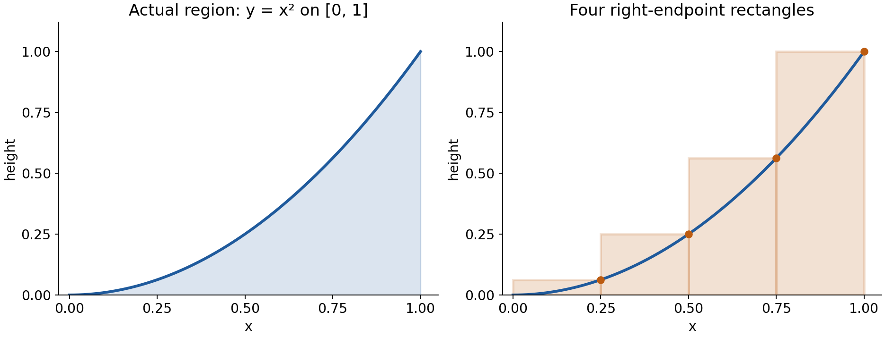
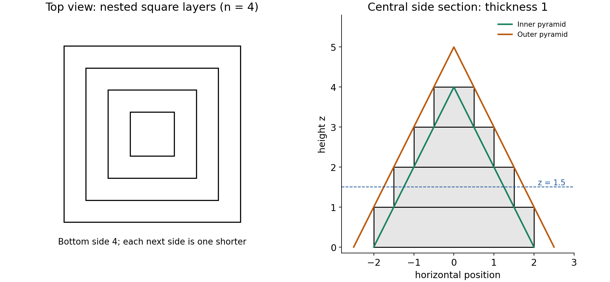
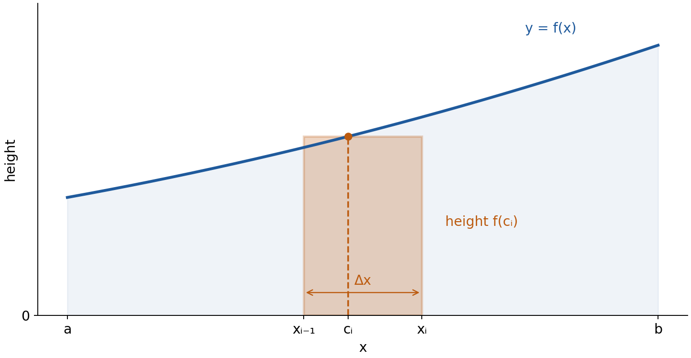

Lecture 18: Definite integrals

MIT 18.01 Single Variable Calculus, Fall 2006

Read this file in order. The six attempts occur beside the relevant teaching or at the end. Open [Hints](hints.md) for an intermediate step; [Solutions](solutions.md) are in a separate file. Each help item links back to its task. You can stop after a partial attempt and use the matching hint.

This lesson connects familiar integration with its construction from small contributions. You will build and interpret rectangle sums, justify their limiting values, read the general definite-integral notation, and construct a borrowing model in which contributions made at different times acquire different interest. Algebra, finite sums, elementary differentiation and antiderivatives are assumed; the geometric construction and financial assumptions are supplied here. No previous MIT lecture is needed.

1. From one rectangle to a curved region

A rectangle's area is width times height. For a region between a nonnegative graph and the horizontal axis, a collection of narrow rectangles approximates the area: divide the horizontal interval, choose one graph height in each piece, multiply each height by its width, and add. Narrowing the pieces can make the approximation approach a fixed value. That limiting value is the definite integral. A finite sum and its limit are different objects.

Start with $`f(x)=x^2`$ on $`[0,b]`$, with $`b\gt 0`$. Here $`b`$ is the right boundary, held fixed while the number $`n`$ of rectangles increases. All $`n`$ rectangles have width $`b/n`$. Number the intervals $`i=1,\ldots,n`$ from left to right. The $`i`$th interval runs from $`(i-1)b/n`$ to $`ib/n`$. Choosing its right endpoint gives height $`(ib/n)^2`$, so its area is

$$
\frac bn\left(\frac{ib}{n}\right)^2=\frac{b^3}{n^3}i^2.
$$

The two factors have different jobs: $`b/n`$ is a horizontal width and $`(ib/n)^2`$ is a vertical height. A power of three appears because the width contributes one factor $`b/n`$ and the height contributes two. Adding all rectangles gives

$$
R_n=\frac bn\left(\frac bn\right)^2+
\frac bn\left(\frac{2b}{n}\right)^2+\cdots+
\frac bn\left(\frac{nb}{n}\right)^2
=\frac{b^3}{n^3}\sum_{i=1}^n i^2.
$$

The sigma expression is exactly the expanded addition: insert each integer $`i`$ from 1 to $`n`$ into $`i^2`$ and add, then multiply the result by the common factor. For instance, with $`b=1`$ and $`n=4`$, the heights are $`1/16,4/16,9/16,16/16`$ and

$$
R_4=\frac14\left(\frac1{16}+\frac4{16}+\frac9{16}+\frac{16}{16}\right)=\frac{30}{64}.
$$



Figure 1. Blue is the graph; the left panel shades the desired area. The orange rectangles in the right panel use the heights at their right edges. Because $`x^2`$ increases for $`x\ge0`$, each rectangle covers its part of the region and some excess. A rectangle may extend above the graph even though the approximation is called an “area-under-the-curve” construction.

Choosing left endpoints instead gives a lower sum $`L_n`$. Both sums use the same width, and all interior sampled heights cancel when we subtract:

$$
R_n-L_n=\frac bn\bigl(b^2-0^2\bigr)=\frac{b^3}{n}.
$$

Thus $`L_n\le A\le R_n`$, where $`A`$ is the true area, and the gap between these bounds tends to zero. Once we know the limit of either bound, we know the area. For a decreasing nonnegative graph the order reverses: left rectangles lie above and right rectangles below. Endpoint choice alone does not determine the error direction; the graph's change does.

<a name="q1"></a>

Q1. For $`f(x)=x^2`$ on $`[0,2]`$, use four equal intervals. Write their width and all four right-endpoint heights, then calculate the right-endpoint rectangle sum. Calculate the left-endpoint sum as well. Explain which sum is above the true area and which is below, using how $`x^2`$ changes on this interval. Your response should distinguish a rectangle sum from the exact area; no antiderivative is needed.

[Q1 hint](hints.md#q1) · [Q1 solution](solutions.md#q1)

2. Why the sum of squares gives one third

An antiderivative would evaluate the area quickly. The lecture instead uses three-dimensional geometry to explain why the rectangle sum has the limit it does. Put

$$
S_n=1^2+2^2+\cdots+n^2.
$$

Construct a stack of square slabs, each one unit thick. The bottom has side $`n`$, the next side $`n-1`$, and so on to a top slab of side 1. Centre them on the same vertical axis, with corresponding square sides parallel. A slab of side $`k`$ has volume $`k^2\times1`$, so the whole staircase has volume $`S_n`$. This volume represents a numerical sum of squares; it is an auxiliary solid, not the original two-dimensional region.

Use the standard geometric fact that a pyramid's volume is one third of its base area times its perpendicular height. For a square pyramid with base side $`s`$ and height $`h`$, this gives $`s^2h/3`$. We take that geometric formula as a premise here; we are not obtaining it by first integrating the very $`x^2`$ area we want to explain.

Nest the staircase between two centred square pyramids with the same base plane. Orient both square bases with their sides parallel to the slab sides. The inner pyramid has base side and height both $`n`$. The outer pyramid has base side and height both $`n+1`$, so it extends a unit above the staircase.



Figure 2. Each top-view square is the footprint of a slab. In the side section, the black steps bound those slabs, the green triangle cuts through the inner pyramid, and the orange triangle cuts through the outer pyramid. The triangles are sections of solids; their triangle areas are not the volumes used below.

Here is why the nesting holds throughout the solids. Let $`z`$ measure vertical height from their common base plane. In layer $`j`$, where $`j=0,\ldots,n-1`$ and $`j\le z\le j+1`$, the staircase has side $`n-j`$. The inner pyramid's horizontal square has side $`n-z`$, and the outer's has side $`n+1-z`$. These side lengths follow by similar triangles: a pyramid's horizontal length decreases linearly to zero at its apex. Within that layer,

$$
n-z\le n-j\le n+1-z.
$$

The centred, equally oriented squares therefore nest at every height. At a layer boundary either adjacent slab description gives the same containment conclusion. Between boundaries there is extra volume on each side, so the volume inequalities are strict for positive integer $`n`$:

$$
\frac{n^3}{3}\lt S_n\lt \frac{(n+1)^3}{3}.
$$

For example, with four layers and $`z=1.5`$, the three side lengths are $`2.5,3,3.5`$. This comparison checks the whole square cross-section, not only a single line drawn in the side view.

Divide the volume bounds by positive $`n^3`$:

$$
\frac13\lt \frac{S_n}{n^3}\lt \frac13\left(1+\frac1n\right)^3.
$$

The upper bound minus the lower bound is

$$
\frac13\left[\left(1+\frac1n\right)^3-1\right]
=\frac1n+\frac1{n^2}+\frac1{3n^3},
$$

which tends to zero. Hence $`S_n/n^3`$ cannot stay any fixed positive distance above $`1/3`$, and it is always above it. This is the squeeze argument: quantities trapped between two bounds approaching the same number must approach that number. It does not say that any finite $`S_n/n^3`$ equals $`1/3`$.

Multiplying by fixed $`b^3`$ gives $`R_n\to b^3/3`$. Since $`L_n=R_n-b^3/n`$, the left sum has the same limit. The area between them is therefore

$$
A=\frac{b^3}{3}.
$$

The familiar exact formula $`S_n=n(n+1)(2n+1)/6`$ provides another check: dividing it by $`n^3`$ gives $`1/3+1/(2n)+1/(6n^2)`$, again tending to $`1/3`$. The exact-sum route is shorter if the formula is already available; the pyramid route explains the scale and leading factor geometrically.

The original lecture calls the two bounding solids “prisms”. Its diagram and its factor $`1/3`$ identify pyramids. A prism has a constant cross-section and volume base area times height; that would not give these bounds.

<a name="q2"></a>

Q2. Change the staircase construction so that each square layer has thickness 2 instead of 1, while its side lengths from bottom to top are still $`n,n-1,\ldots,1`$. Let its volume be $`W_n`$. An inner square pyramid has base side $`n`$ and height $`2n`$; an outer one has base side $`n+1`$ and height $`2(n+1)`$, with all three solids sharing their base plane and central axis. Explain why they bound the staircase by comparing horizontal side lengths in a layer. Obtain bounds for $`W_n/n^3`$ and find its limit. Finally recover the limit of $`(1^2+\cdots+n^2)/n^3`$. Your response must account for the changed layer thickness rather than treating a side-view area as a volume.

[Q2 hint](hints.md#q2) · [Q2 solution](solutions.md#q2)

3. The general construction and its notation

The same construction works beyond $`x^2`$. Fix $`a\lt b`$ and divide $`[a,b]`$ into $`n`$ equal intervals. Write

$$
\Delta x=\frac{b-a}{n},\qquad x_i=a+i\Delta x\quad(i=0,\ldots,n).
$$

Here $`\Delta x`$ means one finite change in the horizontal coordinate. The endpoints are $`x_0=a`$ and $`x_n=b`$; interval $`i`$ is $`[x_{i-1},x_i]`$. Choose a sample point $`c_i`$ inside that particular interval, including its endpoints. It need not be the centre. Use $`f(c_i)`$ for the height. All sample points and intervals are chosen anew as $`n`$ changes.



Figure 3. The dashed line marks $`c_i`$ inside the interval with endpoints $`x_{i-1}`$ and $`x_i`$. The orange rectangle's full width is $`\Delta x`$, even though its height is sampled at just one point. That sample fixes the flat top at height $`f(c_i)`$.

The resulting Riemann sum, named for the mathematician Riemann, is

$$
\sum_{i=1}^n f(c_i)\Delta x
=f(c_1)\Delta x+f(c_2)\Delta x+\cdots+f(c_n)\Delta x.
$$

To build one from a description, first identify the interval and its width, then the sampling rule, then the contribution height times width. For example, for $`f(x)=x+2`$ on $`[1,2]`$ with two midpoint rectangles, width is $`1/2`$, the intervals are $`[1,1.5]`$ and $`[1.5,2]`$, and the samples are $`1.25`$ and $`1.75`$. The sum is

$$
\frac12\bigl[(1.25+2)+(1.75+2)\bigr]=3.5.
$$

Conversely, to read this sum, the brackets supply the two heights and the factor $`1/2`$ supplies each width. The midpoint calculation happens to be exact for this straight line: each midpoint rectangle has the same area as the corresponding trapezium. Exactness at finite $`n`$ is a feature of this example, not of all Riemann sums.

Definition. If these sums approach the same finite number as $`n\to\infty`$ for every allowed choice of sample points, their common limit is the definite integral:

```math
\int_a^b f(x)\,dx=\lim_{n\to\infty}\sum_{i=1}^n f(c_i)\Delta x.
```

Read the left side as “the integral of $`f(x)`$ with respect to $`x`$, from $`a`$ to $`b`$”. The lower and upper labels specify the interval; $`f(x)`$ specifies the quantity being accumulated per unit $`x`$; $`dx`$ identifies that variable and corresponds to the shrinking widths. It is not a further instruction to multiply the final answer by $`x`$. Unlike an indefinite integral, this definite integral is one number when the function and endpoints are fixed. Renaming the internal variable changes nothing: $`\int_a^b f(u)\,du`$ is the same number. The sample $`c_i`$ in a sum belongs to interval $`i`$; it is not the upper integration limit.

A standard sufficient condition for this common limit to exist is that $`f`$ is continuous on the closed interval. Continuity means that values near any point approach the value at that point, without a jump there. Bounded functions that are continuous on finitely many pieces, with only finitely many jumps, also have this integral. All examples here meet these conditions. An arbitrary function need not have the common limit, so the existence clause matters. These sufficient conditions are stated in [OpenStax, Calculus Volume 1, section 5.2, Theorem 5.1 and the paragraph following it](https://openstax.org/books/calculus-volume-1/pages/5-2-the-definite-integral); they are used here as standard existence results, without their general proof.

When $`f\ge0`$, the integral is geometric area. When $`f`$ is negative, the corresponding products $`f(c_i)\Delta x`$ are negative: the integral records signed area, subtracting below-axis contributions. Ordinary geometric area instead adds magnitudes, so use $`\int_a^b |f(x)|\,dx`$, splitting at sign changes as needed. For example, a function equal to 2 on $`[0,1]`$ and $`-1`$ on $`(1,3]`$ has signed integral $`2\times1-1\times2=0`$, but geometric area $`2+2=4`$. Cancellation is meaningful for a net total, not for the total size of the two regions.

If the horizontal coordinate has units $`U`$ and the function has units $`V`$, each contribution and the integral have units $`VU`$. This will turn a borrowing rate in dollars/year into a total in dollars.

<a name="q3"></a>

Q3. For $`f(x)=4-x`$ on $`[1,3]`$, construct a right-endpoint Riemann sum with $`n`$ equal intervals. Specify the interval width, the $`i`$th sample point, the summand and the summation limits. Expand the sum for $`n=2`$. Decide whether that two-rectangle result overestimates or underestimates the integral, and justify the direction. Give the exact integral by a second method of your choice and interpret its relation to the finite sum.

[Q3 hint](hints.md#q3) · [Q3 solution](solutions.md#q3)

4. A moving endpoint, derivatives and averages

For $`f(x)=x`$ on $`[0,b]`$ with $`b\ge0`$, the region is a right triangle with base $`b`$ and perpendicular height $`b`$. Thus its area is $`b^2/2`$. The rectangle construction agrees:

$$
R_n=\frac{b^2}{n^2}(1+2+\cdots+n)
=\frac{b^2}{2}\left(1+\frac1n\right)\longrightarrow\frac{b^2}{2}.
$$

The first equality uses width $`b/n`$ and heights $`ib/n`$; the second uses the arithmetic-series sum $`n(n+1)/2`$. This is the line example in the lecture, beside its triangle diagram.

We now change what varies. Previously $`b`$ was fixed and $`n`$ grew. Now let $`b`$ move and write the accumulated integral as a function,

```math
A(b)=\int_a^b f(x)\,dx,
```

with $`a`$ fixed. The variable $`x`$ is internal to the integral; $`b`$ controls where accumulation stops. For the two areas already found,

$$
\frac{d}{db}\left(\frac{b^3}{3}\right)=b^2,
\qquad
\frac{d}{db}\left(\frac{b^2}{2}\right)=b.
$$

These are the graph heights at the moving endpoint. The reason extends to continuous $`f`$. Increasing $`b`$ by a small positive $`h`$ adds only the narrow strip from $`b`$ to $`b+h`$. Contributions on $`[a,b]`$ cancel in the difference $`A(b+h)-A(b)`$. Throughout the added strip, continuity makes the height close to $`f(b)`$, so its signed integral is close to $`h f(b)`$.

More precisely, if every height in the strip differs from $`f(b)`$ by at most $`\varepsilon`$, its rectangle sums, and then its integral, differ from $`h f(b)`$ by at most $`h\varepsilon`$. Dividing by positive $`h`$ makes the difference quotient differ from $`f(b)`$ by at most $`\varepsilon`$. As $`h`$ shrinks, continuity allows $`\varepsilon`$ to shrink to zero. For negative $`h`$, a strip is removed: its signed contribution and the denominator both reverse sign, with the same limiting quotient. Thus, at an interior point where $`f`$ is continuous,

$$
A'(b)=f(b).
$$

This is the accumulation form of the fundamental theorem of calculus. It explains the lecture's observed pattern. At a jump in $`f`$ the two one-sided strip heights can differ, so this two-sided derivative conclusion is not guaranteed there.

For calculation, your familiar antiderivative rule is $`\int_a^b f(x)\,dx=F(b)-F(a)`$ when $`F'=f`$ and the continuity conditions hold. For instance, $`\int_1^2 x^2\,dx=2^3/3-1^3/3=7/3`$. Subtracting $`F(a)`$ makes the accumulated amount zero when the two endpoints coincide. No arbitrary $`+C`$ remains in a definite integral.

<a name="q4"></a>

Q4. Define $`A(b)=\int_1^b(2x+1)\,dx`$ for $`b\ge1`$. Obtain a formula for $`A(b)`$ and its derivative for $`b\gt 1`$. Explain why the derivative depends on the height at the moving upper edge rather than the height at the fixed lower edge. Your response should include $`A(1)`$ and a short strip-based explanation, not only a differentiated polynomial.

[Q4 hint](hints.md#q4) · [Q4 solution](solutions.md#q4)

An integral also supplies an average value. The average height $`\bar f`$ on an interval is the constant height that gives the same signed total over that interval. Therefore $`\bar f(b-a)=\int_a^b f(x)\,dx`$, giving

```math
\bar f=\frac1{b-a}\int_a^b f(x)\,dx\qquad(a\lt b).
```

For $`x^2`$ on $`[0,b]`$ with $`b\gt 0`$, this is $`(b^3/3)/b=b^2/3`$. It is generally not the simple average of the two endpoint heights, which here would be $`b^2/2`$. Dividing by the full interval length gives the average's original height units. For a signed velocity, the average value is average velocity; average speed uses the nonnegative magnitude before averaging.

5. Building an integral from borrowing

A rate describes amount per unit time. If a student borrows 1000 dollars per month at a constant rate, that is 12000 dollars per year. A month is $`1/12`$ year, so rate times duration gives $`12000\times(1/12)=1000`$ dollars. The factor $`1/12`$ belongs to the time interval; it is not a change in the loan's interest rate.

Let $`f(t)`$ be the borrowing rate in dollars per year, where times are measured in years from the start. Allow it to change with time. For twelve equal monthly intervals, put $`\Delta t=1/12`$ year and $`t_i=i/12`$ years, with $`i=1,\ldots,12`$. Sampling at each month's end gives the approximation

$$
\text{principal borrowed}\ \approx\sum_{i=1}^{12} f(t_i)\Delta t.
$$

Each summand is a small loan amount, not a rate. It is exact for borrowing at a constant rate within each month if the sample represents that month's rate. For a continuously varying rate it is a rectangle approximation. More subdivisions use $`\Delta t=1/n`$ year and $`t_i=i/n`$ years; we must change $`n`$ as well as the width. The continuous-model total over one year is

```math
B=\int_0^1 f(t)\,dt.
```

This total has units dollars. The final page of the original notes calls its units “dollars per year”; multiplying the rate by the time interval corrects that to dollars. The average borrowing rate over an interval is the principal divided by the interval's duration, which does have dollars/year units.

Now add the lecture's interest assumption. A principal $`P`$ dollars borrowed for a duration $`\tau`$ years incurs simple interest $`Pr\tau`$, where $`r`$ is the annual interest rate, for example $`0.06`$ per year. The amount owed is

$$
P(1+r\tau)=P+Pr\tau.
$$

This is a declared model: constant simple interest, no interest on earlier interest, no fees and no repayments before settlement. It is different from compound interest. The rate times duration is dimensionless, so the multiplier can be added to 1.

For a loan made at time $`t_i`$ and settled at the end of the year, the elapsed interest-bearing time is $`1-t_i`$. In this expression the endpoint 1 denotes one year, and the times being subtracted use the same year unit. The resulting debt from that loan is

$$
\underbrace{f(t_i)\Delta t}_{\text{principal for that interval}}
\underbrace{\bigl(1+r(1-t_i)\bigr)}_{\text{growth until settlement}}.
$$

For example, 1000 dollars borrowed after nine months has only $`1/4`$ year to grow. At 6% simple interest its settlement value is $`1000(1+0.06\times1/4)=1015`$ dollars. A loan at the very end has no time to grow; a loan at the start grows for a full year. These endpoint cases check that the duration is $`1-t_i`$, not $`t_i`$.

Add the interval debts and pass to the continuous limit:

```math
D=\int_0^1 f(t)\bigl(1+r(1-t)\bigr)\,dt.
```

The entire product $`f(t)(1+r(1-t))`$ is the quantity summed per unit borrowing time. Constructing it required identifying one loan, growing that loan for its own remaining duration, then combining loans. Multiplying all of $`B`$ by $`1+r`$ instead would charge a full year's interest on even the final loan.

For numerical calculations below, $`t`$ is the numerical time in years and the numerical annual rate is $`r=0.06`$; the product $`0.06(1-t)`$ already incorporates the year units. If $`f(t)=12000`$ throughout the year, then

```math
B=\int_0^1 12000\,dt=12000\text{ dollars},
```

```math
D=12000\int_0^1\bigl(1+0.06(1-t)\bigr)\,dt
=12000\left(1+\frac{0.06}{2}\right)
=12360\text{ dollars}.
```

Here $`\int_0^1(1-t)\,dt=1/2`$: equally spread borrowing has a mean interest-bearing duration of half a year. The interest is 360 dollars, half of the 720 dollars that would apply if all 12000 dollars were borrowed at the start.

Actual monthly lump loans use a finite sum instead. If exactly 1000 dollars is borrowed at each month-end, the settlement debt is

$$
\sum_{i=1}^{12}1000\left(1+0.06\left(1-\frac i{12}\right)\right)
=12000+1000(0.06)\left(12-\frac{78}{12}\right)
=12330\text{ dollars}.
$$

The $`78`$ is $`1+\cdots+12`$. This is lower than the continuous-model value because the same monthly principal arrives at the end of each month and has less time to grow. Refining a mathematical approximation to continuous borrowing is different from changing an actual twelve-payment contract. Choose the sum or integral from the stated timing model.

More generally, for settlement at time $`T`$, borrowing between times $`a`$ and $`T`$, and the same constant simple-interest assumptions, the duration for a loan at $`t`$ is $`T-t`$ and

```math
D(T)=\int_a^T f(t)\bigl(1+r(T-t)\bigr)\,dt.
```

The construction is unchanged, but the upper limit and each loan's duration must use the same settlement time. For $`r=0`$ it reduces to total principal. This is a mathematical borrowing model, not a claim about any actual loan agreement.

<a name="q5"></a>

Q5. A student borrows continuously during one year at rate $`f(t)=24000t`$ dollars per year, where $`t`$ is the numerical time in years since the start. Each amount borrowed accrues simple interest at 6% per year until settlement at $`t=1`$; there are no repayments or fees. Construct and evaluate the integrals for principal borrowed and total owed. Compare the debt with borrowing continuously at the constant rate 12000 dollars per year over that same year. Explain any difference using the timing of borrowing, and check units. A satisfactory response identifies the interest-bearing duration for each small loan before combining the loans.

[Q5 hint](hints.md#q5) · [Q5 solution](solutions.md#q5)

6. Return and apply

A later attempt can separate what you remember from what you can adapt to a new situation. Returning tomorrow or after another topic is one adjustable spacing suggestion, not a fixed optimum. Q6 asks you to recall the sum construction and choose how to handle a rate that changes sign. You may reopen the lesson or use a hint after recording your starting attempt.

<a name="q6"></a>

Q6. Return to this task after a break, with the worked examples closed if useful. A particle moves on a line with velocity $`v(t)=2-t`$ metres per second for $`0\le t\le3`$, where $`t`$ is numerical time in seconds. Find its displacement, total distance travelled, average velocity and average speed over the three seconds. State where a change of sign affects your calculation and explain why one signed integral cannot give both distance and displacement. Also write, without evaluating it, a right-endpoint sum with $`n`$ equal time intervals whose limit gives displacement. This task checks recall of the sum-to-integral construction and transfer to a signed rate; show enough reasoning to distinguish those two aims.

[Q6 hint](hints.md#q6) · [Q6 solution](solutions.md#q6)

Source and scope

Based on MIT OpenCourseWare, [18.01 Single Variable Calculus, Fall 2006, Lecture 18: Definite Integrals](https://ocw.mit.edu/courses/18-01-single-variable-calculus-fall-2006/d1b3d809b6505825b5cde0cee823fa0f_lec18.pdf), PDF pages 1–6 including its cover (printed lecture pages 1–5). The supplied note does not name its individual author. Figures here are new constructions explaining the original region, rectangle, staircase and sample-point relationships. The square-pyramid argument, line example, general definition and borrowing model follow the lecture; the six practice tasks, additional examples and explanations are generated for this lesson. The explicit signed-area and continuity conditions clarify when its area interpretation applies. The word “prisms” and the principal-total units are corrected where used above.
