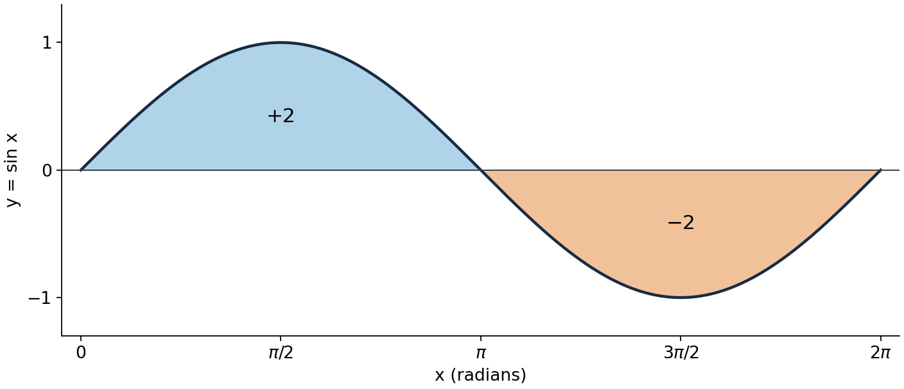
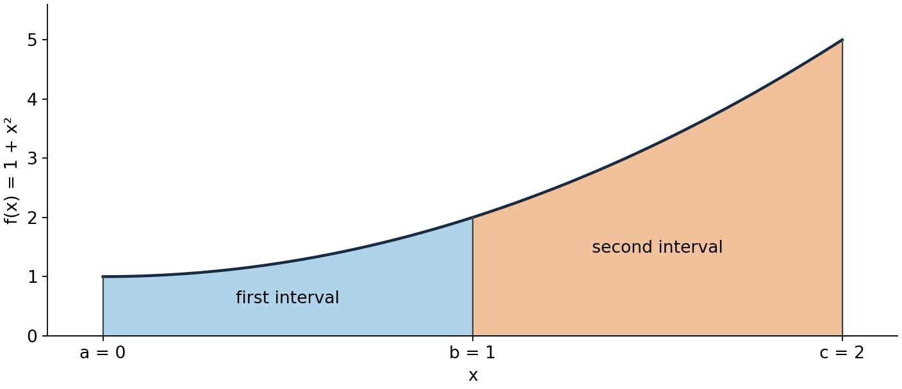

First fundamental theorem of calculus

MIT 18.01, Fall 2006, Lecture 19 — a self-contained study route

Read U1–U6 in order, trying P1–P4 where they appear. P5 is a later revisit. [Hints](hints.md) and [complete solutions](solutions.md) are separate files; each task links to its own help. The two figures belong at their positions below. Calculus facts already in the starting course are used, with the connections needed for this lecture made explicit. The aim is to evaluate and interpret definite integrals, handle endpoint order, obtain bounds, and choose a consistent substitution.

U1. From a rate to an accumulated change

The definite integral $\int_a^b f(x)\,dx$ is a number for fixed endpoints $a,b$. The function $f$ is the integrand, $x$ is the integration variable, and $dx$ identifies that variable. For $a\lt b$, it is the limit of signed rectangle sums: heights $f(x_i)$ times small widths $\Delta x$. Positive and negative heights contribute with their signs. This recovers geometric area when $f\ge0$; otherwise it measures net signed area. For example, to represent accumulation of the rate $x^2$ from input $a$ to input $b$, write $\int_a^b x^2\,dx$. Renaming the dummy variable to $t$ throughout gives the same number, $\int_a^b t^2\,dt$.

An antiderivative $F$ of $f$ is a function satisfying $F'(x)=f(x)$. It is a function, whereas the definite integral is an accumulated number. In this course the first fundamental theorem, FTC 1, is the following evaluation rule: if $f$ is continuous on the interval between $a$ and $b$ and $F'=f$ there, then

$$
\int_a^b f(x)\,dx=F(b)-F(a).
$$

Continuity means the function has no break on that interval, including the appropriate one-sided behavior at its endpoints. Polynomial, sine and exponential functions satisfy this condition everywhere. We use the theorem as an established result; the lecture's motion interpretation below explains what it connects, rather than constituting a general proof. The interval must not conceal a singularity. For instance, $1/x$ has an antiderivative on each side of zero, but this theorem cannot evaluate an integral across zero by blindly subtracting logarithms.

The course writes $F(x)|_a^b$ or $F(x)|_{x=a}^{x=b}$ for $F(b)-F(a)$. We also use $[F(x)]_a^b$. The top endpoint is substituted first and the entire value at the bottom endpoint is subtracted. These bars or brackets instruct endpoint evaluation; they are not absolute value.

For the source's first example, choose $F(x)=x^3/3$ because differentiation gives $F'(x)=x^2$. Then

$$
\int_a^b x^2\,dx=\left[\frac{x^3}{3}\right]_a^b
=\frac{b^3}{3}-\frac{a^3}{3}.
$$

The same procedure gives the source's third example:

$$
\int_0^1 x^5\,dx=\left[\frac{x^6}{6}\right]_0^1=\frac16.
$$

If we choose $F+C$ instead, the difference is $(F(b)+C)-(F(a)+C)=F(b)-F(a)$. A definite answer has no arbitrary $+C$ left. Indefinite integration, $\int f(x)\,dx=F(x)+C$, instead asks for a family of functions. [Source: lecture, printed p. 1.](https://ocw.mit.edu/courses/18-01-single-variable-calculus-fall-2006/817a2c46ddc23e2efda247a79ddeed34_lec19.pdf)

P1. Use the endpoint rule

Evaluate $\int_1^2 x^5\,dx$. Use $F(x)=x^6/6$, state why it is an admissible antiderivative, and explain whether $F(x)+7$ changes the answer. A complete response shows endpoint subtraction and explains the constant. This is an author-generated task.

[Hint P1](hints.md#h1) · [Solution P1](solutions.md#s1)

U2. Signed area, velocity and distance

Since $(-\cos x)'=\sin x$, one sine hump has integral

$$
\int_0^\pi\sin x\,dx=[-\cos x]_0^\pi
=-\cos\pi-(-\cos0)=1-(-1)=2.
$$

Sine is nonnegative on this interval, so 2 is also its geometric area. Extending to a full period changes the result:

$$
\int_0^{2\pi}\sin x\,dx=[-\cos x]_0^{2\pi}
=-1-(-1)=0.
$$

The second hump contributes $\int_\pi^{2\pi}\sin x\,dx=-2$. Its geometric area is positive 2. The two signed contributions cancel, while the total geometric area is $2+2=4$.

Figure 1. The graph is $y=\sin x$ with $x$ in radians. Blue shading from 0 to $\pi$ contributes $+2$; orange shading from $\pi$ to $2\pi$ contributes $-2$. The vertical coordinate is the integrand's value, not accumulated area. Thus the complete graph explains both the one-hump and full-cycle answers. It reconstructs the relationships in source Figures 1 and 2.

For motion, let $x(t)$ denote position along a chosen axis. Its derivative $v(t)=x'(t)$ is signed velocity; speed is $|v(t)|$. For forward elapsed time $a\lt b$, FTC 1 gives

$$
\int_a^b v(t)\,dt=x(b)-x(a),\qquad
\text{distance travelled}=\int_a^b|v(t)|\,dt.
$$

The first is displacement: final position minus initial position. The second is the increase on an odometer, which counts all travel positively. They agree if $v(t)\ge0$ throughout. If velocity is always negative, displacement is negative but distance remains positive; if it changes sign, travel in opposite directions can cancel in displacement. A speedometer reports $|v|$, so it does not alone supply the sign needed for displacement. This makes precise the source's wording: printed p. 2 initially calls $x'(t)$ “speed,” but its cancellation argument requires signed velocity. [Independent net-change reference.](https://openstax.org/books/calculus-volume-1/pages/5-4-integration-formulas-and-the-net-change-theorem)

The rectangle interpretation has physical units. Divide $[a,b]$ into $n$ short intervals of width $\Delta t=(b-a)/n$ and sample velocity at a time $t_i$ in each. Then $\sum_{i=1}^n v(t_i)\Delta t$ approximates displacement: each product is a short signed displacement when velocity is nearly constant on that interval. Metres per second times seconds gives metres. Refining intervals leads to the integral for continuous velocity. Replacing $v$ by $|v|$ instead approximates distance. For example, a constant velocity of $-3$ metres per second for 2 seconds gives displacement $-6$ metres and distance 6 metres, without requiring a reversal.

U3. Joining intervals and reversing endpoints

For adjacent intervals, signed contributions add:

$$
\int_a^b f(x)\,dx+\int_b^c f(x)\,dx=\int_a^c f(x)\,dx.
$$

When $a\lt b\lt c$, each small strip is counted once across the two intervals. The figure shows a positive case; negative contributions obey the same signed addition.

Figure 2. Here $f(x)=1+x^2$, $a=0$, $b=1$, $c=2$. Joining the blue and orange regions covers exactly the whole region from $a$ to $c$. The chosen formula supplies an exact example of source Figure 3's general interval relation.

We define reversing endpoints by

$$
\int_b^a f(x)\,dx=-\int_a^b f(x)\,dx,
\qquad \int_a^a f(x)\,dx=0.
$$

This agrees with the endpoint rule: reversing endpoints changes $F(b)-F(a)$ into $F(a)-F(b)$. It also makes additivity work for any order of $a,b,c$, provided $f$ is continuous on an interval containing them. Indeed, substituting the endpoint rule in the left side gives

$$
(F(b)-F(a))+(F(c)-F(b))=F(c)-F(a).
$$

The two $F(b)$ terms cancel regardless of which endpoint is larger. For example, with $f(x)=1$, $a=0$, $b=3$, $c=1$, the relation says $3+(-2)=1$. Taking an interval backwards removes the part counted beyond $c$; it does not add a second positive area. [Source: printed p. 3.](https://ocw.mit.edu/courses/18-01-single-variable-calculus-fall-2006/817a2c46ddc23e2efda247a79ddeed34_lec19.pdf)

To combine this with motion, consider $v(t)=t-1$ from time 0 to time 2, with numerical time in seconds and velocity in metres per second. An antiderivative is $V(t)=t^2/2-t$. Its values at 0, 1, 2 are 0, $-1/2$, 0. The displacement is $V(2)-V(0)=0$. Velocity is negative before time 1 and positive afterward. Therefore distance is

$$
-\int_0^1(t-1)\,dt+\int_1^2(t-1)\,dt
=-(-1/2)+(1/2)=1\text{ metre}.
$$

The minus sign on the first integral converts its negative displacement into positive distance. We choose the split from the velocity's sign change, not from a sign change of its antiderivative.

P2. Interpret the accumulation

A particle has $v(t)=2t-2$ metres per second, with $t$ the numerical time in seconds, from $t=0$ to $t=3$. Calculate displacement and distance travelled. Explain which is an odometer increment. Also evaluate $\int_3^0v(t)\,dt$ and explain why reversing integration endpoints does not describe additional physical travel. A complete response supplies the sign split, units and physical distinction. This is an author-generated task.

[Hint P2](hints.md#h2) · [Solution P2](solutions.md#s2)

U4. Use a simpler function to bound an integral

Suppose $f(x)\le g(x)$ for every $x$ between $a$ and $b$, with $a\lt b$ and both functions continuous. Each positive-width rectangle for $g-f$ has nonnegative area; hence its integral is nonnegative. By the sum rule for integration,

$$
0\le\int_a^b(g-f)\,dx=\int_a^b g\,dx-\int_a^b f\,dx,
$$

so $\int_a^b f\,dx\le\int_a^b g\,dx$. The functions themselves need not be positive: their difference is what matters. Reversed endpoints negate both integrals and therefore reverse this comparison. Equal endpoints give zero on each side.

The lecture applies this to estimate the number $e$. Because the exponential is increasing and $e^0=1$, we have $1\le e^x$ for $x\ge0$. Integrate on $[0,1]$:

$$
1=\int_0^1 1\,dx\le\int_0^1e^x\,dx=e-1.
$$

Adding 1 gives $e\ge2$. A better lower comparison is $1+x\le e^x$ on the same interval. The source recalls this from earlier work; here is a route that does not need those notes. Set $h(x)=e^x-1-x$. For $x\ge0$, $h'(x)=e^x-1\ge0$, so $h$ is nondecreasing. Since $h(0)=0$, it follows that $h(x)\ge0$, exactly the required inequality. Now integrate it:

$$
\frac32=\left[x+\frac{x^2}{2}\right]_0^1
=\int_0^1(1+x)\,dx\le e-1.
$$

Thus $e\ge5/2$, a stronger lower bound. These are bounds, not assertions that $e$ equals either value. We used an exact integral of a simpler lower function to obtain a bound on a less directly numerical quantity. [Source: printed p. 4, Examples 5 and 6.](https://ocw.mit.edu/courses/18-01-single-variable-calculus-fall-2006/817a2c46ddc23e2efda247a79ddeed34_lec19.pdf)

P3. Change the interval and its orientation

Starting from $1+t\le e^t$ for $0\le t\le2$, derive a numerical lower bound for $e^2$ by integrating. Then state the correct comparison between $\int_2^0(1+t)\,dt$ and $\int_2^0e^t\,dt$, explaining its direction. A complete response evaluates the simpler integral and justifies reversal. This is an author-generated task.

[Hint P3](hints.md#h3) · [Solution P3](solutions.md#s3)

U5. Change variables without changing the accumulation

Substitution reverses the chain rule. Write $u=u(x)$ for an inner function and $g(u)$ for a function of its new input. If $G'(u)=g(u)$, then

$$
\frac{d}{dx}G(u(x))=g(u(x))u'(x).
$$

Consequently $\int g(u(x))u'(x)\,dx=G(u(x))+C$. The short instruction $du=u'(x)\,dx$ packages this chain-rule factor: substitute for the whole product, not just for the symbol inside $g$. In the source's notation $f(x)=g(u(x))$, the transformed integral contains $f(x)u'(x)$, not $f(x)$ alone.

For a definite integral, assume $u$ is continuously differentiable on the interval between $x_1,x_2$, and $g$ is continuous on an interval containing all the values of $u$ there. FTC 1 applied to $G(u(x))$ gives

$$
\int_{x_1}^{x_2}g(u(x))u'(x)\,dx
=G(u(x_2))-G(u(x_1))
=\int_{u(x_1)}^{u(x_2)}g(u)\,du.
$$

This shows why the limits also change: they are input values for the variable displayed by the differential. The starting endpoint maps to the starting endpoint, even when the new values decrease. This chain-rule form does not require $u$ to be increasing. [Substitution hypotheses and proof.](https://openstax.org/books/calculus-volume-1/pages/5-5-substitution)

The source's example is

$$
I=\int_1^2(x^3+2)^4x^2\,dx.
$$

The inner expression $x^3+2$ has derivative $3x^2$, which matches the remaining factor up to a constant. Choose $u=x^3+2$, so $du=3x^2\,dx$ and $x^2\,dx=du/3$. At $x=1$, $u=3$; at $x=2$, $u=10$. Replacing both the composite expression and its accompanying differential yields

$$
I=\frac13\int_3^{10}u^4\,du
=\left[\frac{u^5}{15}\right]_3^{10}
=\frac{10^5-3^5}{15}.
$$

The denominator 15 contains both the substitution factor 3 and the power-antiderivative factor 5. A check in the original variable is

$$
\frac{d}{dx}\left(\frac{(x^3+2)^5}{15}\right)
=\frac5{15}(x^3+2)^4(3x^2)=(x^3+2)^4x^2.
$$

An equally valid route is to find this antiderivative first, restore $x$, and evaluate it at 1 and 2. Evaluating $u^5/15$ at 1 and 2 instead would mix the new expression with the old variable's endpoints. Expanding the fourth power would also work, but creates more terms to integrate. [Source: printed p. 4, Example 7.](https://ocw.mit.edu/courses/18-01-single-variable-calculus-fall-2006/817a2c46ddc23e2efda247a79ddeed34_lec19.pdf)

P4. Choose a consistent change of variable

Evaluate $\int_0^1x(2-x^2)^4\,dx$. Choose and state a substitution, transform the entire integral including differential and endpoints, and check the sign of the final answer against the original integrand. A complete response accounts for every factor and endpoint and explains any minus sign. This is an author-generated task.

[Hint P4](hints.md#h4) · [Solution P4](solutions.md#s4)

U6. Return to the ideas together

A useful later revisit is after a break or on another day; adjust the interval to your needs. P5(a) tests retrieval of the rules, whereas P5(b) asks you to use them in a changed application. If you stop partway, compare that point with the hint before opening the complete solution.

P5. Recall and apply

(a) Without consulting the worked examples initially, write the FTC 1 endpoint rule with its continuity and antiderivative conditions. Write the definite substitution rule including transformed endpoints.

(b) A particle has velocity $v(t)=2t(t^2-1)$ metres per second, with $t$ the numerical time in seconds, for $0\le t\le\sqrt2$. Calculate displacement and total distance. State how you selected the interval split and integration method. A complete response distinguishes the two physical quantities, explains the sign split and method, and includes units. This is an author-generated task, combining the earlier ideas rather than reporting any observed recall or mastery.

[Hint P5](hints.md#h5) · [Solution P5](solutions.md#s5)

Source route

The assigned source is [MIT OpenCourseWare, 18.01 Single Variable Calculus, Fall 2006, Lecture 19: First Fundamental Theorem of Calculus](https://ocw.mit.edu/courses/18-01-single-variable-calculus-fall-2006/resources/lec19/), in the course taught by David Jerison. The notes here cover all four printed teaching pages, including the three figure relationships and seven examples. Two additional references above independently clarify net change and substitution. No external reading is needed to attempt the tasks. [Continue to hints](hints.md) or [complete solutions](solutions.md).
