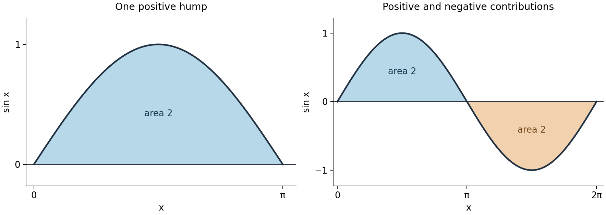
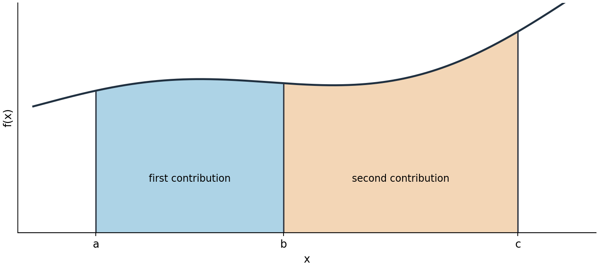

<a name="start"></a>

D017 — First fundamental theorem of calculus

An integral can add many local contributions and still be evaluated from just two endpoint values. This lesson connects that calculation to signed area and motion, then uses it to combine intervals, bound an unknown value and change variables.

Read the core in order, trying P1–P5 where they occur. P6 is a later return to the ideas. [Hints](#hints) are grouped after the core; [complete solutions](#solutions) form a separate group after all hints. Each help item links back to its prompt. All six practice tasks are generated for this lesson; the worked examples follow MIT Lecture 19.

The starting tools are ordinary differentiation, antiderivatives, the chain rule, signed graph areas and the fact that a nonnegative derivative makes a function nondecreasing on an interval. Trigonometric arguments are in radians. The notation FTC 1 follows this course: it means the endpoint-evaluation theorem below.

<a name="endpoints"></a>

1. From an antiderivative to an exact total

For a continuous function $`f`$ on the interval between $`a`$ and $`b`$, suppose $`F`$ is an antiderivative there: $`F'(x)=f(x)`$. The first fundamental theorem of calculus states

```math
\int_a^b f(x)\,dx=F(b)-F(a).
```

Initially take $`a\lt b`$. The integral on the left is the signed total obtained by adding narrow rectangle contributions. The function $`f`$ gives each rectangle's height, and $`dx`$ identifies the variable whose small intervals supply its widths. The right side uses an antiderivative, evaluated at the ending bound and then at the starting bound. The theorem connects this limiting sum to the change in $`F`$; it is not the assertion that $`f(b)-f(a)`$ gives the integral.

Continuity here means that the function has no jump or break: its nearby values approach its value at each point. Together with $`F'=f`$ on the interval, it is a sufficient condition for the stated theorem. Do not apply this version across an undefined point merely because a symbolic antiderivative can be written.

The course's evaluation notation packages the subtraction:

```math
\left.F(x)\right|_a^b
=\left.F(x)\right|_{x=a}^{x=b}
=F(b)-F(a).
```

Read the upper label as “substitute $`b`$”, the lower label as “substitute $`a`$”, and subtract the entire lower value. To build an evaluation from a requested integral, first choose $`F`$ by checking $`F'=f`$, then put the original bounds on that evaluation bar. Adding a constant to $`F`$ has no effect because $`[F(b)+C]-[F(a)+C]=F(b)-F(a)`$.

For example, $`F(x)=x^3/3`$ has derivative $`x^2`$, so

```math
\int_a^b x^2\,dx
=\left.\frac{x^3}{3}\right|_a^b
=\frac{b^3-a^3}{3}.
```

Likewise, for the source's fifth-power example,

```math
\int_0^1 x^5\,dx
=\left.\frac{x^6}{6}\right|_0^1
=\frac16-0=\frac16.
```

In each case the derivative check identifies the correct antiderivative, and the endpoint subtraction supplies one number rather than a family with an arbitrary constant.

<a name="p1"></a>

P1. Evaluate $`\int_{-1}^{2}(3x^2-2)\,dx`$. Show one antiderivative, check its derivative, and show the two endpoint values before subtracting. Explain why an arbitrary additive constant would not change the result. Target: a reliable endpoint evaluation; the response must preserve the lower-endpoint sign. [Hint P1](#hint-p1) · [Solution P1](#solution-p1)

<a name="signed"></a>

2. What the total measures

For $`f(x)=\sin x`$, an antiderivative is $`-\cos x`$. The first sine hump lies above the axis, so its signed integral is also its geometric area:

```math
\int_0^\pi \sin x\,dx
=-\cos\pi-(-\cos0)
=1-(-1)=2.
```



Figure 1. The left panel corresponds to the source's first sine figure. The right panel includes its second, negative hump. Horizontal position is $`x`$ and height is $`\sin x`$. Blue shading contributes positively to an integral; orange shading contributes negatively. The labelled areas are magnitudes of the shaded regions.

Over the full period, the endpoint calculation gives

```math
\int_0^{2\pi}\sin x\,dx
=-\cos(2\pi)-(-\cos0)
=-1-(-1)=0.
```

The zero means that equal positive and negative contributions cancel. Geometric area cannot cancel: it adds their magnitudes and is $`2+2=4`$. In general, split at sign changes and reverse the sign of each below-axis contribution to find area; this is the same as integrating $`|f(x)|`$ in the increasing direction.

For motion, let $`s(t)`$ denote position along a chosen positive direction, and let $`v(t)=s'(t)`$ be signed velocity. Then FTC 1 says

```math
\int_a^b v(t)\,dt=s(b)-s(a).
```

The right side is displacement. On a short time interval of width $`\Delta t`$, velocity close to a constant $`v(t_i)`$ gives displacement approximately $`v(t_i)\Delta t`$. Adding these contributions gives $`\sum_i v(t_i)\Delta t`$; shrinking the time intervals gives the integral. Metres per second multiplied by seconds produces metres. A negative term represents travel in the negative direction, not a negative amount of distance travelled.

Speed is $`|v(t)|`$. An odometer's increase is therefore $`\int_a^b |v(t)|\,dt`$ for $`a\lt b`$, whereas position change is $`\int_a^b v(t)\,dt`$. When velocity stays nonnegative these numbers agree. When it changes sign, a return trip can have zero displacement and positive distance. This distinction makes precise the lecture's speedometer/odometer interpretation: $`s'`$ must be treated as velocity whenever signs matter.

<a name="p2"></a>

P2. A particle has velocity $`v(t)=\cos t`$ for $`0\le t\le\pi`$. Here $`t`$ is the numerical time in seconds and $`v`$ is the numerical velocity in metres per second. Find its displacement and total distance over that interval. Identify the turning time and explain why the two totals differ. Target: distinguish signed accumulation from distance; include the sign intervals and units. [Hint P2](#hint-p2) · [Solution P2](#solution-p2)

<a name="orientation"></a>

3. Combining intervals and reversing direction

If $`a\lt b\lt c`$, splitting the region at $`b`$ gives

```math
\int_a^b f(x)\,dx+\int_b^c f(x)\,dx
=\int_a^c f(x)\,dx.
```



Figure 2. This schematic reconstructs the source's additivity figure. The two shaded pieces meet at $`b`$ without overlap of positive width. Their heights come from the same function. For a graph crossing the axis, the identical split applies to signed contributions.

The endpoint theorem also explains the addition algebraically:

```math
[F(b)-F(a)]+[F(c)-F(b)]=F(c)-F(a).
```

The intermediate endpoint cancels. To keep the same endpoint rule when travelling through the bounds in the opposite order, define

```math
\int_b^a f(x)\,dx=-\int_a^b f(x)\,dx,
\qquad \int_a^a f(x)\,dx=0.
```

These are oriented integrals: their sign records both the sign of the integrand and the order of the bounds. The reversal agrees with $`F(a)-F(b)=-[F(b)-F(a)]`$. The cancellation identity above then proves additivity for $`a,b,c`$ in any order, provided the same continuous function and antiderivative apply over the intervening interval.

For $`f(x)=2x`$, use $`F(x)=x^2`$. Splitting the increasing interval gives

```math
\int_1^2 2x\,dx+\int_2^3 2x\,dx
=(4-1)+(9-4)=3+5=8.
```

Reversing the whole interval gives $`\int_3^1 2x\,dx=1-9=-8`$. The function remains positive there; the negative result now comes from the bounds. This is different from the negative contribution of a below-axis curve integrated from left to right.

<a name="p3"></a>

P3. A continuous function $`f`$ satisfies $`\int_{-1}^{2}f(x)\,dx=5`$ and $`\int_2^4f(x)\,dx=-3`$. Find $`\int_4^{-1}f(x)\,dx`$ and $`\int_4^2f(x)\,dx`$. Can the geometric area between $`f`$ and the axis on $`[-1,4]`$ be determined uniquely from these two data? Justify the answer. Target: combine interval contributions with orientation, and recognise the information lost by cancellation. [Hint P3](#hint-p3) · [Solution P3](#solution-p3)

<a name="bounds"></a>

4. Turning a pointwise comparison into a bound

Suppose $`f(x)\le g(x)`$ at every point of $`[a,b]`$, with both functions continuous and $`a\lt b`$. Then

```math
\int_a^b f(x)\,dx\le\int_a^b g(x)\,dx.
```

To see the reason, $`g-f`$ is nonnegative. Every rectangle contribution to its integral has nonnegative height and positive width, so its limiting total is nonnegative. By the sum and difference rule for integration, this is exactly $`\int_a^b g-\int_a^b f\ge0`$. On reversing both bounds, both integrals change sign and the comparison reverses. Equal bounds make both zero. Thus the direction of integration is an essential condition in a comparison argument.

For $`x\ge0`$, the increasing exponential satisfies $`e^x\ge e^0=1`$. Integrating on $`[0,1]`$ gives

```math
1=\int_0^1 1\,dx
\le\int_0^1 e^x\,dx=e-1,
\qquad e\ge2.
```

A closer lower function gives a better bound. Here is a justification of the lecture's $`1+x\le e^x`$, so it need not be recalled from an earlier lecture. Define $`q(x)=e^x-1-x`$. For $`x\ge0`$, $`q'(x)=e^x-1\ge0`$, so $`q`$ is nondecreasing. Since $`q(0)=0`$, we have $`q(x)\ge0`$, which is exactly $`e^x\ge1+x`$. Now

```math
\frac32=\int_0^1(1+x)\,dx
=\left.x+\frac{x^2}{2}\right|_0^1
\le e-1,
\qquad e\ge\frac52.
```

The comparison is between whole integrals with identical bounds. Adding 1 to both sides then gives the bound on $`e`$. This proves a lower bound without needing a decimal approximation for $`e`$.

<a name="p4"></a>

P4. We have established $`e^x\ge1+x`$ for $`x\ge0`$. Let $`r(x)=e^x-1-x-x^2/2`$. Use the given inequality to determine the sign of $`r'(x)`$, then use $`r(0)`$ to establish a lower bound on $`e^x`$. Integrate that bound from 0 to 1 to obtain a stronger lower bound on $`e`$. Show each inference and compare the result with $`5/2`$. Target: build a bound from an already justified bound, rather than guess from a decimal value. [Hint P4](#hint-p4) · [Solution P4](#solution-p4)

<a name="substitution"></a>

5. Changing variable without changing the total

Suppose an integrand contains a composition $`g(u(x))`$ multiplied by $`u'(x)`$. The inner function $`u`$ converts the old input $`x`$ into a new input; $`g`$ acts on that new input. If $`G'(u)=g(u)`$, the chain rule gives

```math
\frac{d}{dx}G(u(x))=g(u(x))u'(x).
```

Thus $`G(u(x))`$ is an antiderivative of the whole product, not just of $`g(u(x))`$. This is the reason behind the substitution shorthand $`du=u'(x)\,dx`$:

```math
\int g(u(x))u'(x)\,dx
=\int g(u)\,du
=G(u)+C
=G(u(x))+C.
```

In the middle expression $`u`$ is the integration variable. In the final expression it has been replaced by the original function of $`x`$. The course sometimes names the composition $`f(x)=g(u(x))`$, so the left side can also be written $`\int f(x)u'(x)\,dx`$. Naming $`f`$ does not remove the derivative factor.

For a definite integral, map each original endpoint through $`u`$. Assuming $`u`$ is continuously differentiable on the interval and $`g`$ is continuous over its image, FTC 1 gives

```math
\int_{x_1}^{x_2}g(u(x))u'(x)\,dx
=G(u(x_2))-G(u(x_1))
=\int_{u(x_1)}^{u(x_2)}g(u)\,du.
```

The limit attached to the start remains the start, even if it becomes numerically larger. This identity comes from the chain rule and the endpoint subtraction, so it does not require solving for $`x`$ in terms of $`u`$. It also remains valid if $`u`$ turns around between the endpoints; signs in $`u'`$ preserve the cancellations.

In the source example,

```math
I=\int_1^2(x^3+2)^4x^2\,dx,
```

the repeated inner expression suggests $`u=x^3+2`$. Its derivative is $`3x^2`$, so $`du=3x^2\,dx`$ and $`x^2\,dx=du/3`$. The fourth power becomes $`u^4`$. Build the limits from the old endpoints: $`x=1`$ gives $`u=3`$; $`x=2`$ gives $`u=10`$. Consequently,

```math
I=\frac13\int_3^{10}u^4\,du
=\left.\frac{u^5}{15}\right|_3^{10}
=\frac{10^5-3^5}{15}
=\frac{99757}{15}.
```

The coefficient $`1/3`$ repairs the difference between the available $`x^2\,dx`$ and the derivative factor $`3x^2\,dx`$. Keeping the old limits 1 and 2 on the integral in $`u`$ would describe different endpoint values. Alternatively, find the antiderivative $`(x^3+2)^5/15`$ directly and evaluate it at $`x=1,2`$; differentiating this expression checks both the exponent and the coefficient. Expanding the polynomial first also works, but adds unnecessary algebra here.

<a name="p5"></a>

P5. Evaluate $`\int_1^2 x(4-x^2)^3\,dx`$. Show a consistent change of variable, its differential, and the new limit corresponding to each old limit. Explain the sign of the final result by inspecting the original integrand. Target: retain the orientation when the new variable decreases. [Hint P5](#hint-p5) · [Solution P5](#solution-p5)

<a name="p6"></a>

6. Return and connect the ideas

P6. Return after a break, with the worked examples covered if useful. First state the hypotheses and endpoint rule of FTC 1 from recall. Then let $`f(x)=(2x-3)e^{x^2-3x}`$ on $`[1,2]`$. Find both the signed integral of $`f`$ and the geometric area between its graph and the axis. Choose and justify the method, identify every necessary split, and explain why a zero signed total would or would not force the geometric area to be zero. Target: distinguish recall of the theorem from transfer to a case requiring method choice and a sign decision. A complete response gives exact values and reasons. [Hint P6](#hint-p6) · [Solution P6](#solution-p6)

The break can be later today or another study session; adjust it to your study needs. Recalling the statement and handling the changed example are different checks: being able to recite the theorem does not by itself settle a sign or method decision.

Source: [MIT OpenCourseWare, 18.01 Single Variable Calculus, Fall 2006, Lecture 19: First Fundamental Theorem of Calculus](https://ocw.mit.edu/courses/18-01-single-variable-calculus-fall-2006/resources/lec19/), all four numbered lecture pages and their three figures. The figures here are newly drawn, the explanations expanded, and the practice tasks generated. The source's endpoint-evaluation convention is retained. The signed-velocity clarification is stated in section 2.

End of core. [Back to start](#start) · [Hints](#hints) · [Complete solutions](#solutions)

<a name="hints"></a>

Hints — intermediate help only

Use the item matching the prompt. The complete solutions are grouped separately below all six hints.

<a name="hint-p1"></a>

Hint P1. An antiderivative has the form $`x^3-2x+C`$. Keep the two evaluations $`F(2)`$ and $`F(-1)`$ on separate lines before forming their difference; the minus sign in the lower input is not the subtraction sign between the values. [Return to P1](#p1) · [Solution P1](#solution-p1)

<a name="hint-p2"></a>

Hint P2. Mark where cosine vanishes between 0 and $`\pi`$. It is positive before that time and negative after it. Use $`\sin t`$ as the antiderivative; add the magnitudes of the two resulting displacement contributions for distance. [Return to P2](#p2) · [Solution P2](#solution-p2)

<a name="hint-p3"></a>

Hint P3. First combine the two given integrals in the increasing direction from $`-1`$ to 4; only then reverse the limits. For the area question, a net contribution of 5 might contain a positive area of 5 alone, or a larger positive area partly cancelled by a negative one. [Return to P3](#p3) · [Solution P3](#solution-p3)

<a name="hint-p4"></a>

Hint P4. Differentiation gives $`r'(x)=e^x-1-x`$, exactly the nonnegative difference already established. Starting from $`r(0)=0`$, translate “nondecreasing” into an inequality for $`r(x)`$, then rearrange it before integrating. [Return to P4](#p4) · [Solution P4](#solution-p4)

<a name="hint-p5"></a>

Hint P5. Put $`u=4-x^2`$, so $`du=-2x\,dx`$. Write $`x\,dx=-du/2`$. The start $`x=1`$ maps to 3 and the end $`x=2`$ maps to 0; do not sort these limits before accounting for a reversal sign. [Return to P5](#p5) · [Solution P5](#solution-p5)

<a name="hint-p6"></a>

Hint P6. The exponent has derivative $`2x-3`$. Check the derivative of $`e^{x^2-3x}`$ against the whole integrand. The exponential is positive, so only $`2x-3`$ determines the sign. Compare the antiderivative at the two endpoints and at that sign-change point. [Return to P6](#p6) · [Solution P6](#solution-p6)

End of hints. [Back to start](#start) · [Complete solutions](#solutions)

<a name="solutions"></a>

Complete solutions — reasoning and results

<a name="solution-p1"></a>

Solution P1. Choose $`F(x)=x^3-2x`$, whose derivative is $`3x^2-2`$. The polynomial integrand is continuous, so FTC 1 applies. The endpoint values are $`F(2)=8-4=4`$ and $`F(-1)=-1+2=1`$. Therefore

```math
\int_{-1}^{2}(3x^2-2)\,dx=4-1=3.
```

Using $`F+C`$ instead gives $`(4+C)-(1+C)=3`$: the same constant occurs in both endpoint values and cancels. A different antiderivative differing by a constant is equally valid. [Return to P1](#p1)

<a name="solution-p2"></a>

Solution P2. Cosine is positive for $`0\le t\lt\pi/2`$, zero at $`\pi/2`$, and negative for $`\pi/2\lt t\le\pi`$. Thus the direction reverses at $`t=\pi/2`$ seconds. Since $`(\sin t)'=\cos t`$, displacement is

```math
\int_0^\pi\cos t\,dt=\sin\pi-\sin0=0
```

metres. The two displacement contributions are $`\sin(\pi/2)-\sin0=1`$ metre and $`\sin\pi-\sin(\pi/2)=-1`$ metre. Distance adds their magnitudes, giving 2 metres. The particle travels one metre in the positive direction and one metre back; cancellation in displacement does not erase either part of the journey. [Return to P2](#p2)

<a name="solution-p3"></a>

Solution P3. Additivity gives $`\int_{-1}^{4}f(x)\,dx=5+(-3)=2`$. Reversal then gives

```math
\int_4^{-1}f(x)\,dx=-2,
\qquad \int_4^2f(x)\,dx=-(-3)=3.
```

The geometric area is not uniquely fixed. A continuous curve can remain nonnegative on the first interval and nonpositive on the second, meeting the axis at 2; in that case the total area is $`5+3=8`$. A curve can instead have an additional positive and negative lobe of equal area within the first interval. Their contributions cancel in its given integral, but both add to geometric area. The two supplied net totals therefore do not determine the separate positive and negative magnitudes. In particular, the area is at least 8, but could be larger. [Return to P3](#p3)

<a name="solution-p4"></a>

Solution P4. For $`x\ge0`$, the earlier inequality gives $`r'(x)=e^x-1-x\ge0`$. Hence $`r`$ is nondecreasing there, and $`r(0)=0`$ implies $`r(x)\ge0`$. Rearranging gives $`e^x\ge1+x+x^2/2`$. Since the bounds are increasing, comparison yields

```math
e-1=\int_0^1e^x\,dx
\ge\int_0^1\left(1+x+\frac{x^2}{2}\right)\,dx
=\left.x+\frac{x^2}{2}+\frac{x^3}{6}\right|_0^1
=\frac53.
```

Therefore $`e\ge8/3`$. This is stronger than $`e\ge5/2`$ because $`8/3-5/2=1/6\gt0`$. The improvement comes from the additional nonnegative quadratic term in the lower function, whose validity was established before integration. [Return to P4](#p4)

<a name="solution-p5"></a>

Solution P5. Take $`u=4-x^2`$, so $`du=-2x\,dx`$ and $`x\,dx=-du/2`$. The bounds map as $`1\mapsto3`$ and $`2\mapsto0`$. Thus

```math
\int_1^2x(4-x^2)^3\,dx
=-\frac12\int_3^0u^3\,du
=-\frac18(0^4-3^4)
=\frac{81}{8}.
```

Equivalently, reverse the new bounds and change the coefficient to $`+1/2`$, then integrate from 0 to 3. The original integrand is positive for $`1\le x\lt2`$ and zero at 2, so its integral in the increasing direction must be positive. Keeping the coefficient negative while sorting the new limits would incorrectly give a negative answer. Differentiating $`-(4-x^2)^4/8`$ gives the original integrand and supplies another check. [Return to P5](#p5)

<a name="solution-p6"></a>

Solution P6. The recalled statement should identify continuity of $`f`$ on the interval, an antiderivative $`F`$ with $`F'=f`$, and $`\int_a^b f(x)\,dx=F(b)-F(a)`$. Equivalent wording is acceptable if it preserves these conditions and the subtraction order.

Here the product has the form produced by differentiating an exponential composition:

```math
F(x)=e^{x^2-3x},\qquad
F'(x)=(2x-3)e^{x^2-3x}=f(x).
```

All these functions are continuous on $`[1,2]`$. Since $`F(1)=e^{-2}=F(2)`$, the signed integral is zero. No split is needed for that endpoint calculation.

For area, the exponential factor is always positive, whereas $`2x-3`$ is negative before $`x=3/2`$ and positive afterwards. Split there. At that point $`F(3/2)=e^{-9/4}`$. The left contribution is $`e^{-9/4}-e^{-2}`$, which is negative, and the right contribution is $`e^{-2}-e^{-9/4}`$, which is positive. Their magnitudes add to

```math
\int_1^2|f(x)|\,dx
=2\left(e^{-2}-e^{-9/4}\right)\gt0.
```

The positivity follows because the increasing exponential is larger at $`-2`$ than at $`-9/4`$. Equal antiderivative values at the endpoints determine only a zero net change; they do not rule out a decrease followed by an equal increase. This is why the signed total vanishes while the geometric area remains positive. [Return to P6](#p6) · [Back to start](#start)
